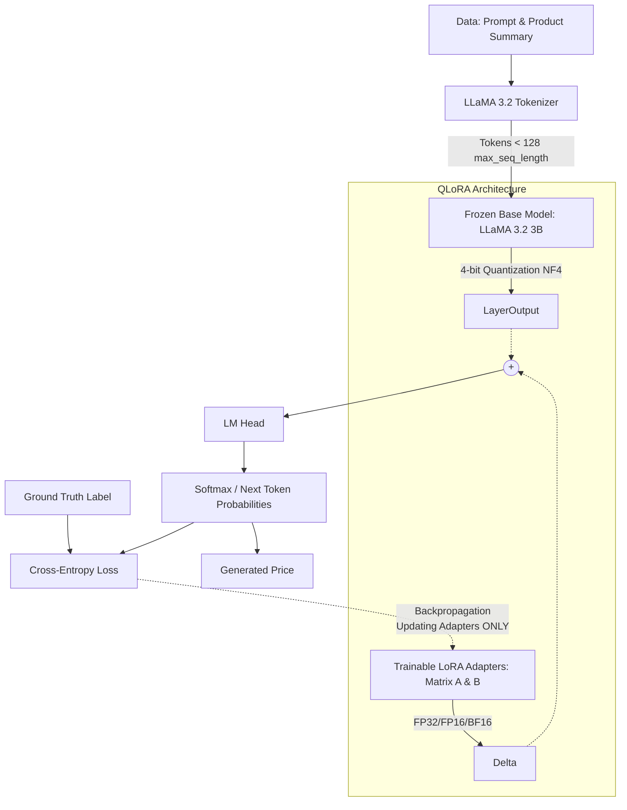

## 1. Project Overview
**Core Purpose & End Goal:** The core objective of this project module is to fine-tune a small, open-source Large Language Model (LLaMA 3.2 3B) using QLoRA to predict product prices from descriptions ("The Price Is Right"). The ultimate goal is to achieve specialized performance that rivals or crushes massive frontier models (like GPT-4o) at a fraction of the cost, reaching an MAE (Mean Absolute Error) of $39.85.

**Target Audience & User:** The user is an AI Engineering student focusing on Deep Learning, ML, and Data Science, utilizing the "Vibe Coding" protocol (fast, creative, yet strictly disciplined and optimized).

**Environment:** Linux (WSL Ubuntu), executing computationally heavy pipelines on Google Colab (T4 / A100 GPUs) using Python, PyTorch, Hugging Face ecosystem, and Weights & Biases (W&B).

## 2. Directory Structure
```text
week7/
├── Fine_tune_Llama3_2_qlora_colab_fullcode.ipynb # 📓 Full pipeline notebook covering data prep, quantization, SFTTrainer, and inference.
└── fine_tune_LLM.txt                             # 📄 Detailed documentation, theory, and lecture notes (Day 1 - Day 5).
```
*Note: Due to the narrowed scope requested, only the target files within this operational folder are detailed.*

## 3. Technology Stack & Core Architecture
**Technology Stack:**
- **Language/Frameworks:** Python, PyTorch.
- **AI/LLM Libraries:** Hugging Face `transformers`, `peft` (Parameter-Efficient Fine-Tuning - LoRA), `trl` (SFTTrainer), `bitsandbytes` (Quantization), `datasets`.
- **Infrastructure & Monitoring:** Google Colab (T4 for Light Mode, A100 for Full Mode), Weights & Biases (W&B) for loss tracking.

**Core Architectural Decisions:**
- **Why QLoRA?** Full fine-tuning of a 3B model requires excessive VRAM (~13GB). QLoRA freezes the base model in 4-bit NF4 quantized precision (reducing VRAM to ~2.2GB) while injecting low-rank (32/16-bit) Trainable Adapters into the Attention/MLP layers.
- **Why Base Model vs. Chat Model?** Regression framed as classification requires pure next-token prediction without the conversational and "chatty" token overhead.
- **Sequence Truncation:** Hard limit of `max_seq_length=128` (Power of 2) for optimal GPU memory alignment, avoiding wasteful padding tensors.

**Architecture & Data Flow:**


## 4. Development Workflow & Rules (CRITICAL)
- **Vibe Coding Protocol Enforcement:**
  - ⚠️ **Type Hinting & Docstrings:** All new Python functions must utilize strict type hinting and include tensor shape documentation (e.g., `# [Batch, Seq_Len, Dim]`).
  - ⚠️ **GPU First:** Always check `torch.cuda.is_available()` and leverage dynamic device mapping (`device_map="auto"` or `.to("cuda")`).
  - ⚠️ **Optimization & Reproducibility:** Ensure `set_seed()` is invoked. Disable gradients using `with torch.no_grad():` strictly during inference.
  - ⚠️ **Colab Compatibility:** Do not write operations that lock the UI (`plt.show()` over SSH/headless); use `plt.savefig()` where necessary.
- **Strict Execution Rules:**
  - When encountering an error, diagnose first, check CloudWatch logs (or Colab terminal tracebacks), and NEVER jump to writing defensive code without understanding the root cause.
  - Apply the "Step Up The Vibe" method: Max 30 lines of new logic at once, followed by testing. Prompt for user confirmation.

## 5. Implementation Roadmap / Guides
- **Phase 1: Environment & Baseline Checking (Day 1 - 2)**
  - Validate Colab GPU (T4/A100). Setup Hugging Face login.
  - Format training dataset into Prompt-Completion mapping, capping tokens at 128 and performing price rounding for uniform token prediction.
  - Evaluate the quantized 4-bit Base LLaMA 3.2 model to establish a `baseline MAE`.
- **Phase 2: Setting up QLoRA & Hyperparameters (Day 3)**
  - Establish `BitsAndBytesConfig` (4-bit NF4, double-quantization).
  - Define `LoraConfig` (Rank $r=32$ for Light, $256$ for Full; Alpha = $2 \times r$, targeting `q_proj, k_proj, v_proj, o_proj` & `MLP`).
- **Phase 3: Supervised Fine-Tuning (SFT) & Monitoring (Day 4)**
  - Deploy `SFTTrainer` via `trl`. Use `paged_adamw_32bit` optimizer and `Cosine` Scheduler with warmup.
  - Launch training and actively monitor via **Weights & Biases (W&B)**. Save checkpoints actively.
- **Phase 4: Evaluation & Commit Pinning (Day 5)**
  - Analyze Training/Validation curves to avoid Overfitting (e.g., epoch 3 spike).
  - Identify the lowest Validation Loss checkpoint and reload the PEFT model via exact `commit_hash`. Run final inference against the Test Set.

## 6. Detailed Notebook Workflow (Actual Code Execution Steps)
Below is the exact sequence of technical steps performed inside `Fine_tune_Llama3_2_qlora_colab_fullcode.ipynb`:

**Step 1: Xử lý dữ liệu cho LLM (Data Processing for LLM)**
- Import base libraries.
- Load dataset, reformat into Prompt-Completion schema (capping text to max_seq_length = 128 tokens).

**Step 2: Chọn model (Model Selection & Login)**
- Log in to Hugging Face Hub using access tokens.
- Declare the base model `meta-llama/Llama-3.2-3B`.

**Step 3: QLORA (QLoRA Setup)**
- Load Tokenizer & Base Model using 4-bit execution configuration.
- Implement LoRA Adaptor matrices (`lora_A` and `lora_B`), and count trainable weights.

**Step 4: Test Base Model**
- Apply optimal quantization config checking hardware limits (T4 or A100).
- Run benchmark inference using only the untuned Base Model to establish the evaluation baseline.

**Step 5: Training**
- Establish training Hyper-parameters (Epochs, LR, Batch Size) alongside specific QLoRA parameters.
- Log in to **Weights & Biases (W&B)** and link it closely to the active tracking project.
- Instantiate parameters into `SFTTrainer` and execute `train()`.
- Push the fine-tuned adapter weights to the Hugging Face repository. Perform filesystem compression (zip) to backup results.

**Step 6: test model fine tune**
- Re-authenticate HuggingFace and load specific Target Hyper-parameters and Tokenizer.
- Apply 4-bit quantization config and map the `PeftModel` (merging Base Model and trained Adapter).
- Inference execution over the Test Set.

## 7. Code Style & Idiomatic Patterns
**Pattern 1: Hugging Face QLoRA Definition**
```python
# Standard 4-bit QLoRA Config
quant_config = BitsAndBytesConfig(
    load_in_4bit=True,
    bnb_4bit_use_double_quant=True,
    bnb_4bit_compute_dtype=torch.bfloat16 if use_bf16 else torch.float16,
    bnb_4bit_quant_type="nf4"
)

peft_config = LoraConfig(
    r=256,
    lora_alpha=512,
    target_modules=["q_proj", "k_proj", "v_proj", "o_proj", "gate_proj", "up_proj", "down_proj"],
    lora_dropout=0.1,
    bias="none",
    task_type="CAUSAL_LM"
)
```

**Pattern 2: SFTTrainer Configuration & Inference Safety**
```python
def model_predict(item: dict) -> str:
    """
    Predict the price using the fine-tuned model.
    Input tensor shape: [1, Seq_Len]
    Return type: string
    """
    inputs = tokenizer(item["prompt"], return_tensors="pt").to("cuda")
    with torch.no_grad(): # Mandatory optimization to prevent OOM
        output_ids = fine_tuned_model.generate(**inputs, max_new_tokens=8)
    
    prompt_len = inputs["input_ids"].shape[1]
    generated_ids = output_ids[0, prompt_len:]
    return tokenizer.decode(generated_ids)
```

**Pattern 3: Golden Checkpoint Loading**
```python
# Utilizing Hub commit tracking to load the absolute best model (avoiding overfitting)
REVISION = "b19c8bfea3b6ff62237fbb0a8da9779fc12cefbd"
fine_tuned_model = PeftModel.from_pretrained(base_model, HUB_MODEL_NAME, revision=REVISION)
```

## 8. Common Issues & Troubleshooting
- 🐛 **Issue:** `CUDA required but not available` (during `bitsandbytes` installation).
  - **Symptoms:** `pip install` completes, but script aborts indicating no CUDA.
  - **Root Causes:** Colab environment hasn't reloaded the newly installed library boundaries linking natively to CUDA drivers.
  - **Solutions:** Force Restart Session (Runtime -> Restart session) strictly after running the install packages block.

- 🐛 **Issue:** Out Of Memory (OOM) Errors (VRAM completely filled).
  - **Symptoms:** Training crashes abruptly indicating CUDA Out Of Memory.
  - **Root Causes:** Loading multiple models (e.g., 8-bit then 4-bit without cleanup), batch size too large, or hardware constraints.
  - **Solutions:** 
    1. Restart Runtime to clear GPU cache. 
    2. Reduce `per_device_train_batch_size` parameter.
    3. Ensure `paged_adamw_32bit` optimizer is handling memory overflow intelligently.

- 🐛 **Issue:** Overfitting Identified via Weights & Biases (W&B).
  - **Symptoms:** Training Loss decreases linearly, but Validation/Eval Loss curves form a "U-Shape" heavily spiking after certain steps (e.g., entering Epoch 3).
  - **Root Causes:** High Rank ($r=256$) + High Epoch count lead to the model "memorizing" exact responses initially instead of generalizing.
  - **Solutions:** Trigger Early Stopping manually. Check the W&B run, identify the precise step where `eval_loss` was minimized, and reload that model state via `revision=commit_hash` in `PeftModel`.
  - ⚠️ **STRICT INSTRUCTION:** When encountering an error, diagnose first, check CloudWatch/Terminal logs, and NEVER jump to writing defensive code without understanding the root cause.
