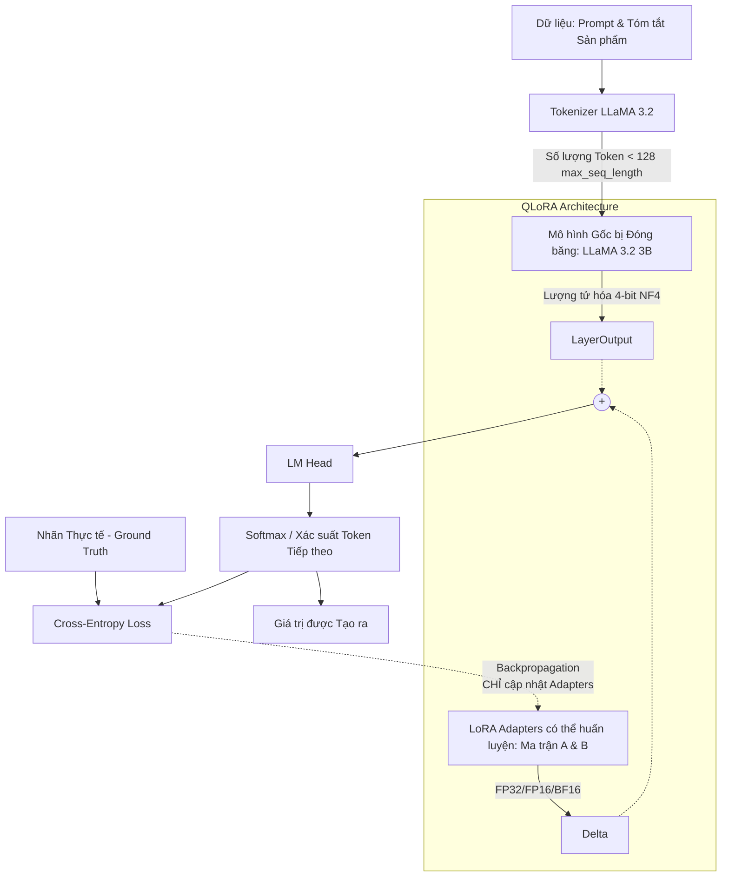

## 1. Tổng quan Dự án (Project Overview)
**Mục đích Cốt lõi & Mục tiêu Cuối cùng:** Mục tiêu cốt lõi của phân hệ dự án này là tinh chỉnh (fine-tune) một Mô hình Ngôn ngữ Lớn nguồn mở, nhỏ gọn (LLaMA 3.2 3B) sử dụng QLoRA để dự đoán giá sản phẩm từ mô tả của chúng ("The Price Is Right"). Mục tiêu cuối cùng là đạt được hiệu suất chuyên biệt sánh ngang hoặc vượt qua các mô hình thương mại hàng đầu (như GPT-4o) với một phần nhỏ chi phí, đạt được MAE (Sai số Tuyệt đối Trung bình) là $39.85.

**Đối tượng Mục tiêu & Người dùng:** Người dùng là một sinh viên Kỹ sư AI đang tập trung vào các dự án Deep Learning, ML và Data Science, áp dụng giao thức "Vibe Coding" (lập trình nhanh, sáng tạo, nhưng kỷ luật nghiêm ngặt và tối ưu hóa).

**Môi trường:** Linux (WSL Ubuntu), thực thi các đường ống tính toán nặng trên Google Colab (GPU T4 / A100) sử dụng Python, PyTorch, hệ sinh thái Hugging Face và Weights & Biases (W&B).

## 2. Cấu trúc Thư mục (Directory Structure)
```text
week7/
├── Fine_tune_Llama3_2_qlora_colab_fullcode.ipynb # 📓 Notebook chứa toàn bộ pipeline từ chuẩn bị dữ liệu, lượng tử hóa (quantization), SFTTrainer, và inference.
└── fine_tune_LLM.txt                             # 📄 Tài liệu chi tiết, lý thuyết và ghi chú bài giảng (Day 1 - Day 5).
```
*Lưu ý: Do phạm vi thu hẹp theo yêu cầu, chỉ các tệp mục tiêu trong thư mục hoạt động này được trình bày chi tiết.*

## 3. Công nghệ Sử dụng & Kiến trúc Lõi (Technology Stack & Core Architecture)
**Công nghệ (Technology Stack):**
- **Ngôn ngữ/Nền tảng:** Python, PyTorch.
- **Thư viện AI/LLM:** Hugging Face `transformers`, `peft` (Parameter-Efficient Fine-Tuning - LoRA), `trl` (SFTTrainer), `bitsandbytes` (Quantization - Lượng tử hóa), `datasets`.
- **Hạ tầng & Giám sát:** Google Colab (T4 cho Light Mode, A100 cho Full Mode), Weights & Biases (W&B) để theo dõi loss.

**Các Quyết định Kiến trúc Cốt lõi:**
- **Tại sao lại dùng QLoRA?** Việc tinh chỉnh toàn bộ (Full fine-tuning) một mô hình 3B đòi hỏi lượng VRAM quá lớn (~13GB). QLoRA "đóng băng" (freezes) mô hình gốc ở độ chính xác lượng tử hóa 4-bit NF4 (giảm VRAM xuống còn ~2.2GB) trong khi chèn các Adapter (Bộ điều hợp) có thể huấn luyện và thứ hạng thấp (low-rank 32/16-bit) vào các lớp Attention/MLP.
- **Tại sao dùng Base Model thay vì Chat Model?** Khung bài toán hồi quy (regression) dưới dạng phân loại (classification) đòi hỏi dự đoán thuần túy token tiếp theo mà không cần phần "overhead" đàm thoại (chat) của các token hội thoại đặc biệt.
- **Cắt ngắn độ dài chuỗi (Sequence Truncation):** Giới hạn cứng cho `max_seq_length=128` (Lũy thừa của 2) để tối ưu hóa sự căn chỉnh bộ nhớ GPU, tránh lãng phí với các tensor đệm (padding tensor).

**Sơ đồ Kiến trúc & Luồng dữ liệu (Architecture & Data Flow):**


## 4. Quy trình Phát triển & Các Quy tắc (Development Workflow & Rules) (CRITICAL)
- **Tuân thủ Giao thức Vibe Coding:**
  - ⚠️ **Type Hinting & Docstrings:** Tất cả các hàm Python mới bắt buộc phải sử dụng type hinting nghiêm ngặt và bao gồm tài liệu về kích thước tensor trong comment (ví dụ: `# [Batch, Seq_Len, Dim]`).
  - ⚠️ **GPU First:** Luôn kiểm tra `torch.cuda.is_available()` và tận dụng ánh xạ thiết bị động (`device_map="auto"` hoặc `.to("cuda")`).
  - ⚠️ **Tối ưu hóa & Tính Tái tạo:** Đảm bảo `set_seed()` được gọi. Vô hiệu hóa tính toán đạo hàm (gradients) bằng cách sử dụng `with torch.no_grad():` một cách nghiêm ngặt, chỉ áp dụng trong quá trình inference (suy luận).
  - ⚠️ **Khả năng Tương thích Colab:** Không viết các câu lệnh gây đóng băng giao diện UI (như `plt.show()` qua SSH/môi trường headless); hãy dùng `plt.savefig()` ở những nơi cần thiết để xuất biểu đồ.
- **Quy tắc Thực thi Nghiêm ngặt:**
  - Khi gặp lỗi, cần chẩn đoán trước, kiểm tra các luồng log CloudWatch (hoặc traceback trong terminal Colab), và KHÔNG BAO GIỜ vội vàng viết mã phòng thủ khi chưa thực sự hiểu rõ nguyên nhân gốc rễ (root cause).
  - Áp dụng phương pháp "Step Up The Vibe": Viết tối đa 30 dòng mã logic mới mỗi lần, sau đó là test kỹ. Dừng và hỏi để người dùng xác nhận bước tiếp theo.

## 5. Lộ trình Triển khai / Hướng dẫn (Implementation Roadmap / Guides)
- **Giai đoạn 1: Cài đặt Môi trường & Đánh giá Baseline (Day 1 - 2)**
  - Xác nhận cấp phát GPU trên Colab (T4 / A100). Thiết lập việc đăng nhập vào Hugging Face.
  - Định dạng lại tập dữ liệu huấn luyện thành cấu trúc Prompt-Completion, cắt giới hạn token tối đa ở mức 128 và làm tròn giá sản phẩm (Price Rounding) để tạo ra tập dự đoán token đồng nhất hơn.
  - Đánh giá trực tiếp Mô hình Cơ sở (Base Model) LLaMA 3.2 4-bit (khi chưa fine-tune) để thiết lập một `Baseline MAE` (Điểm chuẩn sai số gốc).
- **Giai đoạn 2: Thiết lập QLoRA & Hyperparameters (Day 3)**
  - Định dạng `BitsAndBytesConfig` (Sử dụng 4-bit NF4, lượng tử hóa kép - double-quantization).
  - Cấu hình `LoraConfig` (Tùy chọn Rank $r=32$ cho Light Mode, và đặc biệt $256$ cho Full Mode; Alpha được tính bằng $2 \times r$, cấu hình nhắm vào các lớp Attention `q_proj, k_proj, v_proj, o_proj` & các lớp `MLP`).
- **Giai đoạn 3: Huấn luyện SFT (Supervised Fine-Tuning) & Giám sát (Day 4)**
  - Triển khai lớp huấn luyện `SFTTrainer` (từ thư viện `trl`). Lựa chọn optimizer là `paged_adamw_32bit` và bộ lập lịch Scheduler dạng `Cosine` kèm giai đoạn warmup (khởi động).
  - Bắt đầu thực thi huấn luyện và theo dõi sát sao biểu đồ log (Loss) theo thời gian thực trên **Weights & Biases (W&B)**. Chủ động cài đặt quy tắc để lưu các Checkpoint của Model định kỳ.
- **Giai đoạn 4: Đánh giá & Chốt Phiên bản Commit (Day 5)**
  - Phân tích cẩn thận các đường cong Training/Validation Logs để kịp thời ngăn chặn tình trạng Quá khớp (Overfitting, ví dụ: phát hiện hiện tượng vọt loss đột biến ở Epoch 3).
  - Lựa chọn Checkpoint đạt Validation Loss tối ưu (thấp nhất) và tải lại toàn bộ trọng số của mô hình PEFT thông qua mã `commit_hash` chính xác trên Hub. Khởi chạy luồng Inference (Suy luận) cuối cùng đối chiếu lại trên tập dữ liệu Test.

## 6. Lộ trình Chi tiết Thực tế trong Notebook (Detailed Notebook Workflow)
Dưới đây là trình tự chính xác các bước được thực hiện trong file mã nguồn `Fine_tune_Llama3_2_qlora_colab_fullcode.ipynb`:

**Bước 1: Xử lý dữ liệu cho LLM (Data Processing for LLM)**
- Nhập (import) các thư viện cơ bản.
- Load tập dữ liệu gốc, định dạng lại thành cấu trúc Prompt (đầu vào: thông tin sản phẩm) – Completion (đầu ra: giá cả) với độ dài token giới hạn (max_seq_length = 128).

**Bước 2: Chọn model (Model Selection & HuggingFace Login)**
- Đăng nhập vào Hugging Face Hub (thông qua token an toàn).
- Khai báo model gốc `meta-llama/Llama-3.2-3B`.

**Bước 3: Thiết lập QLoRA (QLoRA Setup)**
- Load Tokenizer và Base Model. Cài đặt lượng tử hóa (Quantization) ở mức 4-bit để tối ưu hóa bộ nhớ GPU.
- Tạo cấu trúc ma trận LoRA adaptors (Lora_A và Lora_B) với rank (r) và alpha đã thiết lập, chuẩn bị "gắn" vào các lớp tuyến tính (Linear modules).

**Bước 4: Kiểm thử Base Model (Test Base Model)**
- Khởi động hệ thống tham số (Constants, Hyper-parameters).
- Tùy chọn lượng tử hóa phù hợp với khả năng của phần cứng (vd. kích hoạt thư viện `bitsandbytes`).
- Xác thực sức mạnh dự đoán "kém cỏi" của Base Model khi chưa qua quá trình fine-tune (thiết lập Baseline).

**Bước 5: Huấn luyện (Training)**
- Khai báo thêm cấu hình Huấn luyện và tham số của QLoRA.
- Đăng nhập hệ thống theo dõi và đánh giá mô hình Weights & Biases (W&B) để vẽ biểu đồ learning curves.
- Biên dịch cấu hình, khởi tạo `SFTTrainer` từ thư viện `trl`.
- Khởi chạy quá trình Fine-tune! (Trọng số LoRA adaptors bắt đầu được cập nhật).
- Lưu và đẩy (Push) mô hình đã tinh chỉnh (Fine-tuned model) lên Hugging Face Hub. Tùy chọn nén thư mục (Zip folder) lại thành bản backup cục bộ.

**Bước 6: Kiểm thử mô hình đã Fine-tune (Test model fine tune)**
- Load lại Constants, tham số QLoRA, và HuggingFace Tokenizer.
- Tái kích hoạt lượng tử hóa 4-bit.
- Tiến hành ghép nối Base Model và LoRA adapters đã tạo ở bước 5.
- Chạy Inference (dự đoán thực tế) trên Test set để kiểm tra kết quả (đạt mục tiêu MAE).

## 7. Phong cách Code & Các Mẫu Điển hình (Code Style & Idiomatic Patterns)
**Mẫu 1: Định nghĩa tham số QLoRA với Hugging Face**
```python
# Cấu hình QLoRA 4-bit tiêu chuẩn
quant_config = BitsAndBytesConfig(
    load_in_4bit=True,
    bnb_4bit_use_double_quant=True,
    bnb_4bit_compute_dtype=torch.bfloat16 if use_bf16 else torch.float16,
    bnb_4bit_quant_type="nf4"
)

peft_config = LoraConfig(
    r=256,
    lora_alpha=512,
    target_modules=["q_proj", "k_proj", "v_proj", "o_proj", "gate_proj", "up_proj", "down_proj"],
    lora_dropout=0.1,
    bias="none",
    task_type="CAUSAL_LM"
)
```

**Mẫu 2: Cấu hình SFTTrainer & An toàn Inference**
```python
def model_predict(item: dict) -> str:
    """
    Dự đoán giá trị sản phẩm sử dụng mô hình đã được fine-tune.
    Input tensor shape: [1, Seq_Len]
    Return type: string
    """
    inputs = tokenizer(item["prompt"], return_tensors="pt").to("cuda")
    with torch.no_grad(): # Tối ưu hóa bắt buộc để ngăn lỗi OOM
        output_ids = fine_tuned_model.generate(**inputs, max_new_tokens=8)
    
    prompt_len = inputs["input_ids"].shape[1]
    generated_ids = output_ids[0, prompt_len:]
    return tokenizer.decode(generated_ids)
```

**Mẫu 3: Nạp Lại Checkpoint Vàng (Golden Checkpoint Loading)**
```python
# Tận dụng lịch sử theo dõi dòng Commit từ Hub để load phiên bản Model tốt nhất (tránh Overfitting)
REVISION = "b19c8bfea3b6ff62237fbb0a8da9779fc12cefbd"
fine_tuned_model = PeftModel.from_pretrained(base_model, HUB_MODEL_NAME, revision=REVISION)
```

## 8. Các Lỗi Phổ Biến & Khắc phục Sự cố (Common Issues & Troubleshooting)
- 🐛 **Lỗi:** `CUDA required but not available` (thường xuất hiện lúc cài đặt gói `bitsandbytes`).
  - **Triệu chứng:** Lệnh `pip install` đã chạy xong, nhưng kịch bản bị sụp (aborts) với thông báo không tìm thấy CUDA.
  - **Nguyên nhân gốc rễ:** Môi trường Colab hiện tại không kịp cập nhật, chưa làm mới lại các path liên kết trực tiếp với trình điều khiển driver CUDA mới được tải.
  - **Giải pháp xử lý:** Tiến hành ép lại Khởi động Lại Phiên Làm Việc (Runtime -> Restart session) ngay thời điểm kết thúc dòng code "install packages".

- 🐛 **Lỗi:** Bị Tràn Bộ Nhớ (Out Of Memory - OOM Errors) (Bộ nhớ VRAM bị cạn kiệt ngay lập tức).
  - **Triệu chứng:** Quá trình đang Training bị ngừng ngang và kết thúc với cờ lỗi CUDA Out Of Memory.
  - **Nguyên nhân gốc rễ:** Nạp đè nhiều bộ Model liên tiếp (ví dụ: đang load 8-bit rồi chuyển sang load hẳn model 4-bit) nhưng không giải phóng RAM (cleanup). Kích thước Batch Size đưa vào tham số bị quá tải so với Hardware.
  - **Giải pháp xử lý:** 
    1. Bắt buộc Restart Runtime để giải phóng triệt để cache GPU. 
    2. Hạ cực thấp hoặc điều chỉnh lại tham số `per_device_train_batch_size`.
    3. Đảm bảo optimizer `paged_adamw_32bit` đang thực hiện và kiểm soát việc phân luồng bộ nhớ (memory overflow memory paging) một cách thông minh.

- 🐛 **Lỗi:** Bị dính "Overfitting" (Được báo động cảnh báo sớm thông qua nền tảng giám sát Weights & Biases - W&B).
  - **Triệu chứng:** Mức Cảnh báo Loss huấn luyện giảm mạnh liên tục, tuy nhiên các đường cong của chỉ số "Validation/Eval Loss" bỗng dưng chuyển sang cấu hình "Chữ U" và vọt lên cực kỳ nhanh sau vài thời điểm (ví dụ: ở bước tiếp xúc Epoch 3).
  - **Nguyên nhân gốc rễ:** Đặt cấu hình Rank quá cao ($r=256$) đi kèm lượng Epoch train dài lặp dữ liệu lớn làm hệ thống "Học Thuộc Vẹt" (memorize) nguyên vẹn đáp số mẫu ở đợt học đầu thay vì Generalize quy luật dự đoán.
  - **Giải pháp xử lý:** Chủ động áp dụng cách "Dừng sớm" (Early Stopping). Liên kết lên phiên Run trên trang chủ W&B, kiểm tra chính xác tại checkpoint có Validation `eval_loss` rơi vào điểm cực tiểu (giảm thấp nhất), quay trở lại và nạp lại chuẩn đúng version Hash Key lịch sử qua lệnh `revision=commit_hash` nằm trong file cấu hình phương thức `PeftModel`.
  - ⚠️ **HƯỚNG DẪN NGHIÊM NGẶT (STRICT INSTRUCTION):** Bất cứ khi nào bạn nhìn thấy Lỗi xảy ra, Ưu tiên chẩn đoán trước tiên, Bắt buộc xem CloudWatch/Terminal /Log cụ thể, và TUYỆT ĐỐI KHÔNG nhảy sang fix code theo cảm tính nếu vẫn cố làm ngơ và chưa nắm rõ Tận gốc Nguyên nhân lỗi đó là gì (root cause).
