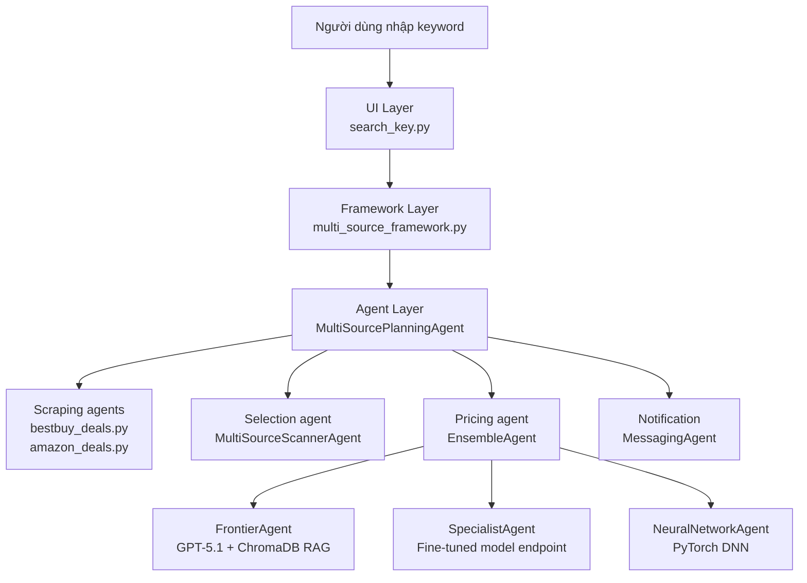
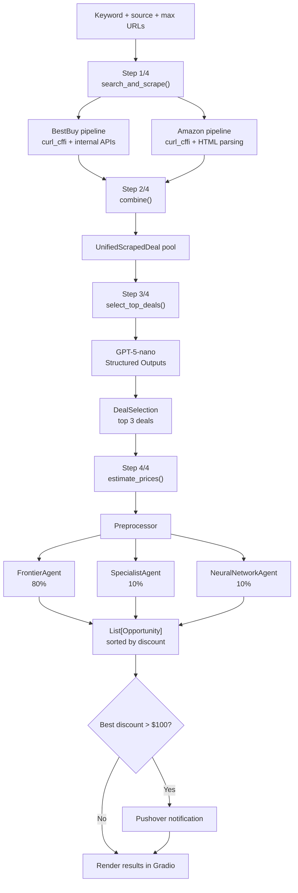

# AI Price Intelligence System

Repository này là nền tảng hiện tại cho hệ thống AI hỗ trợ tìm kiếm deal và ước lượng giá sản phẩm. Trạng thái đang chạy được tập trung ở `segment4/search_key.py`: người dùng nhập từ khóa, hệ thống tìm sản phẩm đang giảm giá trên BestBuy và Amazon, chọn các deal đáng chú ý, ước lượng giá trị thực bằng ensemble model, rồi hiển thị kết quả trên giao diện Gradio.

Mục tiêu dài hạn của repository là phát triển thành trợ lý mua sắm thông minh tiếng Việt cho TTTN/DATN. Vì vậy repo hiện có cả phần runtime tiếng Anh/US market đang chạy được, phần notebook fine-tune Qwen, và phần dữ liệu/scraping tiếng Việt đang chuẩn bị cho giai đoạn tiếp theo.

## Trạng Thái Hiện Tại

`segment4/search_key.py` là ứng dụng chính hiện tại.

Luồng chính:

1. Người dùng nhập keyword và chọn nguồn tìm kiếm.
2. BestBuy và Amazon được search/scrape song song bằng `curl_cffi`.
3. Kết quả từ hai nguồn được chuẩn hóa thành một pool chung.
4. GPT-5-nano chọn top 3 deal đáng chú ý.
5. `EnsembleAgent` ước lượng giá trị thực bằng 3 mô hình.
6. Gradio hiển thị bảng kết quả, log pipeline, và hỗ trợ gửi Pushover notification thủ công.

`segment4/price_is_right.py` là dự án cũ để tham khảo. File này chạy autonomous deal hunter từ DealNews RSS, lưu `memory.json`, và có logic notification tự động. Nó vẫn hữu ích để học lại kiến trúc autonomous agent, nhưng không phải trọng tâm phát triển hiện tại.

## Kiến Trúc

Code runtime chính nằm trong `segment4/` và đi theo 3 tầng:



Pipeline của `search_key.py`:



Ensemble hiện tại:

```text
estimated_price = frontier * 0.8 + specialist * 0.1 + neural * 0.1
discount = estimated_price - sale_price
```

## Cấu Trúc Thư Mục

```text
tech2ai/
|
|-- segment4/                         # Runtime chính hiện tại
|   |-- search_key.py                 # App chính: keyword search BestBuy + Amazon
|   |-- price_is_right.py             # Legacy/reference: autonomous RSS deal hunter
|   |-- multi_source_framework.py     # Framework cho search_key.py
|   |-- deal_agent_framework.py       # Framework cũ cho price_is_right.py
|   |
|   |-- price_agents/                 # Agent layer
|   |   |-- multi_source_planning_agent.py
|   |   |-- bestbuy_deals.py
|   |   |-- amazon_deals.py
|   |   |-- ensemble_agent.py
|   |   |-- frontier_agent.py
|   |   |-- specialist_agent.py
|   |   |-- neural_network_agent.py
|   |   |-- messaging_agent.py
|   |   |-- deals.py
|   |   `-- agent.py
|   |
|   |-- bestbuy_untils/               # Utilities cho multi-source pipeline
|   |   |-- unified_deal.py
|   |   |-- multi_source_scanner_agent.py
|   |   |-- gradio_helpers.py
|   |   `-- clarification_agent.py
|   |
|   |-- mo_ta_du_an/                  # Tài liệu thiết kế và kế hoạch
|   |-- products_vectorstore/         # ChromaDB local
|   |-- deep_neural_network.pth       # Model weights local
|   `-- sandbox/                      # Reference cho legacy autonomous mode
|
|-- fine_tune_qwen/                   # Notebook/thử nghiệm fine-tune Qwen
|-- fine_tune_qwen_v2/                # Phiên bản thử nghiệm fine-tune Qwen tiếp theo
|-- scraping_data_tv/                 # Scraping và xử lý dữ liệu tiếng Việt
|-- AGENTS.md                         # Quy ước làm việc cho coding agent
|-- pyproject.toml                    # Dependencies dùng bởi uv
`-- uv.lock
```

## Cách Cài Đặt

Project dùng `uv` làm package manager và runtime. Không dùng `pip` hoặc gọi `python` trực tiếp khi chạy script trong repo.

```bash
uv sync
```

Yêu cầu chính:

- Python 3.12
- `uv`
- Network access khi cần gọi OpenAI, Modal, Pushover hoặc scrape website
- ChromaDB local trong `segment4/products_vectorstore/`
- Model weights local `segment4/deep_neural_network.pth`

## Biến Môi Trường

Tạo `.env` ở root hoặc trong `segment4/` tùy cách chạy. Không commit `.env`.

```env
OPENAI_API_KEY=...

# Tùy chọn, chỉ cần nếu gửi push notification
PUSHOVER_USER=...
PUSHOVER_TOKEN=...

# Tùy chọn cho preprocessor
PRICER_PREPROCESSOR_MODEL=ollama/llama3.2

# Legacy hoặc thử nghiệm khác nếu cần
BRAVE_API_KEY=...
GOOGLE_API_KEY=...
HF_TOKEN=...
GROQ_API_KEY=...
```

## Cách Chạy

Chạy app chính:

```bash
cd segment4
uv run search_key.py
```

Mở giao diện tại:

```text
http://127.0.0.1:7860
```

Chạy app legacy/reference:

```bash
cd segment4
uv run price_is_right.py
```

## Tech Stack

| Nhóm | Công nghệ |
|---|---|
| Language/runtime | Python 3.12, uv |
| UI | Gradio |
| Scraping | curl_cffi, BeautifulSoup4 |
| LLM | OpenAI GPT-5.1, GPT-5-nano, LiteLLM |
| Local ML | PyTorch DNN, scikit-learn utilities |
| Specialist model | Modal endpoint / fine-tuned LLM experiment |
| Vector DB | ChromaDB |
| Embeddings | sentence-transformers/all-MiniLM-L6-v2 ở pipeline hiện tại |
| Notification | Pushover |
| Agent workflow | Multi-agent classes trong `segment4/price_agents/` |

## Tài Liệu Chi Tiết

Các tài liệu nên đọc khi cần hiểu sâu:

- `segment4/mo_ta_du_an/DOCUMENTATION_SEARCHKEY.md`: tài liệu chính cho `search_key.py`.
- `segment4/mo_ta_du_an/DOCUMENTATION_PRICE_IS_RIGHT.md`: tài liệu dự án cũ `price_is_right.py`.
- `segment4/mo_ta_du_an/Project_Development_Plan.md`: kế hoạch chuyển sang trợ lý mua sắm tiếng Việt.

## Hướng Phát Triển

README này phản ánh trạng thái hiện tại: nền tảng BestBuy/Amazon đang chạy được. Các bước phát triển tiếp theo sẽ cập nhật dần theo tiến độ thực tế:

- Chuyển dữ liệu và pipeline sang sản phẩm tiếng Việt.
- Xây scraper cho các sàn TMĐT Việt Nam.
- Fine-tune Qwen cho bài toán ước lượng giá.
- Xây ChromaDB tiếng Việt với embedding phù hợp hơn.
- Nâng cấp từ keyword search thành chatbot trợ lý mua sắm.
- Bổ sung router intent, compare agent, advisor agent, và ReAct search nếu đủ thời gian.

## Ghi Chú Development

- CodeGraph đã được init trong `segment4` để coding agent tra cứu symbol, call path và blast radius nhanh hơn. Index `.codegraph/` là local artifact và không commit.
- Không commit `.env`, API keys, tokens, model credentials, hoặc dữ liệu nhạy cảm.
- Các folder notebook như `fine_tune_qwen/`, `fine_tune_qwen_v2/`, `scraping_data_tv/` phục vụ nghiên cứu và thử nghiệm, không phải runtime chính hiện tại.
- Khi sửa code Python, ưu tiên lệnh dạng `uv run ...` để dùng đúng môi trường của repo.

## Tác Giả

Phạm Minh Hiếu - Sunny-sunnyy

Repository này đang được dùng cho quá trình học và phát triển TTTN/DATN về AI Engineering, multi-agent systems, scraping, fine-tuning, RAG và price intelligence.
