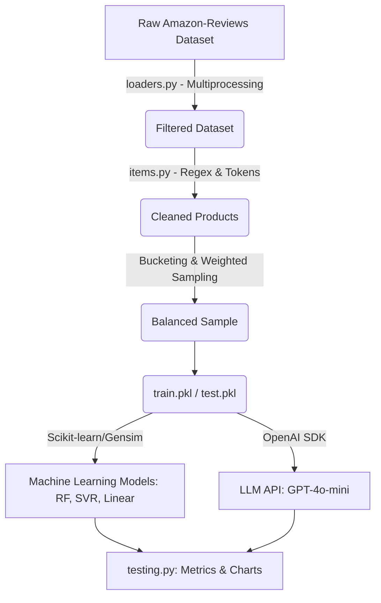

# BÁO CÁO DỰ ÁN DỰ ĐOÁN GIÁ SẢN PHẨM (GAMEPLAN)

## 1. Tổng quan dự án (Project Overview)
- **Mục đích cốt lõi:** Xây dựng mô hình học máy (Machine Learning) và trí tuệ nhân tạo (AI/LLM) để dự đoán giá của một sản phẩm dựa trên các đặc trưng nội dung mô tả sản phẩm (title, description, features, details). Giải quyết các vấn đề liên quan đến dữ liệu không đồng đều (data imbalance) và nhiễu dữ liệu (data noise).
- **Đối tượng sử dụng (Target Audience):** Sinh viên AI, AI Engineer đang nghiên cứu phân tích dữ liệu, Data Science và xử lý ngôn ngữ tự nhiên.
- **Môi trường (Environment):** Linux (WSL), IDE (Jupyter Notebook, VS Code), Python, Package Manager (pip, conda).
- **Tính năng chính & Mục tiêu cuối:** Quá trình huấn luyện bắt đầu từ Baseline Model (Dự đoán trung bình hoặc ngẫu nhiên), các kỹ thuật trích xuất đặc trưng NLP truyền thống (Bag-of-Words, Word2Vec), cải thiện với SVR & Random Forest Regressor, và cuối cùng áp dụng SOTA LLM (GPT-4o-mini với Zero-shot Prompting). Mục tiêu cốt lõi là đạt được mức tính trung bình sai số (Average Error) thấp nhất và tỷ lệ "dự đoán tốt" (% estimates that are "good") cao nhất.

## 2. Cấu trúc thư mục (Directory Structure)
```text
week6/
├── BaocaoXulydulieu.docx         # Báo cáo dạng Word tổng quan dự án.
├── baocaoxulydulieu.txt          # Ghi chú / Blueprint tổng hợp các bước tiền xử lý dữ liệu và cấu trúc học máy.
├── data_preprocessing_final.ipynb# Notebook thực hiện tiền xử lý dữ liệu, tokenize, lấy mẫu có trọng số (Weighted Sampling).
├── gpt-results.ipynb             # Notebook kiểm thử Zero-Shot inference với mô hình GPT-4o-mini.
├── items.py                      # Class `Item` định nghĩa cấu trúc dữ liệu sản phẩm, text scrubbing, chuẩn hóa giới hạn token (sử dụng Tokenizer của Model Llama 3).
├── loaders.py                    # Class `ItemLoader` tải bộ dữ liệu và áp dụng ProcessPoolExecutor để tải đa luồng (multiprocessing).
├── testing.py                    # Script chứa lớp Tester đánh giá các Metrics (RMSE, Error, SLE) và Trực quan hóa giá trị thực tế/dự đoán (scatter plot).
├── Thu_nghiem_hocmay (1).ipynb   # Notebook đào tạo mô hình cơ bản và nâng cao (BoW, Word2Vec, Linear Regression, SVR, RF).
├── Thu_nghiem_hocmay.ipynb       # Notebook học thuật thử nghiệm chính (Workspace của Dev).
└── (Generated) train.pkl & test.pkl # Dữ liệu đã xử lý sạch sẽ được tạo ra cho quá trình training và testing sau giai đoạn lấy mẫu.
```

## 3. Technology Stack & Core Kiến Trúc
- **Ngôn ngữ & Công cụ:** 
  - Python và Jupyter Notebooks.
  - Xử lý dữ liệu đa luồng (Data Ingestion & Scrubbing): `pandas`, `tqdm`, HuggingFace `datasets`, `concurrent.futures`.
  - Machine Learning & Word Embedding: `scikit-learn` (Linear Regression, SVR, Random Forest, CountVectorizer), `gensim` (Word2Vec).
  - LLM GenAI & API Calling: `openai` (GPT-4o-mini), `transformers` (Llama-3 AutoTokenizer).
  - Trực quan hoá dữ liệu (Visualization): `matplotlib` và `testing.py`.
- **Kiến trúc dữ liệu (Data Flow):** 

- **Quyết định kiến trúc cốt lõi:**
  - **Weighted Sampling (Bốc thăm có trọng số):** Hệ thống phân loại mất cân bằng, danh mục "Automotive" chiếm phần lớn. Chúng ta sử dụng gán trọng số 1 đối với Automotive và trọng số 5 so với các nhãn dữ liệu yếu hơn, giúp dataset cân bằng.
  - **Llama-3 Tokenizer Capping:** Giới hạn token (150-160) được định nghĩa sẵn trong tiền xử lý để chắc chắn inference prompt dài tương đồng với training prompt, tiết kiệm chi phí và tăng độ ổn định.

## 4. Development Workflow & Rules (CRITICAL)
- **⚠️ Rule 1 - Tensor/Data Shape Awareness:** Trong Data Science & Deep Learning, luổn comment rõ chiều của ma trận/tensor trước khi feed vào Word2Vec hoặc Scikit-Learn (vd: `# [Batch_size, Embed_dims]`).
- **⚠️ Rule 2 - Kiểm soát Token:** Không nạp mù văn bản. Luôn sử dụng bộ mã hóa `tokenizer.encode()` để cắt giới hạn đoạn text thành các tham số siêu việt (MAX_TOKENS / MIN_TOKENS). Tránh truyền text có chứa các thông số nhiễu lớn hơn 7 ký tự chữ số ngẫu nhiên ra mô hình.
- **⚠️ Rule 3 - Metric Hướng Nghiệp Vụ (Business-centric):** Khi kiểm tra lỗi, tuyệt đối tuân thủ phân tích Error Absolute + Lỗi Logarit Bình Phương (SLE) thông qua tập lệnh tiêu chuẩn trong file `testing.py`. Mô hình không chỉ cần Training Loss mượt, mà % Hit Rate (sai lệch nằm ngưỡng kiểm soát 40 USD / 20%) phải đạt tối đa.
- **⚠️ Rule 4 - Tái lập trạng thái:** Khai báo ngay ở đầu file các tham số random seed (`seed=42`) cho toàn bộ tác vụ tách mẫu dataset, Word2Vec seed, hoặc OpenAI request seed.

## 5. Implementation Roadmap / Guides
- **Phase 1 – Scrubbing & Ingestion (Tải và làm sạch dữ liệu):** Sử dụng hàm có trong `loaders.py`, bóc tách dữ liệu từ file lớn với `ProcessPoolExecutor`. Đồng thời sử dụng class `Item` trong `items.py` nhằm sàng lọc những từ lạ và dấu phẩy trùng lặp (`Regex`).
- **Phase 2 – Sampling & Balancing (Khắc phục mất cân bằng):** Ngăn chặn sự thiên vị phân bổ giá thấp. Tạo nhóm dữ liệu thành các Block Price, áp dụng mẫu ngẫu nhiên từ kho với tỉ lệ ưu tiên nhóm thiểu số để lập file `train.pkl` và `test.pkl`.
- **Phase 3 – ML Baselines & NLP:** Xây dựng Baseline với giá Mean. Tiếp tục sử dụng `CountVectorizer` (Bag-of-Words) trên văn bản thô, sau đó nâng cấp thuật toán semantic search bằng `Word2Vec`. Huấn luyện LinearRegression là điểm mốc.
- **Phase 4 – Advanced Models:** Phá vỡ mức dự đoán của Linear Regression bằng `Support Vector Regression (SVR)` và cây Quyết định `Random Forest`. 
- **Phase 5 – Prompt Engineering (SOTA):** Cải thiện vượt trội với GPT-4o-mini thông qua kịch bản mớm lời cứng `Assistant Pre-filling`.

## 6. Code Style & Idiomatic Patterns
- **Tối ưu vòng lặp:** Sử dụng `tqdm` cho những phân đoạn tải hay huấn luyện lâu (vd loaders & RF Models). KHÔNG ĐƯỢC dùng lệnh `print()` trong vòng lặp lớn (hàng trăm ngàn records).
- **Type Hinting trong AI:** Định nghĩa Types cho các models và function arguments rõ ràng.
- **Mẫu Thiết kế Prompt Engineering Cốt lõi (GPT Pre-filling):**
  Sử dụng kỹ thuật "mớm lời" với vai trò Assistant để bắt ép API trả về dữ liệu số tiền nguyên bản thay vì chat text lan man:
  ```python
  def messages_for(item: Item) -> list:
      return [
          {"role": "system", "content": "You estimate prices of items. Reply only with the price, no explanation"},
          {"role": "user", "content": item.test_prompt()},
          {"role": "assistant", "content": "Price is $"} # BẮT BUỘC: Ép LLM điền số tiền ngay lập tức
      ]
  ```

## 7. Common Issues & Troubleshooting
- **🚨 Lỗi 1: Tràn bộ nhớ phân trang CPU / Kernel Restart (OOM Crash)**
  - *Triệu chứng:* Kernel notebook crash trong quá trình xử lý đa luồng tại hàm `load_in_parallel()` trong thư viện `loaders.py`.
  - *Root Cause:* Giới hạn RAM của WSL quá thấp không gánh nổi 8 Workers.
  - *Giải pháp:* Diagnostic trước tài nguyên qua `htop` đối với WSL. Bạn cần thay thế tham số truy cập luồng bằng cách giảm giới hạn số Worker `workers = 2` hoặc `workers = 4`, hạ thấp mức `CHUNK_SIZE`.  
  
- **🚨 Lỗi 2: Llama-3 Tokenizer Request Bị Chặn (Unauthorized Error)**
  - *Triệu chứng:* Module `AutoTokenizer` báo không lấy được Weights/Configs từ Huggingface HUB.
  - *Root Cause:* Meta-Llama/Meta-Llama-3.1-8B bị bật yêu cầu xác minh Remote.
  - *Giải pháp:* Xác minh bằng token cá nhân qua `huggingface-cli login`, và check cờ `trust_remote_code=True`.
  
- **🚨 Lỗi 3: Data Leakage Overconfidence (Kết quả Overfit ảo)**
  - *Triệu chứng:* Word2Vec hoặc Model có Random Forest đạt % RMSE và Error rate quá phi lý trên testing.
  - *Root Cause:* Bạn đã `fit_transform` mô hình nhúng Text Vocabulary chung cho cả Train lẫn Test trước khi chia dataset.
  - *Giải pháp:* Chỉnh sửa bằng cách gọi phương thức `.fit()` độc lập HOÀN TOÀN trên data train, sau đó mới dùng `.transform()` lên dataset của test.

## 8. Chi tiết quá trình thử nghiệm qua các Notebook (.ipynb)

### 8.1. `data_preprocessing_final.ipynb` (Phân tích và Tiền xử lý dữ liệu)
- **Tải và Khám phá Dữ liệu:**
  - Kết nối Huggingface HUB thông qua token và thư viện `datasets`.
  - Lấy mẫu test danh mục "Appliances" từ tập `McAuley-Lab/Amazon-Reviews-2023`.
  - Loại bỏ các mặt hàng không có giá thật, vẽ biểu đồ rải rác và phân phối (distribution) cho độ dài văn bản (Length/Chars) và tầm giá (Price). Phát hiện tính chất "Long-tail" của một vài miêu tả sản phẩm rác quá dài, và phân phối bị móp tại vùng nhãn có sản phẩm quá rẻ.
- **Tối ưu Pipeline Xử lý:**
  - Định nghĩa kiến trúc cho class `Item` hỗ trợ sàng lọc chi tiết (details filtering bỏ qua những text không mang giá trị như số Serial hay "Batteries Included").
  - Lọc token text bằng `meta-llama/Meta-Llama-3.1-8B` trên tokenizer.
  - Chạy mô hình xử lý đa luồng qua class `ItemLoader` sử dụng cơ chế `ProcessPoolExecutor` trên tất cả 8 danh mục lớn (Automotive, Electronics, v.v).
- **Cân bằng dữ liệu (Weighted Sampling/Bucketing):**
  - Áp dụng nguyên tắc chia nhỏ (slots) theo đơn giá.
  - Xử lý bất đối xứng dữ liệu phân lớp: Nhóm sản phẩm quá 1200 items (đặc trưng là danh mục Automotive) sẽ bị thu hồi bớt qua module random choice với trọng lượng tuỳ ý (Automotive weight=1 so với các hạng mục khác weight=5) nhằm bù đắp dữ liệu thiểu số.
  - Phân chia `400,000` samples cho dữ liệu huấn luyện (Train) và test data cỡ nhỏ 2,000 samples. Dump model cuối cùng dưới dạng `train.pkl` và `test.pkl`.

### 8.2. `Thu_nghiem_hocmay.ipynb` (Machine Learning truyền thống & NLP)
- **Mô hình Cơ bản (Baselines):**
  - Chạy các chiến lược đối chứng (Control Strategies) thông qua hàm đo lường thuộc thư viện Testing tự dựng (Random Pricer & Constant Pricer sử dụng giá trung bình).
- **Hồi quy tuyến tính (Linear Regression với Đặc trưng thủ công):**
  - Trích xuất thủ công các tính năng từ chuỗi JSON của `details` như Cân nặng chuẩn hoá (`Item Weight` lột về lbs), Đánh giá bán xếp hạng (`Best Sellers Rank`), Độ dài text, và Biến Boolean giả lập xem có phải thương hiệu nổi tiếng (`is_top_electronics_brand`) không.
  - Output R2 score và MSE làm điểm mốc tham chiếu cho đặc trưng số.
- **Học máy qua các mô hình Ngôn ngữ tự nhiên (NLP):**
  - **Bag-of-Words (BoW) + Linear Regression:** Thay vì lấy đặc trúc thủ công phiền hà, model sử dụng `CountVectorizer` của scikit-learn với 1000 vocab cho ra hiệu suất dự báo tối ưu hơn đặc trưng tay.
  - **Word2Vec (w2v) + Linear Regression:** Train Embeddings dày 400 dimension của thư viện `gensim`. Lấy mean của các Token vector cho từng Document để đưa vào Model Linear.
  - **Support Vector Regression (SVR):** Import module `LinearSVR` chạy trên Vector W2V cho kết quả linh hoạt và tổng quát hoá nhỉnh hơn.
  - **Random Forest Regressor:** Sử dụng mô hình rừng cây quyết định trên nền tảng vector Words, đạt lỗi trung bình thấp nhất trong cụm thuật toán truyền thống.

### 8.3. `gpt-results.ipynb` (Thử nghiệm Model LLM Frontier)
- **Zero-Shot Inference với API Của OpenAI:**
  - Bỏ chạy hệ thống training/data features cục bộ, chuyển hoàn toàn module qua API của `openai` (Phiên bản `gpt-4o-mini` và `gpt-4o-2024-08-06`).
- **Nâng cao hiệu suất bằng Prompt Engineering:**
  - Kịch bản truyền vào với form cứng xác định: 
    - `system`: Bắt buộc Agent trả về giá thay vì lý do.
    - `user`: Truyền vào mô tả đã lọc sẵn từ class `Item`.
    - `assistant`: Cưỡng chế output bắt đầu bằng dòng `"Price is $"`. (Kỹ thuật "mớm lời").
  - Kiểm soát nghiêm ngặt chi phí inference và độ dài qua tham số `max_tokens=5` và đạt chuẩn testing với random `seed=42`.
- **Đánh giá & Trích xuất:**
  - Dùng function Regex `get_price` lấy về con số Float dạng parse từ chuỗi trả về.
  - Đẩy vào script Tester tự dựng. Kết quả phân tích cho dự đoán bằng LLM GPT-4o-mini đánh bại mọi thủ thuật thuật toán Vectors NLP truyền thống được áp dụng tại bước trước, đặc biệt là với zero-shot inference (không tốn chi phí train model nào cả).
