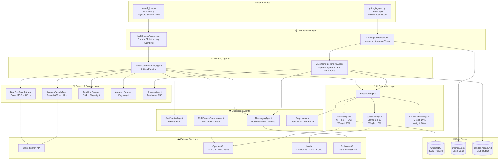

# 🎯 GAMEPLAN — AI Price Intelligence System (DACN3)

> **Master Context Document for AI Assistants**
> **Version:** 1.0 — March 2026
> **Author:** Phạm Minh Hiếu ([@Sunny-sunnyy](https://github.com/Sunny-sunnyy))
> **Last Updated:** 2026-03-05

---

## 1. Project Overview

### 1.1 Core Purpose

This is a **capstone project (DACN3 — Đồ Án Chuyên Ngành 3)** building an **AI-powered Multi-Agent System** for intelligent product deal hunting and price estimation. The system automatically searches, scrapes, analyzes, and estimates the true market value of products from **BestBuy** and **Amazon**, then notifies the user of exceptional deals.

### 1.2 Target Audience

| Attribute            | Detail                                                       |
| -------------------- | ------------------------------------------------------------ |
| **User**             | Student studying AI Engineering (AI/ML/DL focus)             |
| **OS**               | Linux (WSL2 on Windows)                                      |
| **IDE**              | VS Code with Cursor / Copilot / Claude extensions            |
| **Package Manager**  | **`uv`** (primary, mandatory), `npm`/`npx` for MCP servers   |
| **Python Version**   | 3.12+                                                        |
| **GPU**              | CUDA-capable GPU recommended (falls back to MPS → CPU)       |

### 1.3 Final Product

Two fully functional **Gradio web applications**:

1. **Multi-Source Deal Finder** (`search_key.py`) — User-driven keyword search across BestBuy + Amazon simultaneously, with AI clarification questions to refine the search.
2. **Autonomous Deal Hunter** (`price_is_right.py`) — Fully autonomous agent that runs every 5 minutes, scanning RSS feeds from DealNews.com, estimating product values, and sending push notifications for exceptional deals.

### 1.4 Main Features

- 🔍 **Parallel multi-source search** on BestBuy & Amazon via Brave Search API + MCP
- 🤖 **Clarification Agent** — Generates 3 smart questions to refine user intent before searching
- 🏷️ **Real-time sale filtering** with BeautifulSoup (BestBuy) and Playwright (Amazon)
- 🧠 **Ensemble AI Price Estimation** — 3 models combined: GPT-5.1 RAG (80%) + Fine-tuned Llama (10%) + PyTorch DNN (10%)
- 📲 **Automated push notifications** via Pushover API for deals exceeding discount thresholds
- 🔄 **Autonomous mode** — Periodic scanning with deduplication via `memory.json`
- 📊 **3D t-SNE visualization** of the ChromaDB product vector space

---

## 2. Directory Structure

```
tech2ai/                                    # Root project directory
│
├── .env                                    # ⚠️ API keys (GITIGNORED — NEVER COMMIT)
├── .gitignore                              # Ignore rules for .env, .pth, vectorstore, etc.
├── .python-version                         # Python version pin (3.12)
├── pyproject.toml                          # 📦 uv project config + all dependencies
├── uv.lock                                 # Lock file for reproducible installs
├── requirements.txt                        # Legacy pip requirements (backup)
├── environment.yml                         # Conda env definition (alternative)
├── package.json                            # Node.js config for MCP servers
├── README.md                               # 📖 Project README in Vietnamese
│
├── segment4/                               # 🎯 MAIN PROJECT DIRECTORY
│   │
│   ├── search_key.py                       # 🚀 Entry Point 1 — Multi-Source Deal Finder (Gradio)
│   ├── price_is_right.py                   # 🚀 Entry Point 2 — Autonomous Deal Hunter (Gradio)
│   ├── multi_source_framework.py           # 📦 Framework orchestrator (ChromaDB, lazy init)
│   ├── deal_agent_framework.py             # 📦 Framework for autonomous mode
│   │
│   ├── price_agents/                       # 🤖 ALL AI AGENTS
│   │   ├── agent.py                        # Base Agent class (logging, ANSI colors)
│   │   ├── deals.py                        # Pydantic models: Deal, DealSelection, Opportunity, ScrapedDeal
│   │   ├── multi_source_planning_agent.py  # 🧠 CORE: 6-step pipeline (search → estimate)
│   │   ├── planning_agent.py               # Simple planning agent (RSS mode)
│   │   ├── autonomous_planning_agent.py    # OpenAI Agents SDK autonomous planner
│   │   ├── ensemble_agent.py               # 🧪 Ensemble: combines 3 price estimation models
│   │   ├── frontier_agent.py               # GPT-5.1 + RAG (ChromaDB) — weight: 80%
│   │   ├── specialist_agent.py             # Fine-tuned Llama-3.2-3B on Modal — weight: 10%
│   │   ├── neural_network_agent.py         # PyTorch DNN (local) — weight: 10%
│   │   ├── deep_neural_network.py          # PyTorch model architecture (ResidualBlocks)
│   │   ├── preprocessor.py                 # Text normalization via LiteLLM
│   │   ├── scanner_agent.py                # RSS feed scanner (DealNews)
│   │   ├── bestbuy_scanner_agent.py        # BestBuy search via Brave MCP
│   │   ├── amazon_scanner_agent.py         # Amazon search via Brave MCP
│   │   ├── bestbuy_deals.py                # BestBuy scraping logic (Playwright + BS4)
│   │   ├── amazon_deals.py                 # Amazon scraping logic (Playwright)
│   │   └── messaging_agent.py              # Push notifications via Pushover
│   │
│   ├── bestbuy_untils/                     # 🛠️ UTILITY MODULES
│   │   ├── clarification_agent.py          # Generates 3 clarification questions
│   │   ├── unified_deal.py                 # UnifiedScrapedDeal — merges BB + AZ deals
│   │   ├── multi_source_scanner_agent.py   # Selects top 5 from unified pool
│   │   └── gradio_helpers.py               # UI helpers: logging, HTML formatters
│   │
│   ├── mo_ta_du_an/                        # 📚 PROJECT DOCUMENTATION (Vietnamese)
│   │   ├── COMPLETE_PROJECT_DOCUMENTATION.md
│   │   ├── DOCUMENTATION_SEARCHKEY.md
│   │   ├── DOCUMENTATION_PRICE_IS_RIGHT.md
│   │   └── READING_ROADMAP_SEARCHKEY.md
│   │
│   ├── ghi_chu/                            # 📝 Development notes & experiment notebooks
│   │   ├── test_chuc_nang/                 # Functional test notebooks (BestBuy)
│   │   ├── test_chuc_nang_v2/              # Functional test notebooks v2
│   │   ├── test_amazon/                    # Amazon integration test notebooks
│   │   └── price_agents/                   # Agent-specific test notes
│   │
│   ├── products_vectorstore/               # 🗄️ ChromaDB (800K+ products) — GITIGNORED
│   ├── deep_neural_network.pth             # 🧠 PyTorch model weights (~1.1GB) — GITIGNORED
│   ├── memory.json                         # 💾 Autonomous mode memory — GITIGNORED
│   ├── sandbox/                            # 📂 MCP filesystem sandbox
│   │   └── deals.md                        # Auto-generated deal summaries
│   │
│   ├── evaluator.py                        # 📊 Model evaluation with plotly charts
│   ├── testing.py                          # 📊 Model testing with matplotlib charts
│   ├── items.py                            # Item data class for training data
│   ├── pricer_service2.py                  # Modal deployment for fine-tuned Llama
│   ├── hello.py                            # Modal hello-world test
│   ├── keep_warm.py                        # Keep Modal container warm
│   └── log_utils.py                        # ANSI → HTML color conversion
│
├── tailieu/                                # 📄 Academic reports (DACN)
├── week7/                                  # 📓 Fine-tuning Llama notebooks
├── day_mcp/                                # 🧪 MCP protocol experiments
└── day_openai/                             # 🧪 OpenAI API experiments
```

### ⚠️ Critical Files

| File / Directory | Status | Note |
|---|---|---|
| `.env` | **GITIGNORED** | Contains all API keys. **NEVER** commit. |
| `products_vectorstore/` | **GITIGNORED** | ~800K product embeddings. Must be built locally. |
| `deep_neural_network.pth` | **GITIGNORED** | ~1.1GB PyTorch weights. Must be downloaded/trained. |
| `memory.json` | **GITIGNORED** | Runtime state for autonomous mode. |

---

## 3. Technology Stack & Core Architecture

### 3.1 Technology Stack

| Layer | Technology | Purpose |
|---|---|---|
| **UI** | Gradio 5.x | Interactive web interface with real-time logs |
| **Web Search** | Brave Search API + MCP Protocol | Product URL discovery |
| **Web Scraping** | Playwright (async) + BeautifulSoup4 | Product detail extraction |
| **LLM Orchestration** | OpenAI SDK, OpenAI Agents SDK, LiteLLM | Agent coordination |
| **LLM Models** | GPT-5.1, GPT-5-mini, GPT-5-nano | Estimation, selection, crafting |
| **Fine-tuned Model** | Llama-3.2-3B (LoRA, 4-bit NF4) | Price specialist on Modal |
| **Neural Network** | PyTorch DNN (10 layers, ResidualBlocks) | Local price estimation |
| **Vector DB** | ChromaDB (persistent) | 800K product embeddings for RAG |
| **Embeddings** | sentence-transformers/all-MiniLM-L6-v2 | Text → vector encoding |
| **Data Validation** | Pydantic v2 | Schema enforcement, structured outputs |
| **Notifications** | Pushover API | Mobile push alerts |
| **Text Preprocessing** | LiteLLM (Groq/Ollama/OpenAI) | Product description normalization |
| **Serverless GPU** | Modal | Host fine-tuned Llama on T4 GPU |
| **Package Manager** | **uv** (Python), npm (Node.js for MCP) | Dependency management |
| **Visualization** | Plotly, Matplotlib | 3D t-SNE, evaluation charts |

### 3.2 System Architecture Diagram



### 3.3 Core Architectural Decisions

| Decision | Rationale |
|---|---|
| **Multi-Agent Architecture** | Each agent has a single responsibility (search, scrape, estimate, notify). This enables parallel execution, easy testing, and independent evolution. |
| **Ensemble Pricing (3 Models)** | Combining GPT-5.1 RAG (accuracy), fine-tuned Llama (domain expertise), and DNN (speed) reduces variance. GPT dominates (80%) because it has RAG context from 800K products. |
| **MCP Protocol for Search** | Brave Search MCP servers provide a standardized tool interface for LLMs, enabling the search agents to be swapped or upgraded independently. |
| **ChromaDB for RAG** | Persistent, local vector store with 800K products enables fast similarity search without external DB dependencies. `sentence-transformers/all-MiniLM-L6-v2` provides high-quality embeddings. |
| **Modal for Fine-tuned Llama** | Running a 3B-parameter model with LoRA adapters requires GPU. Modal provides serverless T4 GPU with cold-start, keeping costs near zero when idle. |
| **Playwright over Selenium** | Async-native, modern API, better anti-detection, and native support for headless Chromium. Critical for Amazon scraping which requires JS rendering. |
| **Gradio over Streamlit** | Native support for generators (real-time log streaming), Plotly integration, and simpler event binding. |
| **Pydantic Structured Outputs** | OpenAI's `.parse()` with `response_format=PydanticModel` guarantees type-safe, validated JSON responses from LLMs. |

---

## 4. Development Workflow & Rules (CRITICAL)

### 4.1 ⚠️ STRICT RULES FOR AI ASSISTANTS

> **Read and follow these rules EXACTLY.** Violations will introduce bugs or break the project.

#### Package Management
- ✅ **ALWAYS** use `uv add <package>` to install new Python dependencies
- ✅ **ALWAYS** use `uv sync` to install from `pyproject.toml`
- ✅ **ALWAYS** use `uv run <script.py>` to run Python scripts
- ❌ **NEVER** use `pip install` directly
- ❌ **NEVER** modify `uv.lock` manually
- ❌ **NEVER** activate a venv manually — `uv run` handles this

#### Environment & Secrets
- ✅ **ALWAYS** load env vars with `load_dotenv(override=True)` at module level
- ✅ **ALWAYS** use `os.getenv("KEY")` to access secrets
- ❌ **NEVER** hardcode API keys, tokens, or credentials in source code
- ❌ **NEVER** commit `.env` to git (it is `.gitignored`)
- ⚠️ The `.env` file is at the **project root** (`tech2ai/.env`), NOT in `segment4/`

#### Code Style
- ✅ **ALWAYS** add **Type Hints** to function signatures and return types
- ✅ **ALWAYS** write **docstrings** for classes and public methods
- ✅ **ALWAYS** follow the existing **Agent base class** pattern (see Section 6)
- ✅ **ALWAYS** use `logging.info()` for operational messages, NEVER `print()`
- ✅ **ALWAYS** add `self.log()` messages in agents for pipeline traceability
- ❌ **NEVER** use bare `except:` — always catch specific exceptions

#### Architecture
- ✅ **ALWAYS** follow the **3-layer pattern**: `UI (Gradio) → Framework → Planning Agent`
- ✅ **ALWAYS** use **lazy initialization** for heavy objects (ChromaDB, models)
- ✅ **ALWAYS** use **Pydantic BaseModel** for LLM structured outputs
- ❌ **NEVER** put business logic in the Gradio UI file
- ❌ **NEVER** import directly from `ghi_chu/` — that's for development notes only

#### Git & Safety
- ✅ **ALWAYS** check `.gitignore` before creating new large files
- ❌ **NEVER** commit files matching: `*.pth`, `*.pkl`, `products_vectorstore/`, `memory.json`, `.env`
- ❌ **NEVER** run destructive commands without explicit user confirmation

### 4.2 Running the Applications

```bash
# Navigate to segment4 (required — relative imports depend on this)
cd segment4

# Run Multi-Source Deal Finder (keyword search mode)
uv run search_key.py
# Opens at http://127.0.0.1:7860

# Run Autonomous Deal Hunter (auto-scan every 5 minutes)
uv run price_is_right.py
# Opens at http://127.0.0.1:7860
```

### 4.3 Testing Strategy

| Test Type | Tool | Usage |
|---|---|---|
| **Quick smoke test** | `uv run search_key.py` | Verify app launches and UI renders |
| **Agent unit test** | Jupyter notebooks in `ghi_chu/` | Test individual agents (scraping, search) |
| **Evaluation** | `evaluator.py` / `testing.py` | Run 250-datapoint accuracy benchmarks |
| **Modal test** | `uv run hello.py` | Verify Modal connection |
| **Playwright test** | In notebooks in `ghi_chu/test_chuc_nang/` | Test scraping logic |

⚠️ **There is no automated test suite (pytest) yet.** Testing is manual via Gradio UI and Jupyter notebooks. When writing new features, always suggest creating a quick test script.

---

## 5. Implementation Roadmap / Guides

### Phase 1: Data Foundation
| Module | Files | Description |
|---|---|---|
| Data Models | `price_agents/deals.py` | Pydantic schemas: `Deal`, `DealSelection`, `Opportunity`, `ScrapedDeal` |
| Unified Deal | `bestbuy_untils/unified_deal.py` | `UnifiedScrapedDeal` — normalizes deals from BestBuy/Amazon into a common format |
| Items | `items.py` | Training data class for fine-tuning the Llama model |

### Phase 2: Scraping & Search
| Module | Files | Description |
|---|---|---|
| BestBuy Scraper | `price_agents/bestbuy_deals.py` | BeautifulSoup for sale filtering, Playwright for detail scraping |
| Amazon Scraper | `price_agents/amazon_deals.py` | Full Playwright pipeline for sale filtering + detail scraping |
| BestBuy Search | `price_agents/bestbuy_scanner_agent.py` | Brave MCP → product URL discovery |
| Amazon Search | `price_agents/amazon_scanner_agent.py` | Brave MCP → product URL discovery |
| RSS Scanner | `price_agents/scanner_agent.py` | DealNews RSS feed parser |

### Phase 3: AI Estimation Engine
| Module | Files | Description |
|---|---|---|
| Frontier (RAG) | `price_agents/frontier_agent.py` | GPT-5.1 + ChromaDB similarity search (5 neighbors) |
| Specialist | `price_agents/specialist_agent.py` + `pricer_service2.py` | Fine-tuned Llama-3.2-3B on Modal (T4 GPU, 4-bit NF4 quantization) |
| Neural Network | `price_agents/neural_network_agent.py` + `price_agents/deep_neural_network.py` | PyTorch DNN with ResidualBlocks, HashingVectorizer |
| Ensemble | `price_agents/ensemble_agent.py` | Weighted combination: `price = frontier × 0.8 + specialist × 0.1 + neural × 0.1` |
| Preprocessor | `price_agents/preprocessor.py` | Text normalization via LiteLLM before estimation |

### Phase 4: Orchestration & Agents
| Module | Files | Description |
|---|---|---|
| Clarification | `bestbuy_untils/clarification_agent.py` | GPT-5-mini generates 3 questions + builds refined search query |
| Multi-Source Scanner | `bestbuy_untils/multi_source_scanner_agent.py` | GPT-5-mini selects top 5 deals from combined pool |
| Multi-Source Planner | `price_agents/multi_source_planning_agent.py` | **CORE** — 6-step pipeline orchestrator |
| Autonomous Planner | `price_agents/autonomous_planning_agent.py` | OpenAI Agents SDK with function tools |
| Messaging | `price_agents/messaging_agent.py` | Pushover push notifications with GPT-crafted messages |

### Phase 5: Application Layer
| Module | Files | Description |
|---|---|---|
| Framework (Search) | `multi_source_framework.py` | ChromaDB init, lazy agent init, high-level API |
| Framework (Auto) | `deal_agent_framework.py` | Memory management, t-SNE visualization, auto-run |
| Gradio UI (Search) | `search_key.py` | App class, event handlers, real-time log streaming |
| Gradio UI (Auto) | `price_is_right.py` | App class, timer-based auto-run, 3D plot |
| UI Helpers | `bestbuy_untils/gradio_helpers.py` | QueueHandler, HTML formatters, table builders |

### Phase 6: Evaluation & Deployment
| Module | Files | Description |
|---|---|---|
| Evaluator | `evaluator.py` | Plotly-based accuracy charts (scatter + error trend) |
| Tester | `testing.py` | Matplotlib-based testing |
| Modal Deploy | `pricer_service2.py` | `modal deploy pricer_service2.py` |
| Keep Warm | `keep_warm.py` | Prevent Modal cold starts |

---

## 6. Code Style & Idiomatic Patterns

### 6.1 Agent Base Class Pattern

All agents extend the `Agent` base class for consistent logging:

```python
# price_agents/agent.py — Base class
class Agent:
    """Abstract superclass for all agents."""
    RED = '\033[31m'
    GREEN = '\033[32m'
    # ... other ANSI colors
    RESET = '\033[0m'
    
    name: str = ""
    color: str = '\033[37m'

    def log(self, message):
        color_code = self.BG_BLACK + self.color
        message = f"[{self.name}] {message}"
        logging.info(color_code + message + self.RESET)
```

**✅ The correct way to create a new agent:**
```python
from price_agents.agent import Agent

class MyNewAgent(Agent):
    name = "My Agent"           # Required: identifies agent in logs
    color = Agent.CYAN          # Required: ANSI color for log messages
    MODEL = "gpt-5-mini"       # Convention: define model as class constant

    def __init__(self):
        self.log("My Agent is initializing")
        # ... setup
        self.log("My Agent is ready")

    def some_action(self, param: str) -> float:
        """
        Describe what this does.
        
        Args:
            param: description
            
        Returns:
            float: description
        """
        self.log("My Agent is performing action")
        result = ...
        self.log(f"My Agent completed - result: {result}")
        return result
```

### 6.2 Pydantic Structured Outputs Pattern

Use OpenAI's `.parse()` with Pydantic models for guaranteed type-safe LLM responses:

```python
from pydantic import BaseModel, Field
from openai import OpenAI

class MyOutput(BaseModel):
    """Pydantic model defining expected LLM output shape."""
    name: str = Field(description="Product name")
    price: float = Field(description="Price in USD, must be > 0")

# ✅ Correct — structured output
result = self.openai.chat.completions.parse(
    model="gpt-5-mini",
    messages=[
        {"role": "system", "content": SYSTEM_PROMPT},
        {"role": "user", "content": user_prompt},
    ],
    response_format=MyOutput,       # Pass Pydantic class
)
parsed = result.choices[0].message.parsed  # Already a MyOutput instance!
```

### 6.3 Three-Layer Architecture Pattern

```
┌────────────────────────────────┐
│ UI Layer (Gradio App)          │  search_key.py / price_is_right.py
│  - Event handlers              │  - No business logic here
│  - Real-time log streaming     │  - Only Gradio components
│  - Table/HTML formatters       │
├────────────────────────────────┤
│ Framework Layer                │  multi_source_framework.py / deal_agent_framework.py
│  - ChromaDB initialization     │  - Lazy agent init
│  - High-level API methods      │  - Memory management
├────────────────────────────────┤
│ Agent Layer                    │  price_agents/*.py + bestbuy_untils/*.py
│  - Pipeline logic              │  - Search, scrape, estimate, notify
│  - Individual agent actions    │  - Each agent = single responsibility
└────────────────────────────────┘
```

**✅ Correct — Framework delegates to PlanningAgent:**
```python
class MultiSourceFramework:
    def run(self, keyword: str, max_urls: int = 10) -> List[Opportunity]:
        self.init_agents_as_needed()  # Lazy init
        return self.planner.plan(keyword, max_urls)  # Delegate to agent
```

**❌ Wrong — putting pipeline logic in Framework or UI:**
```python
# DON'T do this:
class MultiSourceFramework:
    def run(self, keyword):
        urls = brave_search(keyword)     # ← Business logic in framework!
        products = scrape(urls)          # ← Should be in PlanningAgent
```

### 6.4 Brave MCP Server Pattern

Use the OpenAI Agents SDK with `MCPServerStdio` for web search:

```python
from agents import Agent, Runner
from agents.mcp import MCPServerStdio

async def _search_async(self, keyword: str) -> List[str]:
    async with MCPServerStdio(
        params={
            "command": "npx",
            "args": ["-y", "@modelcontextprotocol/server-brave-search"],
            "env": {"BRAVE_API_KEY": self.brave_api_key}
        },
        client_session_timeout_seconds=60
    ) as brave_server:
        search_agent = Agent(
            name="SearchAgent",
            instructions=self.INSTRUCTIONS,
            model="gpt-5-nano",             # Use cheapest model for search
            mcp_servers=[brave_server],
            output_type=SearchResults        # Pydantic structured output
        )
        result = await Runner.run(search_agent, f"Search for {keyword}", max_turns=30)
        return result.final_output.product_urls
```

### 6.5 Ensemble Pricing Pattern

```python
class EnsembleAgent(Agent):
    def price(self, description: str) -> float:
        rewrite = self.preprocessor.preprocess(description)  # Normalize text first
        specialist = self.specialist.price(rewrite)           # Modal remote call
        frontier = self.frontier.price(rewrite)               # GPT-5.1 + RAG
        neural_network = self.neural_network.price(rewrite)   # Local PyTorch DNN
        combined = frontier * 0.8 + specialist * 0.1 + neural_network * 0.1
        return combined
```

### 6.6 Device Auto-Detection Pattern (PyTorch)

```python
if torch.cuda.is_available():
    self.device = torch.device("cuda")
elif torch.backends.mps.is_available():
    self.device = torch.device("mps")
else:
    self.device = torch.device("cpu")
logging.info(f"Neural Network is using {self.device}")
```

---

## 7. Common Issues & Troubleshooting

> ⚠️ **INSTRUCTION FOR AI ASSISTANTS:** When encountering an error, **diagnose first**. Read the full stack trace, check logs, and **NEVER jump to writing defensive code without understanding the root cause.**

### 7.1 API Key Issues

| Symptom | Root Cause | Solution |
|---|---|---|
| `AuthenticationError: Incorrect API key` | `.env` file missing or not loaded | 1. Verify `.env` exists at project root (`tech2ai/.env`)<br>2. Ensure `load_dotenv(override=True)` is called<br>3. Check key format: `OPENAI_API_KEY=sk-proj-...` |
| `BRAVE_API_KEY not found` | Missing Brave API key | 1. Get key from [brave.com/search/api](https://brave.com/search/api)<br>2. Add `BRAVE_API_KEY=BSA-...` to `.env` |
| `RateLimitError` | OpenAI rate limit exceeded | 1. Wait 60s and retry<br>2. Switch to a cheaper model (`gpt-5-nano`)<br>3. Reduce `max_urls` parameter |

### 7.2 Playwright / Scraping Issues

| Symptom | Root Cause | Solution |
|---|---|---|
| `Playwright browsers not installed` | Missing Chromium | Run `uv run playwright install chromium` |
| `TimeoutError` during scraping | Page load too slow or changed | 1. Increase timeout in Playwright calls<br>2. Check if the target site changed its HTML structure<br>3. Try with `headless=False` for debugging |
| `Amazon blocks scraping` | Anti-bot detection | 1. Add random delays between requests<br>2. Rotate user agents<br>3. Use `headless=False` mode |
| `BestBuy returns empty results` | URL pattern changed | Check if `bestbuy.com/product/` URL structure is still valid |

### 7.3 ChromaDB Issues

| Symptom | Root Cause | Solution |
|---|---|---|
| `ValueError: collection products not found` | `products_vectorstore/` is empty | 1. Ensure `products_vectorstore/` directory exists<br>2. Run the dataset ingestion notebook to build the vector store |
| `ChromaDB takes too long to load` | Large collection (800K+ docs) | 1. This is expected on first load (~30-60s)<br>2. Subsequent loads use cache |
| `Embedding dimension mismatch` | Wrong embedding model | Ensure `sentence-transformers/all-MiniLM-L6-v2` is used consistently |

### 7.4 Modal / Fine-tuned Model Issues

| Symptom | Root Cause | Solution |
|---|---|---|
| `Modal: lookup failed for pricer-service` | Service not deployed | Run `modal deploy pricer_service2.py` |
| `Modal cold start takes 60s+` | Container spun down | 1. Use `keep_warm.py` to prevent cold starts<br>2. Set `MIN_CONTAINERS = 1` in `pricer_service2.py` (costs money) |
| `CUDA out of memory on Modal` | T4 GPU is 16GB | 1. Verify 4-bit quantization is enabled<br>2. Check `BitsAndBytesConfig` settings |

### 7.5 MCP / Node.js Issues

| Symptom | Root Cause | Solution |
|---|---|---|
| `npx: command not found` | Node.js not installed | Install Node.js 18+: `sudo apt install nodejs npm` |
| `MCP server timeout` | Server didn't start in time | 1. Increase `client_session_timeout_seconds`<br>2. Check if `npx` can run: `npx -y @modelcontextprotocol/server-brave-search --help` |
| `EACCES permission denied` | npm permissions | Run `npm config set prefix ~/.npm-global` and update PATH |

### 7.6 Gradio / UI Issues

| Symptom | Root Cause | Solution |
|---|---|---|
| `Port 7860 already in use` | Previous instance still running | 1. Kill the process: `lsof -i :7860 \| kill`<br>2. Or change port: `ui.launch(server_port=7861)` |
| `Logs not updating in real-time` | QueueHandler not set up | Ensure `setup_logging(log_queue)` is called before pipeline starts |
| `plt.show() hangs` | Running via SSH without display | Use `plt.savefig("output.png")` instead |

### 7.7 PyTorch / DNN Issues

| Symptom | Root Cause | Solution |
|---|---|---|
| `FileNotFoundError: deep_neural_network.pth` | Model weights file missing | 1. Download the pre-trained weights<br>2. Or re-train from the training notebook |
| `RuntimeError: CUDA not available` | No GPU or drivers missing | 1. System will fallback to CPU automatically<br>2. Check CUDA: `python -c "import torch; print(torch.cuda.is_available())"` |
| `Prediction returns 0.0` | Model loaded on wrong device | Ensure `model.to(self.device)` is called after `load_state_dict()` |

---

## 💡 Quick Reference

### Cost per Run

| Component | Model | Cost |
|---|---|---|
| Search Agents (×2) | GPT-5-nano | ~$0.001 |
| Clarification | GPT-5-nano | ~$0.001 |
| Select top 5 | GPT-5-mini | ~$0.002 |
| Estimate (×5) | GPT-5.1 | ~$0.005 |
| Preprocess | Groq/Ollama | ~$0 |
| **Total** | | **~$0.01/run** |

### Key Commands

```bash
# Install all dependencies
uv sync

# Install Playwright browsers
uv run playwright install chromium

# Run keyword search app
uv run search_key.py

# Run autonomous agent
uv run price_is_right.py

# Deploy fine-tuned model to Modal
uv run modal deploy pricer_service2.py

# Test Modal connection
uv run hello.py

# Keep Modal warm (run in background)
uv run keep_warm.py
```

---

*This document is designed to be consumed by AI assistants. Keep it updated whenever significant architectural changes are made.*
