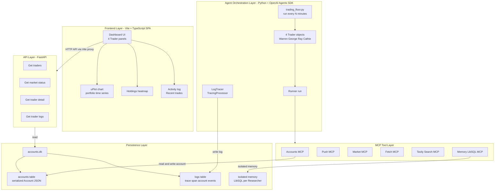
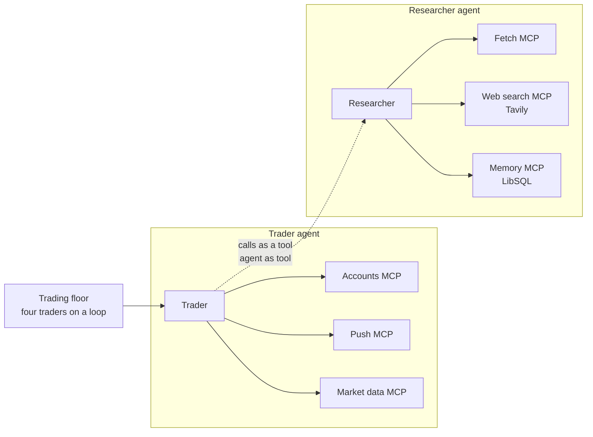
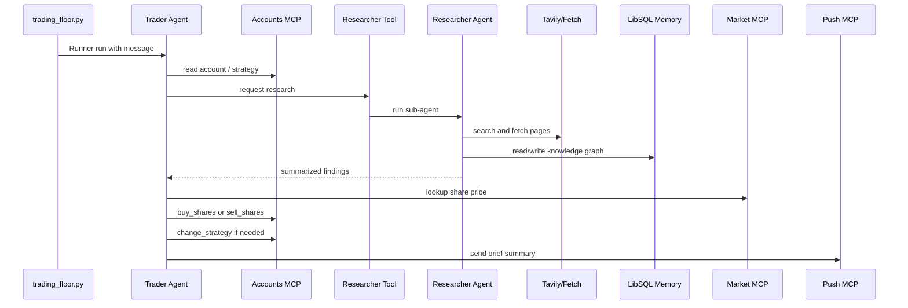
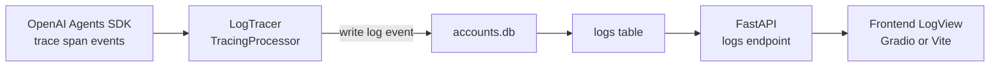
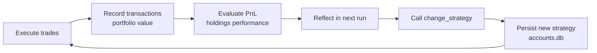
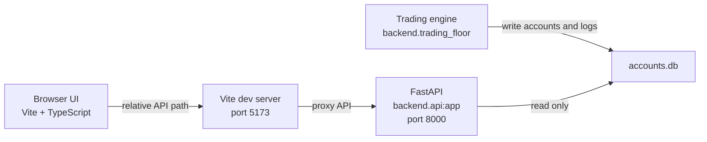
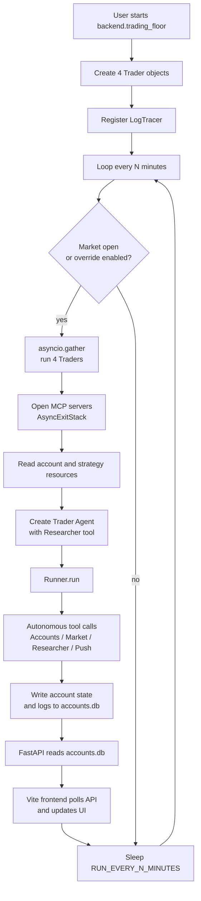

# Readme Project Codex - Autonomous AI Trading Floor

## 1. Tổng Quan Dự Án

**Autonomous AI Trading Floor** là dự án capstone của phần MCP trong khóa **AI Engineer Agentic Track**. Dự án mô phỏng một sàn giao dịch cổ phiếu tự trị, nơi nhiều AI Agent tự nghiên cứu thị trường, đọc tin tức, quản lý tài khoản, ra quyết định mua/bán, ghi log hoạt động và hiển thị kết quả lên dashboard.

Dự án này không nhằm tạo một bot đầu tư thật. Mục tiêu chính là giúp người học hiểu cách xây dựng một hệ thống **Agentic AI end-to-end** có đầy đủ các thành phần quan trọng:

- Multi-Agent system.
- Model Context Protocol (MCP).
- OpenAI Agents SDK.
- Agent-as-tool pattern.
- Workflow orchestration bằng Python code.
- LLM orchestration bằng autonomous tool calling.
- Long-term memory tách biệt theo từng Agent.
- Observability bằng custom `TracingProcessor`.
- Activity logging ra SQLite và UI.
- Feedback loop cho phép Agent tự đánh giá và cập nhật chiến lược.
- API backend bằng FastAPI.
- Frontend sản xuất bằng Vite + TypeScript.

**Cảnh báo giáo dục:** Không dùng dự án này để đưa ra quyết định đầu tư thật, không giao dịch tiền thật dựa trên output của Agent. Dự án chỉ phù hợp cho học tập, paper trading, mô phỏng và nghiên cứu hệ thống Agent.

## 2. Sản Phẩm Đạt Được

Sau Day 4 và Day 5, project tạo ra một hệ thống hoàn chỉnh gồm:

- 4 Trader Agent chạy độc lập: `Warren`, `George`, `Ray`, `Cathie`.
- Mỗi Trader có tài khoản riêng trong SQLite `accounts.db`.
- Mỗi Trader có chiến lược đầu tư riêng và có quyền tự cập nhật chiến lược bằng tool `change_strategy`.
- Mỗi Trader có một Researcher Agent riêng, được bọc thành tool bằng `agent.as_tool()`.
- 6 nhóm MCP server cung cấp công cụ cho Agent:
  - Accounts MCP server.
  - Push notification MCP server.
  - Market data MCP server.
  - Fetch MCP server.
  - Tavily Search MCP server.
  - Memory LibSQL MCP server.
- Scheduler chạy 4 Trader song song bằng `asyncio.gather`.
- Custom tracer `LogTracer` ghi trace/span hoạt động của Agent vào SQLite.
- Dashboard prototype bằng Gradio trong `app.py` và `demo/`.
- API backend read-only bằng FastAPI trong `backend/api.py`.
- Frontend sản xuất bằng Vite + TypeScript trong `frontend/`.

## 3. Mục Đích Và Nhiệm Vụ Chính

Dự án minh họa cách xây dựng một **vertical Agent system** cho domain tài chính. Thay vì làm chatbot tổng quát, hệ thống giải quyết một workflow nghiệp vụ cụ thể:

1. Đọc trạng thái tài khoản và chiến lược đầu tư.
2. Nghiên cứu tin tức tài chính mới.
3. Tìm cơ hội đầu tư phù hợp với phong cách từng trader.
4. Tra cứu giá thị trường thật hoặc giá mô phỏng.
5. Mua/bán cổ phiếu trong tài khoản mô phỏng.
6. Ghi lịch sử giao dịch, PnL và portfolio value.
7. Ghi log mọi bước hoạt động của Agent.
8. Hiển thị dashboard để người học quan sát.
9. Cho phép Agent tự đánh giá hiệu quả và cập nhật chiến lược.

Điểm quan trọng của dự án là tư duy **Agentic Engineering**: bắt đầu bằng workflow rõ ràng, đo lường kết quả, quan sát trace, rồi mới mở rộng quyền tự trị của LLM.

## 4. Kiến Trúc Tổng Thể End-to-End

Dự án được chia thành 5 layer chính:



Hệ thống có hai giao diện:

- **Gradio dashboard:** prototype nội bộ, chạy bằng `uv run app.py`, đọc `accounts.db` trực tiếp trong Python process.
- **Production frontend:** Vite + TypeScript SPA, chạy riêng, chỉ đọc dữ liệu qua FastAPI.

## 5. Kiến Trúc Agent Theo Hình Tham Khảo

Hình gốc trong notebook mô tả một trading floor chạy 4 Trader theo vòng lặp. Mỗi Trader có 3 MCP server riêng cho giao dịch, và gọi Researcher Agent như một tool. Researcher lại có 3 MCP server riêng để nghiên cứu.


Mermaid diagram tương ứng:



Một điểm thiết kế quan trọng: cách chia Trader và Researcher không chỉ bắt chước tổ chức con người. Mục tiêu chính là **context engineering**:

- Trader chỉ giữ context liên quan tới tài khoản, chiến lược và quyết định giao dịch.
- Researcher giữ context nặng hơn: web search, fetched pages, long-term memory.
- Trader nhận kết quả nghiên cứu đã tóm tắt, không phải xử lý toàn bộ nội dung web thô.

## 6. Cấu Trúc Thư Mục Core

```text
6_mcp/
├── 4_lab4.ipynb
├── 5_lab5.ipynb
├── app.py
├── accounts.db
├── backend/
│   ├── accounts.py
│   ├── accounts_client.py
│   ├── accounts_server.py
│   ├── api.py
│   ├── database.py
│   ├── market.py
│   ├── market_server.py
│   ├── market_simulator.py
│   ├── mcp_servers.py
│   ├── push_server.py
│   ├── reset.py
│   ├── templates.py
│   ├── tracers.py
│   ├── traders.py
│   └── trading_floor.py
├── demo/
│   ├── ui.py
│   └── util.py
├── frontend/
│   ├── index.html
│   ├── package.json
│   ├── package-lock.json
│   ├── tsconfig.json
│   ├── vite.config.ts
│   └── src/
│       ├── api.ts
│       ├── chart.ts
│       ├── heatmap.ts
│       ├── log.ts
│       ├── main.ts
│       ├── panel.ts
│       ├── state.ts
│       ├── styles.css
│       ├── theme.ts
│       └── transactions.ts
├── memory/
│   ├── memory.json
│   └── memory.txt
└── tai_lieu/
    ├── day4_summary.md
    ├── day5_summary.md
    └── Readme_Project_Codex.md
```

`community_contributions/` không thuộc phạm vi core project của tài liệu này.

## 7. Các Agent Chính

### 7.1 Trader Agent

Trader Agent là Agent ra quyết định giao dịch. Có 4 Trader:

| Trader | Persona | Chiến lược |
|---|---|---|
| Warren | Warren Buffett | Đầu tư giá trị dài hạn, ưu tiên công ty chất lượng |
| George | George Soros | Macro trader, contrarian, tìm mispricing lớn |
| Ray | Ray Dalio | Systematic, risk parity, đa dạng hóa |
| Cathie | Cathie Wood | Disruptive innovation, crypto ETFs, công nghệ đột phá |

Mỗi Trader có:

- `name`, `lastname`, `model_name`.
- Một `Account` riêng trong `accounts.db`.
- Một system prompt được tạo từ `trader_instructions(name)`.
- Các MCP server của trader:
  - Accounts server.
  - Push server.
  - Market server.
- Một Researcher Agent riêng được bọc thành tool `Researcher`.

Trong `backend/traders.py`, class `Trader` điều phối một lượt chạy:

1. Mở MCP server bằng `AsyncExitStack`.
2. Tạo Researcher tool.
3. Tạo Trader `Agent`.
4. Đọc account report và strategy qua MCP resources.
5. Chọn prompt `trade_message` hoặc `rebalance_message`.
6. Gọi `Runner.run(...)`.
7. Ghi trace bằng `trace(...)`.
8. Đảo `self.do_trade` để lần sau chuyển giữa trade và rebalance.

### 7.2 Researcher Agent

Researcher Agent không giao dịch. Nhiệm vụ của nó là nghiên cứu:

- Search web bằng Tavily.
- Fetch nội dung trang web.
- Lưu tri thức vào knowledge graph memory.
- Đọc lại tri thức đã lưu.
- Tóm tắt kết quả cho Trader.

Researcher được tạo trong `get_researcher(...)`:

```python
researcher = Agent(
    name="Researcher",
    instructions=researcher_instructions(),
    model=get_model(model_name),
    mcp_servers=mcp_servers,
)
```

Sau đó được bọc thành tool:

```python
return researcher.as_tool(
    tool_name="Researcher",
    tool_description=research_tool(),
)
```

Đây là pattern **Agent-as-Tool**. Trader không mất quyền điều khiển hội thoại chính; Trader chỉ gọi Researcher như một tool, nhận lại output tóm tắt và tiếp tục tự quyết định.

## 8. MCP Server Và Công Cụ

### 8.1 Accounts MCP Server

File: `backend/accounts_server.py`

Server dùng `FastMCP("accounts_server")`, chạy qua stdio. Công cụ:

- `get_balance(name: str) -> float`
- `get_holdings(name: str) -> dict[str, int]`
- `buy_shares(name: str, symbol: str, quantity: int, rationale: str) -> str`
- `sell_shares(name: str, symbol: str, quantity: int, rationale: str) -> str`
- `change_strategy(name: str, strategy: str) -> str`

Resources:

- `accounts://accounts_server/{name}`: trả về account report dạng JSON.
- `accounts://strategy/{name}`: trả về strategy hiện tại.

Accounts server là cầu nối giữa Agent và database tài khoản. Agent không sửa SQLite trực tiếp; Agent gọi tool MCP.

### 8.2 Market MCP Server

File: `backend/market_server.py`

Tool:

- `lookup_share_price(symbol: str) -> float`

Giá cổ phiếu được lấy từ `backend/market.py`. Nếu có `MASSIVE_API_KEY`, hệ thống thử gọi Massive API. Nếu không có key hoặc API lỗi, fallback sang simulator.

### 8.3 Market Simulator

File: `backend/market_simulator.py`

Simulator tạo giá cổ phiếu có vẻ tự nhiên bằng smooth value noise:

- Seed ổn định từ ticker bằng SHA-256.
- Base price tính từ seed.
- Time-based smooth noise theo ngày từ epoch `2025-01-01`.
- Nhiều octave để tạo trend và intraday wiggle.

Kết quả: cùng ticker và timestamp sẽ cho giá lặp lại được, nhưng giá vẫn thay đổi mềm theo thời gian.

### 8.4 Push MCP Server

File: `backend/push_server.py`

Tool:

- `push(args: PushModelArgs) -> str`

Tool gửi notification qua Pushover API bằng `PUSHOVER_USER` và `PUSHOVER_TOKEN`. Trong mỗi chu kỳ, prompt yêu cầu Trader gửi thông báo ngắn sau khi giao dịch xong.

### 8.5 Fetch MCP Server

Tạo trong `backend/mcp_servers.py`:

```python
fetch = MCPServerStdio(
    {"command": "uvx", "args": ["mcp-server-fetch"]},
    client_session_timeout_seconds=TIMEOUT,
)
```

Fetch server cho Researcher đọc nội dung trang web.

### 8.6 Tavily Search MCP Server

Tạo trong `backend/mcp_servers.py`:

```python
search = MCPServerStdio(
    {"command": "npx", "args": ["-y", "tavily-mcp@latest"], "env": tavily_env},
    client_session_timeout_seconds=TIMEOUT,
    tool_filter=create_static_tool_filter(allowed_tool_names=["tavily_search"]),
)
```

Tavily server có nhiều tool, nhưng dự án dùng `create_static_tool_filter(...)` để chỉ cho phép `tavily_search`. Đây là một kỹ thuật **context engineering**: giảm tool surface, giúp Researcher nhanh và tập trung hơn.

### 8.7 Memory LibSQL MCP Server

Tạo trong `backend/mcp_servers.py`:

```python
memory = MCPServerStdio(
    {
        "command": "npx",
        "args": ["-y", "mcp-memory-libsql"],
        "env": {"LIBSQL_URL": f"file:./memory/{name}.db"},
    },
    client_session_timeout_seconds=TIMEOUT,
)
```

Mỗi Researcher có file memory riêng, ví dụ:

- `memory/Warren.db`
- `memory/George.db`
- `memory/Ray.db`
- `memory/Cathie.db`

Trong repo hiện tại cũng có `memory/memory.json` và `memory/memory.txt` như dấu vết từ các lab memory cũ. Core project Day 4/5 đã nâng cấp sang `mcp-memory-libsql` cho Researcher.

## 9. Information Leakage Và Cách Khắc Phục

**Information leakage** là hiện tượng tri thức của Agent này bị Agent khác đọc được ngoài ý muốn.

Trong dự án này, leakage có thể xảy ra nếu 4 Researcher dùng chung một file memory:

- Researcher của Warren lưu nghiên cứu về cổ phiếu giá trị.
- Researcher của George đọc lại tri thức của Warren.
- George bắt đầu quyết định giống Warren.
- Các chiến lược hội tụ, làm mất tính đa dạng của multi-agent system.

Cách khắc phục trong core project:

1. Mỗi Trader có Researcher riêng.
2. Mỗi Researcher được truyền `name` riêng.
3. Memory MCP server dùng `LIBSQL_URL=file:./memory/{name}.db`.
4. Tri thức dài hạn được cô lập theo từng Agent.

Giá trị engineering của thiết kế này:

- Giảm leakage giữa các chiến lược.
- Giảm rủi ro conflict khi ghi memory đồng thời.
- Tốt hơn file JSON chung vì LibSQL/SQLite phù hợp hơn cho truy cập có cấu trúc.
- Dễ mở rộng lên cloud/edge LibSQL nếu cần.

## 10. Cơ Chế Lập Trình Bất Đồng Bộ Và Bất Tuần Tự

Dự án dùng bất đồng bộ ở cả backend Python và frontend TypeScript.

### 10.1 Python `async/await`

Trong `backend/traders.py`, các hàm chính là async:

- `get_researcher(...)`
- `get_researcher_tool(...)`
- `Trader.create_agent(...)`
- `Trader.get_account_report(...)`
- `Trader.run_agent(...)`
- `Trader.run_with_mcp_servers(...)`
- `Trader.run_with_trace(...)`
- `Trader.run(...)`

Lý do cần async:

- Gọi LLM qua OpenAI Agents SDK là I/O bound.
- Kết nối MCP server qua stdio là I/O bound.
- Researcher có thể gọi web search/fetch.
- Trader có nhiều subprocess MCP cần mở/dọn dẹp đúng cách.

### 10.2 `AsyncExitStack`

Mỗi Trader cần mở nhiều async context manager:

- Trader MCP servers: accounts, push, market.
- Researcher MCP servers: fetch, Tavily, memory.

`AsyncExitStack` cho phép mở một danh sách context manager động, rồi tự động cleanup khi scope kết thúc:

```python
async with AsyncExitStack() as stack:
    trader_servers = [
        await stack.enter_async_context(server) for server in trader_mcp_servers()
    ]
    researcher_servers = [
        await stack.enter_async_context(server)
        for server in researcher_mcp_servers(self.name)
    ]
    await self.run_agent(trader_servers, researcher_servers)
```

Đây là kỹ thuật quan trọng khi số lượng server không phải một context cố định có thể viết tay bằng nhiều `async with`.

### 10.3 `asyncio.gather`

File: `backend/trading_floor.py`

Scheduler chạy 4 Trader song song:

```python
await asyncio.gather(*[trader.run() for trader in traders])
```

Nếu chạy tuần tự, hệ thống phải đợi Warren xong mới đến George, Ray, Cathie. Với `asyncio.gather`, 4 Trader cùng bắt đầu trong một chu kỳ, phù hợp với tính chất I/O bound của Agent tool calling.

### 10.4 Frontend Async Polling

File: `frontend/src/main.ts`

Frontend dùng:

- `setInterval(pollData, 6000)` để cập nhật portfolio mỗi 6 giây.
- `setInterval(pollLogs, 2000)` để cập nhật log mỗi 2 giây.
- `Promise.all(...)` để fetch dữ liệu cho nhiều Trader song song.

Điều này giúp UI không bị block và 4 panel cập nhật độc lập.

## 11. Mixed Orchestration: Code Workflow Và LLM Autonomy

Dự án không để LLM tự làm mọi thứ. Nó kết hợp hai kiểu điều phối.

### 11.1 Code Orchestration

Code quyết định những việc cần deterministic:

- Tạo danh sách 4 Trader.
- Chọn model theo `USE_MANY_MODELS`.
- Đăng ký `LogTracer`.
- Kiểm tra market open/closed.
- Lập lịch chạy mỗi `RUN_EVERY_N_MINUTES`.
- Chạy 4 Trader song song bằng `asyncio.gather`.
- Đảo giữa trade và rebalance bằng `self.do_trade = not self.do_trade`.

Đây là phần workflow cần ổn định, tránh để Agent tự chạy vô hạn và đốt API usage.

### 11.2 LLM Orchestration

LLM quyết định những việc cần linh hoạt:

- Có nên gọi Researcher không.
- Search query nên là gì.
- Cần đọc website nào.
- Có cần mua/bán/giữ không.
- Symbol nào phù hợp với chiến lược.
- Số lượng cổ phiếu cần mua/bán.
- Có nên gọi `change_strategy` để cập nhật chiến lược không.
- Nội dung push notification.

Đây là phần autonomy. LLM được cấp tool và context, rồi tự tạo chuỗi tool call.

## 12. Autonomous Tool Chaining

**Autonomous tool chaining** là khả năng Agent tự gọi liên tiếp nhiều tool để đạt mục tiêu.



Trong Day 5 summary, trace thực tế của George được dùng để minh họa: George có thể gọi nhiều tool trong một chu kỳ, thậm chí gọi Researcher hơn một lần với query khác nhau. Điểm quan trọng là con người không hard-code “gọi Researcher 2 lần”; Agent tự quyết định dựa trên lập luận và kết quả trung gian.

## 13. Data Model Và Persistence

### 13.1 SQLite `accounts.db`

File: `backend/database.py`

Database mặc định:

```python
DB = "accounts.db"
```

Khi import module, code tạo 2 bảng nếu chưa có:

```sql
CREATE TABLE IF NOT EXISTS accounts (
    name TEXT PRIMARY KEY,
    account TEXT
)
```

```sql
CREATE TABLE IF NOT EXISTS logs (
    id INTEGER PRIMARY KEY AUTOINCREMENT,
    name TEXT,
    datetime DATETIME,
    type TEXT,
    message TEXT
)
```

Bảng `accounts` lưu serialized JSON của `Account`.

Bảng `logs` lưu activity log của Agent, account event và trace/span event.

### 13.2 Account Model

File: `backend/accounts.py`

`Account` là Pydantic model:

- `name: str`
- `balance: float`
- `strategy: str`
- `holdings: dict[str, int]`
- `transactions: list[Transaction]`
- `portfolio_value_time_series: list[tuple[str, float]]`

`Transaction` gồm:

- `symbol`
- `quantity`
- `price`
- `timestamp`
- `rationale`

Quy tắc giao dịch:

- `buy_shares` lấy giá từ `get_share_price`, thêm spread mua `SPREAD = 0.002`, trừ tiền, tăng holdings, ghi transaction, save DB, ghi log.
- `sell_shares` kiểm tra đủ số lượng, lấy giá, trừ spread bán, giảm holdings, cộng tiền, ghi transaction, save DB, ghi log.
- `report` tính portfolio value, append vào time series, tính PnL, ghi log `Retrieved account details`, trả JSON.
- `change_strategy` ghi đè strategy và log `Changed strategy`.

### 13.3 Reset State

File: `backend/reset.py`

`reset_traders()` đưa 4 account về:

- Balance: `$10,000`.
- Holdings rỗng.
- Transactions rỗng.
- Portfolio time series rỗng.
- Strategy ban đầu theo persona.

Notebook `4_lab4.ipynb` comment dòng reset để tránh vô tình xóa lịch sử trader đang có.

## 14. TracingProcessor Và External Activity Logging

### 14.1 `make_trace_id`

File: `backend/tracers.py`

`make_trace_id(tag)` tạo ID dạng:

```text
trace_<tag>0<random_suffix>
```

Ví dụ:

```text
trace_warren0abc123...
```

Ký tự `0` được dùng như delimiter để `LogTracer` tách tên Agent ra khỏi random suffix.

### 14.2 `LogTracer`

`LogTracer` kế thừa `TracingProcessor` của OpenAI Agents SDK và override:

- `on_trace_start`
- `on_trace_end`
- `on_span_start`
- `on_span_end`
- `force_flush`
- `shutdown`

`force_flush` và `shutdown` hiện là no-op vì tracer không giữ buffer riêng; mỗi event ghi thẳng vào SQLite.

### 14.3 Luồng Ghi Log Ra Bên Ngoài



Đây là kỹ thuật **externalizing Agent logs**: thay vì chỉ xem trace trên OpenAI platform, dự án đưa event vào database riêng để dashboard local/độc lập có thể hiển thị.

## 15. Observability

Observability trong dự án gồm 4 lớp:

1. **OpenAI trace:** SDK ghi trace và span trong `with trace(...)`.
2. **Custom processor:** `LogTracer` intercept trace/span lifecycle.
3. **SQLite logs:** bảng `logs` lưu activity theo trader.
4. **UI rendering:**
   - Gradio: `demo/ui.py` đọc `read_log(...)`.
   - Vite frontend: `backend/api.py` expose logs, `frontend/src/log.ts` render.

Log type được gắn màu:

| Type | Màu trong API/frontend |
|---|---|
| trace | `#87CEEB` |
| agent | `#00dddd` |
| function | `#00dd00` |
| generation | `#dddd00` |
| response | `#aa00dd` |
| account | `#dd0000` |

Giá trị của observability:

- Biết Agent có thực sự gọi tool hay chỉ hallucinate.
- Kiểm tra Agent bị loop ở tool nào.
- Quan sát thứ tự span.
- Giải thích quyết định mua/bán.
- Theo dõi `change_strategy` có bị dùng quá mức không.
- Debug production frontend nếu UI không cập nhật.

## 16. Automated Evaluation Và Autonomous Feedback Loop

Dự án không có evaluation dataset riêng, nhưng có cơ chế evaluation runtime dựa trên metric kinh doanh của bài toán trading.

### 16.1 Metric Được Tính Tự Động

Trong `Account` và `backend/api.py`, hệ thống tính:

- `balance`: tiền mặt.
- `holdings`: số lượng cổ phiếu đang nắm.
- `portfolio_value`: tiền mặt + market value của holdings.
- `pnl`: lời/lỗ theo implementation trong `calculate_profit_loss(...)`.
- `portfolio_value_time_series`: chuỗi thời gian để vẽ chart.
- `unrealized_pnl`: lời/lỗ chưa thực hiện theo từng holding.
- Return percentage trên sidebar frontend.

Đây là các signal Agent có thể đọc lại trong account report và dùng để đánh giá chiến lược.

### 16.2 Feedback Loop

Prompt trong `templates.py` nói rõ:

- Trader phải review past trades.
- Trader phải xem holdings perform như thế nào.
- Trader có tool `change_strategy`.
- Trader có thể evolve hoặc switch strategy nếu cần.



Đây là **autonomous feedback loop**: output của hành động trước trở thành input để Agent tự điều chỉnh hành vi sau.

### 16.3 Nâng Cao Hiệu Suất Hệ Thống Tự Động

Project nâng hiệu suất bằng các kỹ thuật:

- Chia vai trò Trader/Researcher để giảm context của Trader.
- Tavily tool filter để giảm tool selection noise.
- `asyncio.gather` để chạy 4 Trader đồng thời.
- `AsyncExitStack` để quản lý server lifecycle gọn.
- Market simulator để chạy lab không phụ thuộc API thật.
- `plan_tier` trong `market.py` nhớ Massive API method nào dùng được, giảm request thất bại lặp lại.
- uPlot nhẹ hơn các chart library lớn.
- Vite proxy tránh cần CORS config trong FastAPI.
- Frontend chỉ poll log mỗi 2 giây và data mỗi 6 giây, chưa dùng streaming phức tạp khi chưa cần.

## 17. Backend Deep Dive

### 17.1 `backend/database.py`

Trách nhiệm:

- Tạo schema SQLite.
- Ghi/đọc account JSON.
- Ghi/đọc log.

Hàm chính:

- `write_account(name, account_dict)`
- `read_account(name)`
- `write_log(name, type, message)`
- `read_log(name, last_n=10)`

### 17.2 `backend/accounts.py`

Trách nhiệm:

- Định nghĩa domain model `Account` và `Transaction`.
- Thực thi business logic mua/bán.
- Tính portfolio value và PnL.
- Persist account state.
- Ghi account-level log.

### 17.3 `backend/accounts_client.py`

Trách nhiệm:

- Là MCP client nhỏ để notebook/Trader đọc resource từ accounts server.
- Dùng `stdio_client(...)` và `mcp.ClientSession`.
- Đọc:
  - `accounts://accounts_server/{name}`
  - `accounts://strategy/{name}`

### 17.4 `backend/accounts_server.py`

Trách nhiệm:

- MCP server cho tài khoản.
- Expose tool mua/bán/đọc holdings/đọc balance/đổi strategy.
- Expose resource đọc account report và strategy.

### 17.5 `backend/market.py`

Trách nhiệm:

- Lấy giá cổ phiếu từ Massive API nếu có key.
- Fallback sang simulator nếu không có key hoặc API lỗi.
- Kiểm tra market open nếu Massive available.

Có 3 strategy lấy giá Massive:

1. `_last_trade`
2. `_snapshot`
3. `_previous_close`

`plan_tier` ghi nhớ tier nào chạy được để lần sau bắt đầu từ đó.

### 17.6 `backend/market_server.py`

Trách nhiệm:

- MCP wrapper cho `get_share_price`.
- Expose `lookup_share_price`.

### 17.7 `backend/market_simulator.py`

Trách nhiệm:

- Tạo giá cổ phiếu giả lập có tính lặp lại.
- Giữ lab chạy được out-of-the-box không cần paid API.

### 17.8 `backend/mcp_servers.py`

Trách nhiệm:

- Khai báo tất cả MCP server process params.
- Tạo trader MCP server list.
- Tạo researcher MCP server list.
- Chọn market server thật/giả lập dựa vào `MASSIVE_API_KEY`.
- Giảm tool surface của Tavily bằng static tool filter.
- Tách memory LibSQL theo name.

### 17.9 `backend/push_server.py`

Trách nhiệm:

- MCP server gửi Pushover notification.
- Đọc `PUSHOVER_USER`, `PUSHOVER_TOKEN` từ environment.

### 17.10 `backend/reset.py`

Trách nhiệm:

- Chứa 4 strategy ban đầu.
- Reset 4 account về trạng thái khởi tạo.

### 17.11 `backend/templates.py`

Trách nhiệm:

- Chứa prompt/instructions.
- Tách prompt khỏi orchestration code.

Prompt chính:

- `researcher_instructions()`
- `research_tool()`
- `trader_instructions(name)`
- `trade_message(name, strategy, account)`
- `rebalance_message(name, strategy, account)`

### 17.12 `backend/tracers.py`

Trách nhiệm:

- Tạo trace id có tag trader.
- Chuyển OpenAI trace/span event thành SQLite log.

### 17.13 `backend/traders.py`

Trách nhiệm:

- Chọn model client theo model name.
- Tạo Researcher Agent.
- Bọc Researcher thành tool.
- Tạo Trader Agent.
- Đọc account/strategy.
- Chạy Agent trong trace.
- Quản lý MCP server lifecycle.

Hỗ trợ nhiều provider qua OpenAI-compatible API:

- OpenAI model name bình thường.
- OpenRouter nếu model name có `/`.
- DeepSeek nếu có `deepseek`.
- Grok nếu có `grok`.
- Gemini nếu có `gemini`.

### 17.14 `backend/trading_floor.py`

Trách nhiệm:

- Định nghĩa roster 4 Trader.
- Chọn model list theo `USE_MANY_MODELS`.
- Tạo traders.
- Đăng ký `LogTracer`.
- Lập lịch vô hạn:
  - Nếu market open hoặc `RUN_EVEN_WHEN_MARKET_IS_CLOSED=True`, chạy 4 Trader.
  - Nếu market closed, skip.
  - Sleep `RUN_EVERY_N_MINUTES * 60`.

### 17.15 `backend/api.py`

Trách nhiệm:

- Thin read-only HTTP API cho frontend.
- Không chạy Trader.
- Không mutate account.
- Đọc `accounts.db` và return JSON.

Endpoints:

| Method | Path | Chức năng |
|---|---|---|
| GET | `/api/traders` | Danh sách 4 Trader |
| GET | `/api/market` | Nguồn giá `massive`/`simulator` và market open |
| GET | `/api/traders/{name}` | Trạng thái chi tiết của Trader |
| GET | `/api/traders/{name}/logs?last_n=13` | Activity logs gần nhất |

## 18. Gradio Dashboard Prototype

File:

- `app.py`
- `demo/ui.py`
- `demo/util.py`

`app.py` tạo UI bằng `create_ui()` và launch Gradio:

```python
ui.launch(
    theme=gr.themes.Default(primary_hue="sky"),
    css=css,
    js=js,
    inbrowser=True,
)
```

`demo/ui.py` tạo 4 cột Trader bằng Gradio. Mỗi panel có:

- Title.
- Portfolio value + PnL.
- Plotly line chart.
- Activity log.
- Holdings table.
- Recent transactions table.

Gradio phù hợp làm prototype nhanh vì đọc DB trực tiếp trong Python process. Day 5 thêm FastAPI + Vite để tách frontend/backend theo hướng production hơn.

## 19. FastAPI Backend Và Production Frontend

### 19.1 Vì Sao Cần Tách Frontend/Backend

Gradio nhanh để demo, nhưng production thường cần:

- API rõ ràng.
- Frontend deploy riêng.
- Client khác có thể consume cùng API.
- Browser app không đọc database trực tiếp.
- Backend Agent có thể chạy out-of-band.

Day 5 thêm `backend/api.py` và `frontend/` trong khi giữ nguyên trading engine.

### 19.2 Kiến Trúc Frontend/Backend



Frontend không dùng React trong code hiện tại. Nó là Vanilla TypeScript SPA build bằng Vite.

Dependencies:

- `vite`
- `typescript`
- `uplot`

### 19.3 API Client

File: `frontend/src/api.ts`

Dùng `fetch(path)` với relative path:

- `/api/traders`
- `/api/market`
- `/api/traders/{name}`
- `/api/traders/{name}/logs?last_n=...`

Vì dùng relative path, browser chỉ nói chuyện với Vite origin. Vite proxy forward `/api` sang FastAPI.

### 19.4 Vite Proxy Và CORS

File: `frontend/vite.config.ts`

```typescript
export default defineConfig({
  server: {
    port: 5173,
    proxy: {
      "/api": {
        target: "http://127.0.0.1:8000",
        changeOrigin: true,
      },
    },
  },
  build: {
    outDir: "dist",
  },
});
```

Tác dụng:

- Frontend dev server chạy port `5173`.
- API backend chạy port `8000`.
- Browser request `/api/...` đến `5173`.
- Vite proxy sang `8000`.
- Browser vẫn thấy same-origin, không gặp CORS.

### 19.5 Main Polling Loop

File: `frontend/src/main.ts`

Luồng khởi động:

1. `initTheme(...)`.
2. `loadMarket()`.
3. `buildPanels()`.
4. `pollData()`.
5. `pollLogs()`.
6. Set interval data/log.

Data polling:

- Mỗi 6 giây.
- Gọi `getTrader(name)` cho từng Trader bằng `Promise.all`.
- Update state và panel.
- Render ranking returns.
- Mark leader.

Log polling:

- Mỗi 2 giây.
- Gọi `getTraderLogs(name)`.
- Render activity log.

### 19.6 Các Thành Phần Frontend

| File | Vai trò |
|---|---|
| `api.ts` | HTTP client và TypeScript interfaces |
| `main.ts` | App entry point, polling loop |
| `state.ts` | Client-side state cho từng Trader |
| `panel.ts` | Một panel UI cho một Trader |
| `chart.ts` | uPlot wrapper cho portfolio time series |
| `heatmap.ts` | Holdings heatmap |
| `log.ts` | Activity log view |
| `transactions.ts` | Recent trades view |
| `theme.ts` | Dark/light mode bằng `localStorage` |
| `styles.css` | Layout, theme tokens, responsive dashboard |

## 20. Workflow Vận Hành Hệ Thống

### 20.1 Chạy Gradio Prototype

Terminal 1:

```bash
cd 6_mcp
uv run app.py
```

Terminal 2:

```bash
cd 6_mcp
uv run -m backend.trading_floor
```

### 20.2 Chạy FastAPI + Vite Frontend

Terminal 1 - API:

```bash
cd 6_mcp
uv run uvicorn backend.api:app --port 8000
```

FastAPI docs:

```text
http://localhost:8000/docs
```

Terminal 2 - Frontend:

```bash
cd 6_mcp/frontend
npm install
npm run dev
```

Open:

```text
http://localhost:5173
```

Terminal 3 - Trading engine:

```bash
cd 6_mcp
uv run -m backend.trading_floor
```

### 20.3 Environment Variables Điều Khiển Engine

Trong `backend/trading_floor.py`:

| Biến | Default | Tác dụng |
|---|---:|---|
| `RUN_EVERY_N_MINUTES` | `60` | Số phút giữa các chu kỳ chạy |
| `RUN_EVEN_WHEN_MARKET_IS_CLOSED` | `false` | Cho phép chạy khi market đóng cửa |
| `USE_MANY_MODELS` | `false` | Dùng 4 model khác nhau thay vì cùng `gpt-5.4-mini` |

Nếu `USE_MANY_MODELS=false`:

- Cả 4 Trader dùng `gpt-5.4-mini`.

Nếu `USE_MANY_MODELS=true`:

- Warren: `gpt-5.5`
- George: `deepseek-v4-flash`
- Ray: `gemini-3.5-flash`
- Cathie: `grok-4.3`

## 21. Day 4: Các Bài Học Kỹ Thuật Chính

Day 4 là phần kickoff và lắp ráp trading floor.

Nội dung chính:

- Giới thiệu capstone Autonomous Traders.
- Giải thích 6 MCP server và 17 tool trong hệ sinh thái bài học.
- Xây dựng architecture Trader + Researcher.
- Nhấn mạnh context engineering thay vì chia role theo sơ đồ tổ chức con người.
- Tích hợp MCP server bằng `mcp_servers.py`.
- Dùng Memory LibSQL để tránh file memory JSON chung.
- Bọc Researcher thành tool bằng `as_tool`.
- Chạy thử một Trader độc lập.
- Đăng ký `LogTracer`.
- Chạy full trading floor bằng `trading_floor.py`.
- Xem dashboard Gradio.

Thông điệp quan trọng của Day 4:

- Workflow bằng code giữ hệ thống ổn định.
- LLM autonomy giúp Agent linh hoạt trong chuỗi tool call.
- Multi-agent phải quản lý context và memory cẩn thận.
- Observability cần được tích hợp từ đầu.

## 22. Day 5: Các Bài Học Kỹ Thuật Chính

Day 5 nâng cấp hệ thống theo hướng production và Agentic Engineering discipline.

Nội dung chính:

- Observability bằng custom `TracingProcessor`.
- Evaluation và feedback loop bằng PnL/portfolio value.
- Tool `change_strategy` cho phép Agent tự cập nhật strategy.
- Tách API backend bằng FastAPI.
- Tách frontend web bằng Vite + TypeScript.
- Dùng Vite proxy để tránh CORS trong development.
- Kiểm tra traces để phát hiện hallucinated execution.
- Nhận diện autonomous tool chaining.
- Tổng kết 10 nguyên lý Agentic AI Engineering.

## 23. Rủi Ro, Pitfall Và Guardrails

### 23.1 Trading Thật

Rủi ro lớn nhất: dùng output của Agent để đầu tư thật.

Guardrail:

- Chỉ dùng paper trading/simulation.
- Không cấp broker API thật vào project khi học.
- Không để Agent có quyền thao tác tiền thật.

### 23.2 API Usage

Engine chạy loop vô hạn. Nếu để chạy lâu:

- Tốn LLM token.
- Tốn Tavily request.
- Tốn Massive API quota.
- Gửi nhiều Pushover notification.

Guardrail:

- Tăng `RUN_EVERY_N_MINUTES`.
- Tắt engine khi xem đủ.
- Dùng simulator khi có thể.
- Kiểm tra usage của provider.

### 23.3 Market Closed

Nếu market đóng cửa và `RUN_EVEN_WHEN_MARKET_IS_CLOSED=false`, engine sẽ skip:

```text
Market is closed, skipping run
```

Guardrail:

- Để test, set `RUN_EVEN_WHEN_MARKET_IS_CLOSED=true`.
- Hoặc dùng simulator.

### 23.4 Hallucinated Execution

Agent có thể trả lời nghe hợp lý nhưng không gọi tool thật.

Guardrail:

- Luôn xem trace/log.
- Kiểm tra `logs` table.
- Kiểm tra transaction có thật trong account.
- Kiểm tra tool span trong OpenAI traces.

### 23.5 Information Leakage

Nếu memory dùng chung, Agent có thể bị nhiễm tri thức của nhau.

Guardrail:

- Mỗi Researcher dùng `file:./memory/{name}.db`.
- Không dùng chung memory JSON cho 4 Trader.

### 23.6 Strategy Drift

`change_strategy` cho Agent quyền sửa strategy. Nếu prompt không chặt, Agent có thể drift quá xa persona ban đầu.

Guardrail:

- Prompt nên nói rõ phần nào của strategy là invariant.
- Theo dõi log `Changed strategy`.
- Hiển thị strategy lên UI.
- Có thể thêm policy check trước khi chấp nhận strategy mới trong bản production.

### 23.7 CORS Và Sai Port

Nếu mở nhầm `http://localhost:8000` để xem frontend, browser không có app UI.

Guardrail:

- Frontend dev URL là `http://localhost:5173`.
- API docs là `http://localhost:8000/docs`.
- Vite proxy phải trỏ đến `127.0.0.1:8000`.

### 23.8 Secrets

Dự án đọc secrets từ `.env`, bao gồm API keys.

Guardrail:

- Không commit `.env`.
- Không in secrets vào README/log.
- Chỉ ghi tên biến môi trường, không ghi giá trị.

### 23.9 Giới Hạn Hiện Tại

Một số điểm cần biết nếu muốn đưa lên production thật:

- `push_server.py` chưa xử lý response lỗi từ Pushover.
- `database.py` dùng SQLite local file, phù hợp lab/local demo hơn distributed production.
- `Account.get_profit_loss()` trong code hiện tại gọi `calculate_profit_loss()` thiếu tham số nếu dùng trực tiếp; API đang dùng path khác nên không ảnh hưởng luồng frontend hiện tại.
- FastAPI layer hiện read-only, chưa có auth.
- Trading tools chưa có risk limits nâng cao như max position size, max daily loss, sector exposure cap.
- PnL formula là implementation của lab, cần audit lại nếu dùng cho finance-grade accounting.

## 24. 10 Nguyên Lý Agentic AI Engineering Gắn Với Project

Day 5 tổng kết 10 nguyên lý, và project này minh họa rõ:

1. **Start with the problem, not the solution:** bài toán là trading workflow, không phải demo Agent chung chung.
2. **Have a metric to evaluate success:** PnL, portfolio value, holdings performance.
3. **Favor workflow over autonomy initially:** scheduler, market check, run interval do code quản lý.
4. **Work bottom-up, not top-down:** account, market, MCP server, single trader, full floor, API/frontend.
5. **Start simple, then add:** Gradio prototype trước, production frontend sau.
6. **Start with large frontier models, then reduce:** có option dùng một mini model hoặc nhiều model provider.
7. **Think context rather than memory:** tách Trader/Researcher, filter Tavily tools, memory cô lập.
8. **Most problems are solved with prompts:** strategy, tool usage, feedback behavior nằm trong `templates.py`.
9. **Look at the traces:** `LogTracer` và OpenAI traces là công cụ debug bắt buộc.
10. **Be a scientist; no shortcut to R&D:** Agent cần được chạy, quan sát, đo lường, lặp lại, không đoán cảm tính.

## 25. Tóm Tắt Luồng Dữ Liệu



## 26. Kết Luận

Autonomous AI Trading Floor là một project capstone mạnh vì nó gom đủ các thành phần quan trọng của một hệ thống Agent hiện đại:

- Có domain cụ thể.
- Có tool ecosystem qua MCP.
- Có multi-agent collaboration.
- Có long-term memory.
- Có async orchestration.
- Có LLM autonomy.
- Có observability.
- Có feedback loop.
- Có API boundary.
- Có production-style frontend.

Điểm mạnh nhất của dự án không nằm ở việc Agent “trade đúng hay không”, mà nằm ở việc người học thấy được toàn bộ vòng đời Agentic Engineering: thiết kế context, cấp tool, quản lý memory, orchestration, tracing, evaluation, UI và iteration.


- Giải quyết câu hỏi lớn của khóa học: **Nên chọn khung phát triển (Agent Framework) nào cho dự án?**
  - Câu trả lời của tác giả: **Việc lựa chọn framework không thực sự quá quan trọng.** Hầu hết các framework hiện tại đều có khả năng thực hiện các tác vụ tương đương nhau. Hãy chọn framework phù hợp với phong cách lập trình cá nhân và kỹ năng của đội ngũ phát triển.
  - Phân loại nhanh: Chọn `CrewAI` nếu thích kiểu "batteries-included" (mọi thứ đóng gói sẵn qua cấu hình YAML). Chọn `OpenAI Agents SDK`, `Google ADK`, hoặc `LangChain Create Agent` nếu ưa chuộng sự tối giản, gọn nhẹ và linh hoạt cao.
  - Lựa chọn cá nhân của tác giả: `OpenAI Agents SDK` kết hợp với hệ sinh thái `MCP`.
- **Đúc kết 10 nguyên lý vàng trong kỹ nghệ Agentic AI (10 Principles of Agentic AI Engineering):**
  1. *Start with the problem, not the solution:* Tập trung giải quyết bài toán nghiệp vụ thực tế, tránh chạy theo trào lưu công nghệ AI Agent vô ích.
  2. *Have a metric to evaluate success:* Luôn xây dựng các chỉ số đo lường hiệu quả thực tế (chỉ số kinh doanh/vận hành) của Agent.
  3. *Favor workflow over autonomy initially:* Khi bắt đầu, luôn ưu tiên xây dựng luồng kiểm soát bằng code cứng (workflow) trước. Khi hệ thống đã resilient (bền bỉ), mới thử nghiệm tăng thêm tính tự trị (autonomy) cho LLM. Trong thực tế, hầu hết các hệ thống Agent chạy sản xuất thương mại đều là dạng workflow.
  4. *Work bottom-up, not top-down:* Giải quyết bài toán nhỏ nhất trước rồi mới ghép nối lên hệ thống lớn, thay vì ngồi vẽ các sơ đồ kiến trúc hộp và đường nối phức tạp ngay từ đầu.
  5. *Start simple, then add:* Bắt đầu bằng 1 lượt gọi LLM duy nhất. Chỉ chia nhỏ thành nhiều Agent khi dữ liệu thực nghiệm chứng minh điều đó mang lại hiệu năng tốt hơn.
  6. *Start with large frontier models, then reduce:* Luôn bắt đầu phát triển với các mô hình lớn nhất (như GPT-5, Claude Fable 5) để viết prompt ổn định, sau đó mới tìm cách hạ cấp sang mô hình nhỏ hơn để tối ưu hóa chi phí.
  7. *Think context rather than memory:* Tư duy rộng về tất cả các nguồn tài nguyên đầu vào cung cấp cho LLM (Context Engineering) thay vì chỉ chăm chăm nghĩ về bộ nhớ (Memory).
  8. *Most problems are solved with prompts:* Phần lớn các hành vi bất thường hoặc lỗi của Agent đều có thể xử lý triệt để bằng cách tinh chỉnh, lặp lại Prompt hệ thống.
  9. *Look at the traces:* Luôn duy trì kỷ luật kiểm tra traces để hiểu rõ bản chất hoạt động của Agent phía sau hậu trường.
  10. *Be a scientist; no shortcut to R&D:* Phát triển Agent là một quá trình thực nghiệm khoa học. Không có đường tắt nào ngoài việc xắn tay áo lên thử nghiệm, đo lường và lặp lại.
