# IT Learning Recommender System - Tài liệu phân tích kỹ thuật End-to-End

Tài liệu này mô tả toàn bộ dự án theo góc nhìn học tập/kỹ thuật: mục tiêu, kiến trúc, tính năng,
module, workflow vận hành, thuật toán, DataLake, evaluation, CI/CD, cách chạy, điểm mạnh và giới
hạn. Nội dung được tổng hợp từ mã nguồn, cấu hình, script, README gốc và cấu trúc thư mục hiện có
trong workspace.

Lưu ý về phạm vi phân tích:

- Các file secrets thật như `.env` không được đọc hoặc trích nội dung. Tài liệu chỉ dựa trên
  `.env.example`, `.env.docker.example`, `DataLake/env.example` và biến môi trường được code dùng.
- Các file generated như `web/coverage/`, artifacts trong `var/`, reports trong `reports/`, font,
  image, notebook nhị phân được mô tả theo vai trò, không nhúng nội dung thô.
- Một số metric trong README gốc là kết quả đã được tác giả ghi lại và có script tái lập trong
  `scripts/eval/`. Tài liệu này mô tả cả claim và cách đo tương ứng.

---

## 1. Tổng quan dự án

`IT Learning Recommender System` là một hệ thống full-stack hỗ trợ học CNTT bằng tiếng Việt. Dự án
kết hợp ba mảng lớn:

1. **AI/Recommender/RAG backend (`itlr/`)**
   - Tìm kiếm khóa học/tài liệu bằng hybrid retrieval.
   - Gợi ý cá nhân hóa bằng Collaborative Filtering.
   - Chatbot học tập CNTT có RAG, intent routing, knowledge base offline và fallback LLM.
   - Khung evaluation khoa học cho recommender, chatbot gate, LTR, latency và off-policy.

2. **Web platform (`web/`)**
   - Ứng dụng Express + TypeScript + EJS + PostgreSQL.
   - Auth, dashboard, search, chi tiết khóa học, chat assistant, lưu tiến độ học.
   - Mạng xã hội học tập: bài viết, bình luận, like, share, bạn bè, nhắn tin realtime.
   - Admin dashboard, duyệt đóng góp, quản lý file, user, bài viết, course/document catalog.

3. **Data Lakehouse (`DataLake/`)**
   - Lakehouse containerized bằng Dagster, Spark, Delta Lake, MinIO, Hive Metastore, Trino, dbt.
   - Domain Olist e-commerce để chứng minh năng lực Data Engineering đầy đủ.
   - Domain `itlr` tích hợp dữ liệu thật từ PostgreSQL của web app sang Gold fact table.
   - MLflow + Streamlit cho sentiment analysis review và SQL chatbot demo trên dữ liệu Olist.

Dự án không chỉ là một demo UI. Nó thể hiện một pipeline tương đối hoàn chỉnh: tạo/cào/dịch dữ liệu,
build model artifacts, phục vụ API, tích hợp web app, thu thập tương tác, đưa tương tác vào DataLake,
đồng bộ ngược về CF training, và đánh giá bằng metric/kiểm định thống kê.

---

## 2. Mục tiêu và bài toán chính

### 2.1. Bài toán

Người học CNTT thường gặp các vấn đề:

- Có quá nhiều khóa học/tài liệu rời rạc, khó biết bắt đầu từ đâu.
- Cùng một chủ đề có nhiều tài nguyên chất lượng khác nhau, khó tìm đúng mức độ.
- Người mới cần lộ trình, không chỉ danh sách khóa học.
- Truy vấn tiếng Việt có thể thiếu dấu, sai chính tả, dùng viết tắt như `ml`, `k8s`, `db`, `dsa`.
- Hệ thống gợi ý cần đo được chất lượng, không chỉ trình bày cảm tính.
- Khi người dùng thật bắt đầu tương tác, dữ liệu cần quay lại pipeline để cải thiện gợi ý.

### 2.2. Mục tiêu sản phẩm

Sản phẩm hướng tới một nền tảng học tập CNTT có các năng lực:

- Tìm kiếm khóa học/tài liệu phù hợp với câu hỏi tự nhiên.
- Gợi ý tài nguyên học tập theo persona hoặc lịch sử quan tâm.
- Chatbot trả lời câu hỏi CNTT, giải thích khái niệm, gợi ý lộ trình và kéo tài nguyên từ catalog.
- Quản lý học tập cá nhân: lưu khóa học, trạng thái, tiến độ, bài học video.
- Cộng đồng học tập: bài viết, tài liệu đính kèm, bạn bè, tin nhắn realtime.
- Admin kiểm duyệt đóng góp để tránh nội dung người dùng tự động lên công khai.
- DataLake để phân tích tương tác thật và đóng vòng phản hồi về recommender.

### 2.3. Mục tiêu kỹ thuật

- Xây dựng kiến trúc full-stack có backend AI riêng và web app riêng.
- Dùng retrieval nhiều tầng: lexical, dense embedding, char n-gram, ANN, rerank, MMR.
- Dùng RAG-Fusion và off-topic gate để chatbot vừa hữu ích vừa giới hạn phạm vi CNTT.
- Dùng Collaborative Filtering item-based cho feed “Dành cho bạn”.
- Có evaluation framework tái lập được: ranking metrics, paired bootstrap, t-test, Cohen's Kappa,
  off-policy IPS/SNIPS/DR, latency benchmark.
- Có Data Engineering pipeline theo medallion architecture và CDC streaming.
- Có CI/CD, Docker Compose, security middleware, rate limit, CSRF, JWT cookie.

---

## 3. Tính năng chính

### 3.1. Tính năng cho người học

| Nhóm tính năng | Mô tả | Thành phần chính |
|---|---|---|
| Trang chủ | Hiển thị lĩnh vực phổ biến, form tìm kiếm, prompt gợi ý từ recommender | `web/src/routes/pages.routes.ts`, `home.ejs` |
| Tìm kiếm khóa học/tài liệu | Nhập truy vấn tự nhiên, lọc loại tài nguyên, lọc cấp độ, ngưỡng phù hợp | `GET /search`, `POST /api/search` trong FastAPI |
| Chi tiết khóa học | Xem mô tả, topics, instructor, platform, link, tài nguyên liên quan | `course.ejs`, `pages.routes.ts` |
| Lưu khóa học | Lưu/bỏ lưu khóa học vào dashboard cá nhân | `POST /api/save`, `POST /api/unsave` |
| Theo dõi tiến độ | Cập nhật status `saved`, `in_progress`, `completed`, progress 0-100 | bảng `enrollments` |
| Bài học video | Thêm link YouTube, xem danh sách lesson, đánh dấu hoàn thành từng lesson | bảng `lessons`, `lesson_progress` |
| Tài liệu đính kèm | Upload PDF/DOC/DOCX/XLS/XLSX, tải xuống, xem inline, trích text | bảng `attachments`, `extractText()` |
| Dashboard | Xem khóa học đã lưu và feed “Dành cho bạn” từ CF | `dashboard.ejs`, `recommender.forYou()` |
| Chatbot học tập CNTT | Hỏi đáp, tìm tài nguyên, lộ trình, so sánh, career guidance, streaming | `chat.ejs`, `EducationalChatbot` |
| Lịch sử chat | Mỗi user có nhiều conversation, lưu user/assistant messages | bảng `conversations`, `messages` |

### 3.2. Tính năng chatbot

Chatbot không chỉ gọi LLM. Nó có nhiều tầng xử lý:

- Chào hỏi và welcome message.
- Chuẩn hóa truy vấn:
  - Sửa lỗi gõ phổ biến: `phyton` -> `python`, `docke` -> `docker`.
  - Hiểu viết tắt: `ml`, `ai`, `k8s`, `db`, `dsa`, `fe`, `be`, `sec`, `cloud`.
  - Bỏ dấu/khớp chịu lỗi bằng char n-gram.
- Off-topic gate:
  - Chặn câu ngoài phạm vi CNTT trước khi trả lời.
  - Dựa trên max similarity với catalog và whitelist concept an toàn.
- Intent routing:
  - `definition`: định nghĩa khái niệm.
  - `comparison`: so sánh công nghệ/tài nguyên.
  - `career_path`: lộ trình nghề.
  - `skill_gap`: kỹ năng còn thiếu.
  - `next_skill`: học gì tiếp.
  - `time_estimate`: ước lượng thời gian học.
  - `admin_stat`: thống kê catalog.
  - `interview`: câu hỏi phỏng vấn.
  - `salary`: mức lương tham khảo.
  - `career_guidance`: tư vấn chọn vai trò IT.
- Multi-intent:
  - Tách câu nhiều ý như “Python là gì, so sánh với Java, và cho lộ trình backend”.
- Follow-up resolution:
  - Câu ngắn như “nó dùng để làm gì?” được nối với lịch sử user gần nhất.
- RAG retrieval:
  - RAG-Fusion nhiều biến thể truy vấn.
  - Reciprocal Rank Fusion.
  - Rerank bằng Cross-Encoder nếu bật.
  - MMR để đa dạng hóa kết quả.
- LLM fallback:
  - Ưu tiên OpenAI nếu có API key.
  - Nếu không có OpenAI, thử Ollama local.
  - Nếu không có LLM, dùng template synthesis offline.
- Streaming:
  - API FastAPI có `/api/chat/stream`.
  - Web client có fallback về non-stream khi stream không khả dụng.

### 3.3. Tính năng mạng xã hội học tập

| Tính năng | Mô tả | Bảng/route liên quan |
|---|---|---|
| Hồ sơ cá nhân | Trang profile, avatar, bài viết của user | `users`, `/u/:id` |
| Avatar | Upload ảnh avatar lưu trong PostgreSQL BYTEA | `avatar_data`, `avatar_mime` |
| Blog cộng đồng | Đăng bài text, ảnh, video, tài liệu | `posts`, `/api/posts` |
| Like | Toggle like bài viết | `post_likes` |
| Bình luận | Bình luận bài viết và cập nhật realtime | `post_comments` |
| Share bài viết | Chia sẻ bài về trang cá nhân hoặc gửi vào DM | `shared_from`, `shared_post_id` |
| Kết bạn | Gửi lời mời có intro, accept/remove | `friendships` |
| Presence | Online/offline, last seen qua SSE | `last_seen`, `/api/realtime` |
| Direct message | Nhắn tin giữa bạn bè đã accepted | `direct_messages` |
| Media trong DM | Gửi ảnh/video/tài liệu trong tin nhắn | `image_data`, `video_data`, `doc_data` |
| Read receipt | Đánh dấu đã xem | `read_at` |
| Typing indicator | Gửi event typing qua SSE | `/api/messages/:userId/typing` |
| Export chat | Xuất lịch sử DM ra file HTML | `/api/messages/:userId/export` |
| Share course vào DM | Gửi card khóa học/tài liệu cho bạn bè | `shared_course_id` |

### 3.4. Tính năng admin

- Đăng nhập admin bằng passcode riêng, lưu cookie `adm` ký bằng JWT.
- Dashboard thống kê:
  - số user, course, enrollment, conversation, message, post, comment, attachment.
- Quản lý file:
  - tải xuống file attachment/post image/post doc.
  - xóa file hoặc bỏ file khỏi post.
- Quản lý user:
  - cấp/bỏ quyền admin.
  - xóa user kèm dữ liệu cascade.
- Quản lý bài viết:
  - xóa bài viết.
- Quản lý catalog:
  - danh sách course/document.
  - tìm kiếm theo title.
  - xem số lesson/attachment và số pending.
- Quản lý lesson/tài liệu:
  - thêm YouTube lesson trực tiếp.
  - upload tài liệu trực tiếp.
  - duyệt/từ chối đóng góp user.
- Quy tắc fail-closed:
  - user upload lesson/attachment mặc định `approved=false`.
  - admin thêm trực tiếp mới `approved=true`.

### 3.5. Tính năng Data Engineering và Analytics

- Olist domain:
  - MySQL source mô phỏng OLTP.
  - Bronze raw extraction.
  - Silver cleaning/conforming.
  - Gold star schema.
  - Platinum marts.
  - CDC streaming MySQL binlog qua Kafka/Debezium.
  - Trino query Delta tables qua Hive Metastore.
  - dbt build marts và schema tests.
  - MLflow sentiment model.
  - Streamlit app xem review, predict sentiment, SQL chatbot.
- ITLR domain:
  - Extract `courses`, `enrollments`, `lessons`, `lesson_progress` từ PostgreSQL web app.
  - Không extract `users` để tránh PII như email.
  - Union enrollment/lesson progress thành interaction events.
  - Gold fact interaction kèm category.
  - dbt mart `course_popularity`, `course_completion_funnel`.
  - Script đồng bộ `gold.itlr_fact_interaction` về `interactions_real.csv` để rebuild CF.

---

## 4. Kiến trúc tổng thể End-to-End

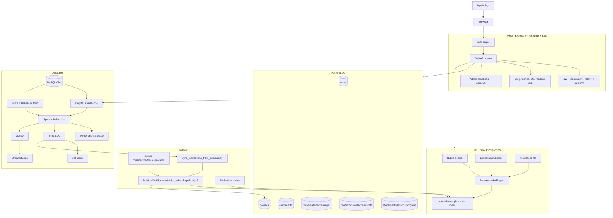

### 4.1. Các boundary chính

- `web/` là giao diện sản phẩm chính và nơi lưu dữ liệu người dùng.
- `itlr/` là backend AI độc lập, expose FastAPI trên port `8000`.
- PostgreSQL là database nghiệp vụ của web platform.
- `DataLake/` là hạ tầng phân tích riêng, không nằm trong request path trực tiếp của người dùng.
- `scripts/` là lớp vận hành offline: build artifacts, cập nhật data, evaluation, sync interactions.

### 4.2. Vì sao tách web và recommender

Tách `web/` và `itlr/` giúp:

- Web app không phải nạp model ML nặng trong process Node.js.
- Python backend dùng trực tiếp ecosystem ML: scikit-learn, sentence-transformers, FAISS, LightGBM.
- Có thể scale hoặc restart recommender độc lập với web.
- Web chỉ cần client HTTP qua `RECOMMENDER_URL`.
- Docker Compose có healthcheck riêng cho recommender để web chờ engine sẵn sàng.

---

## 5. Cấu trúc thư mục

```text
.
├── itlr/
│   ├── api/                  # FastAPI server, static demo page
│   ├── chatbot/              # EducationalChatbot, intent router, query understanding, KB JSON
│   ├── core/                 # retrieval, recommender, BM25, ANN, rerank, RAG, pipeline
│   ├── data/                 # synthetic catalog + synthetic interactions generation
│   ├── eval/                 # metrics, significance, CF eval, off-policy, LTR features
│   ├── pipelines/            # build_model, build_embeddings, build_cf
│   ├── utils/                # runtime patches, repickle
│   ├── config.py             # central paths: var/artifacts, var/data
│   └── engine.py             # process-level RecommenderEngine
├── web/
│   ├── src/
│   │   ├── config/           # env parsing and production guard
│   │   ├── db/               # schema, migrate, seed, sync, pool, types
│   │   ├── middleware/       # auth, security, CSRF, rate limit
│   │   ├── routes/           # auth, pages, api, social, admin
│   │   ├── services/         # recommender client, dataset extraction, markdown, social, realtime
│   │   ├── views/            # EJS pages and partials
│   │   └── public/           # app.js, styles.css, fonts
│   ├── Dockerfile
│   └── package.json
├── DataLake/
│   ├── etl_pipeline/         # Dagster code location
│   ├── streaming/            # Spark Structured Streaming CDC jobs
│   ├── dbt/                  # Trino/dbt marts and tests
│   ├── docker_image/         # custom images/config for Spark, Dagster, Trino, MLflow, Streamlit
│   ├── app/                  # Streamlit pages for Olist
│   ├── cdc/                  # Debezium connector config
│   ├── load_dataset_into_mysql/
│   ├── docker-compose.yaml
│   └── Makefile
├── scripts/
│   ├── scrape/               # HTTP scrapers + catalog merge
│   ├── data/                 # translation and DataLake interaction sync
│   ├── eval/                 # scientific evaluation CLI scripts
│   ├── build_all.py
│   ├── update_data.py
│   └── clean_catalog.py
├── tests/                    # Python tests for chatbot behavior
├── .github/                  # CI/CD, CodeQL, Trivy, rulesets, templates
├── docker-compose.yml        # app stack: PostgreSQL + recommender + web
├── Dockerfile                # recommender image
├── pyproject.toml
├── requirements.txt
├── README.md
└── ABOUT_AI_USAGE.md
```

### 5.1. Generated/local directories

- `var/`: dữ liệu và artifacts build ra, được gitignore.
- `reports/`: kết quả evaluation, được gitignore.
- `web/coverage/`: coverage generated từ Vitest.
- `DataLake/dataset/`: dataset Olist tải ngoài, không commit.
- `.venv/`, `node_modules/`, caches: không commit.

---

## 6. Subsystem `itlr/`: AI, Recommender, RAG API

### 6.1. Vai trò

`itlr/` là package Python chính của hệ thống. Nó chịu trách nhiệm:

- Build và nạp model artifacts.
- Tìm kiếm catalog bằng hybrid retrieval.
- Chatbot RAG và intent routing.
- Feed gợi ý cá nhân hóa bằng Collaborative Filtering.
- Evaluation và benchmark.
- FastAPI serving cho web app.

### 6.2. Entrypoint

| File | Vai trò |
|---|---|
| `app.py` | Entrypoint tiện lợi, gọi `itlr.api.__main__.main()` |
| `itlr/api/server.py` | FastAPI app chính |
| `itlr/engine.py` | Nạp artifacts một lần bằng `lru_cache`, expose search/chat/personas/for_you |
| `Dockerfile` | Build image Python cho recommender API |
| `Procfile` | Entrypoint kiểu Heroku: uvicorn |

### 6.3. API endpoints của FastAPI

| Endpoint | Method | Mục đích |
|---|---|---|
| `/` | GET | Serve static demo page |
| `/health` | GET | Readiness: engine đã nạp artifacts chưa |
| `/metrics` | GET | Text metrics đơn giản: request count, error count, latency avg/max theo route |
| `/api/search` | POST | Hybrid semantic search |
| `/api/chat` | POST | Chatbot non-stream |
| `/api/chat/stream` | POST | Chatbot streaming SSE |
| `/api/personas` | GET | Danh sách demo personas từ CF model |
| `/api/for-you` | POST | Gợi ý CF cho persona + interested item ids |
| `/api/suggested` | GET | Suggested prompts và welcome message |
| `/admin/reload` | POST | Clear cache và nạp lại artifacts không cần restart process |

### 6.4. Engine artifacts

`load_engine()` trong `itlr/engine.py` nạp các artifacts:

| Artifact | Sinh bởi | Vai trò |
|---|---|---|
| `item_list.pkl` | `build_model.py` | DataFrame catalog đã chuẩn hóa |
| `retrieval_model.pkl` | `build_model.py` | TF-IDF vectorizers/matrices, BM25, categories, topic index |
| `tfidf_vectorizer.pkl` | `build_model.py` | Vectorizer full text legacy |
| `tfidf_matrix.pkl` | `build_model.py` | Matrix full text legacy |
| `embeddings.pkl` | `build_embeddings.py` | Dense embedding cho từng item |
| `search_meta.pkl` | `build_embeddings.py` | model name, query/passsage prefix |
| `char_vectorizer.pkl` | `build_embeddings.py` | char n-gram TF-IDF bỏ dấu |
| `char_matrix.pkl` | `build_embeddings.py` | char n-gram matrix |
| `ann_index.faiss` hoặc `ann_index.hnsw` | `build_embeddings.py` | ANN index nếu backend khả dụng |
| `ann_meta.pkl` | `build_embeddings.py` | metadata ANN |
| `cf_model.pkl` | `build_cf.py` | item similarity sparse matrix, popularity, histories, labels |

### 6.5. Build artifacts workflow

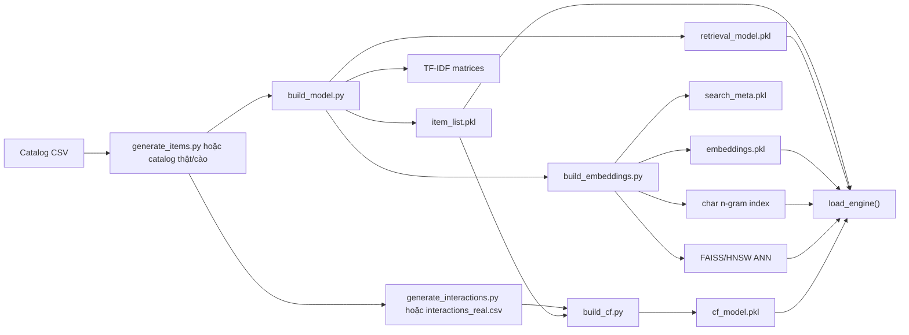

Một lệnh tổng hợp:

```bash
uv run scripts/build_all.py
```

Thứ tự trong `scripts/build_all.py`:

1. `generate_items.main()`
2. `build_model.main()`
3. `build_embeddings.main()`
4. `generate_interactions.main()`
5. `build_cf.main()`

### 6.6. Retrieval lexical: TF-IDF + BM25

`itlr/core/recommender.py` và `itlr/core/bm25.py` triển khai:

- Chuẩn hóa text Unicode NFC.
- Tokenization tiếng Việt/Anh, bỏ stop words.
- Stemming cho token ASCII bằng `PorterStemmer`.
- Tạo unigram, bigram, trigram.
- Multi-field TF-IDF:
  - `title` trọng số cao.
  - `topics` trọng số cao.
  - `full` gồm title/topics/category/description/type/instructor/platform.
- BM25 Okapi tự cài:
  - `k1=1.4`, `b=0.75`.
  - Min-max normalize score.
- Category detection:
  - map keyword tiếng Anh/không dấu sang category tiếng Việt.
  - token overlap trên category đã strip accents.
- Query-item scoring:
  - TF-IDF score.
  - BM25 score.
  - category bonus.
  - topic Jaccard.
  - topic containment.
  - title overlap.
  - type match.

### 6.7. Dense retrieval: SentenceTransformer + char n-gram + ANN

`itlr/core/embeddings.py` hỗ trợ preset:

| Preset | Model | Ghi chú |
|---|---|---|
| `minilm` | `paraphrase-multilingual-MiniLM-L12-v2` | nhẹ, đa ngữ |
| `e5-base` | `intfloat/multilingual-e5-base` | dùng query/passsage prefix |
| `e5-large` | `intfloat/multilingual-e5-large` | lớn hơn |
| `bge-m3` | `BAAI/bge-m3` | multilingual/general |

Dense search trong `search_by_embedding()` dùng:

- Encode query bằng cùng model/prefix đã lưu trong `search_meta.pkl`.
- Nếu có ANN index:
  - FAISS `IndexFlatIP` ưu tiên.
  - HNSW fallback nếu có.
  - Nếu không nạp được thì brute-force `embeddings @ q_emb`.
- Char n-gram TF-IDF bỏ dấu:
  - `analyzer="char_wb"`, `ngram_range=(2, 4)`.
  - Dùng `max(dense_score, char_score)` để chịu lỗi thiếu dấu/sai chính tả.
- Absolute off-topic/relevance floor:
  - `ABS_RELEVANCE_GATE = 0.48` cho search.
  - `ABS_ITEM_FLOOR = 0.42` cho candidate.
- Rerank top pool bằng Cross-Encoder nếu bật.
- Calibrate confidence hiển thị về dải 90-100%.

### 6.8. Cross-Encoder reranking

`itlr/core/rerank.py`:

- Default model: `BAAI/bge-reranker-base`.
- Lazy-load global singleton.
- Có thể tắt bằng `DISABLE_RERANKER`.
- Predict score cho từng pair `[query, document]`.
- Sigmoid raw score về 0-1.
- Fail-safe: nếu thiếu model/thư viện/lỗi predict, trả lại thứ tự candidate ban đầu.

### 6.9. Multi-stage ranking pipeline

`itlr/core/pipeline.py` chuẩn hóa retrieval thành bốn tầng:

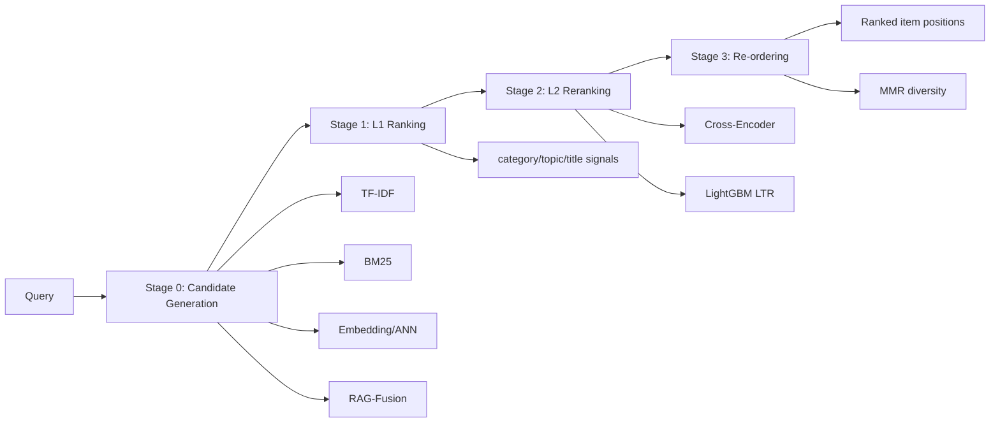

Tầng này phục vụ evaluation/ablation nhiều hơn UI trực tiếp. Các config ablation gồm:

- `TF-IDF only`
- `BM25 only`
- `Hybrid lexical`
- `Embeddings`
- `+ L1 hybrid signals`
- `+ Cross-Encoder`
- `+ RAG-Fusion + MMR`

### 6.10. Collaborative Filtering

`itlr/pipelines/build_cf.py` tạo model item-based CF:

- Đọc `interactions.csv` hoặc `interactions_real.csv`.
- Factorize user id.
- Map `item_id` sang position trong `item_list`.
- Tạo sparse user-item matrix `R`.
- Tạo co-occurrence `R.T @ R`.
- Chuẩn hóa cosine bằng popularity:
  - `sim(i,j)=cooc(i,j)/sqrt(pop_i*pop_j)`.
- Giữ top-K neighbor mỗi item, `TOP_K=50`.
- Tạo demo personas từ users có nhiều tương tác nhất.
- Lưu:
  - `item_sim`
  - `popularity`
  - `pos_to_id`
  - `id_to_pos`
  - `histories`
  - `labels`

Runtime `recommend_for_user()`:

- Nếu có lịch sử: score item = tổng similarity tới các item đã học/quan tâm.
- Nếu cold-start: fallback popularity.
- Loại item đã seen.
- Calibrate confidence thành phần trăm phù hợp.

### 6.11. Chatbot RAG

`itlr/chatbot/chatbot.py` là module lớn nhất trong chatbot runtime. Nó kết hợp:

- Query understanding.
- Intent routing.
- Knowledge base offline.
- Semantic retrieval.
- LLM generation.
- Offline synthesis.
- Streaming.

Workflow chính:

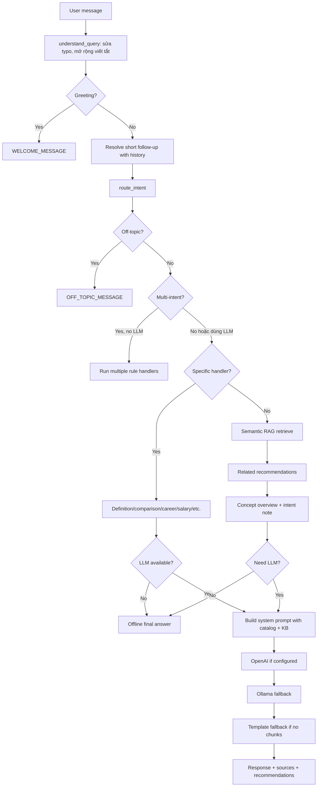

### 6.12. Knowledge base offline

`itlr/chatbot/data/it_glossary.json`:

- Hơn 6.000 dòng.
- Lưu concepts CNTT:
  - `name`
  - `aliases`
  - `category`
  - `level`
  - `definition`
  - `topics`
  - `related`
  - `example`
- Dùng cho định nghĩa, concept match, safe concept gate và mở rộng truy vấn.

`itlr/chatbot/data/it_roles.json`:

- Lưu vai trò IT:
  - Frontend, Backend, Fullstack, Mobile, DevOps, Cloud, SysAdmin, Embedded, Data Engineer,
    Data Analyst, Data Scientist và các vai trò khác.
- Mỗi role có:
  - aliases
  - field aliases
  - description
  - roadmap nhiều stage
  - interview questions
  - salary ranges tham khảo
- Dùng cho career path, interview, salary, skill gap và career guidance.

---

## 7. Subsystem `web/`: Full-stack platform

### 7.1. Vai trò

`web/` là sản phẩm người dùng tương tác trực tiếp. Nó dùng:

- Express 4.
- TypeScript.
- EJS SSR.
- PostgreSQL.
- JWT cookie auth.
- CSRF token.
- Helmet/CSP.
- Rate limit.
- SSE realtime.
- Multer memory upload.
- Markdown rendering.
- Client HTTP gọi recommender FastAPI.

### 7.2. Server bootstrap

`web/src/server.ts`:

1. Disable `x-powered-by`.
2. Set `trust proxy`.
3. Apply Helmet security headers.
4. Set EJS view engine.
5. Serve static assets.
6. Parse URL encoded and JSON body, max 1MB.
7. Parse cookies.
8. Apply global rate limiter.
9. Load current user from JWT cookie.
10. Apply CSRF protection.
11. Redirect unauthenticated users except public paths and admin.
12. Mount routers:
    - auth
    - social
    - pages
    - admin
    - api
13. 404 handler.
14. Error handler.

### 7.3. Security middleware

`web/src/middleware/security.ts`:

- Helmet CSP:
  - `default-src 'self'`
  - image self/data/blob/YouTube thumbnail
  - media self/blob/data
  - frame YouTube
  - object none
  - HSTS only in production
- CSRF:
  - cookie `csrf` chứa token hex 64 chars.
  - unsafe methods phải gửi token qua header/body/query.
  - API trả JSON 403, page render error.
- Rate limit:
  - global: 300 request/phút.
  - auth: 20 lần/15 phút, skip successful requests.

`web/src/middleware/auth.ts`:

- JWT user cookie `token`, httpOnly, sameSite lax.
- Token hết hạn sau 7 ngày.
- Admin access cookie `adm`, có version `ADM_VER=2`.
- Guards:
  - `requireAuth`
  - `requireAdmin`
  - `requireAdminAccess`

### 7.4. Database schema

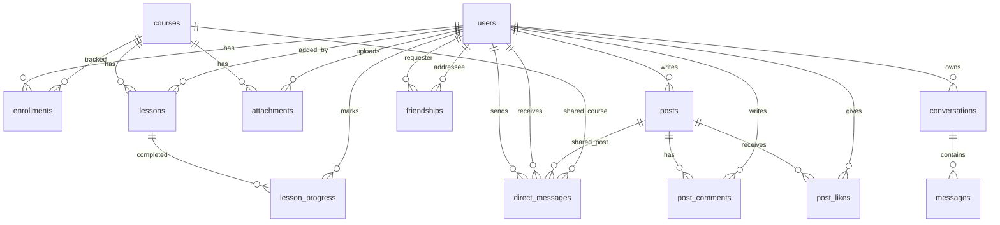

Các bảng chính:

- `users`: email, password hash, name, role, avatar, last seen.
- `courses`: catalog khóa học/tài liệu, seed/sync từ CSV.
- `enrollments`: trạng thái học và progress.
- `conversations`, `messages`: lịch sử chatbot.
- `attachments`: file đính kèm khóa học/tài liệu, BYTEA, extracted text, approval.
- `posts`, `post_likes`, `post_comments`: cộng đồng.
- `friendships`: kết bạn, pending/accepted, intro.
- `direct_messages`: DM text/media/share/read receipt.
- `lessons`, `lesson_progress`: lesson YouTube và tiến độ từng bài.

### 7.5. Routes chính

| Router | File | Chức năng |
|---|---|---|
| Auth | `auth.routes.ts` | register, login, logout, forgot password, account, avatar/profile/password |
| Pages | `pages.routes.ts` | home, search, course detail, dashboard, blog, chat |
| API | `api.routes.ts` | chat, realtime, save/unsave, upload attachments, posts, lessons |
| Social | `social.routes.ts` | avatar, profile, friends, DM, export, share |
| Admin | `admin.routes.ts` | admin login, dashboard, catalog, manage, pending approval |

### 7.6. Web to recommender integration

`web/src/services/recommender.ts`:

- Base URL từ `RECOMMENDER_URL`.
- Default timeout 60s.
- Chat timeout 240s vì Ollama local có thể chậm.
- Methods:
  - `search(query, type, minPct)`
  - `chat(message, history)`
  - `personas()`
  - `forYou(persona, interested)`
  - `suggested()`

Request flow search:

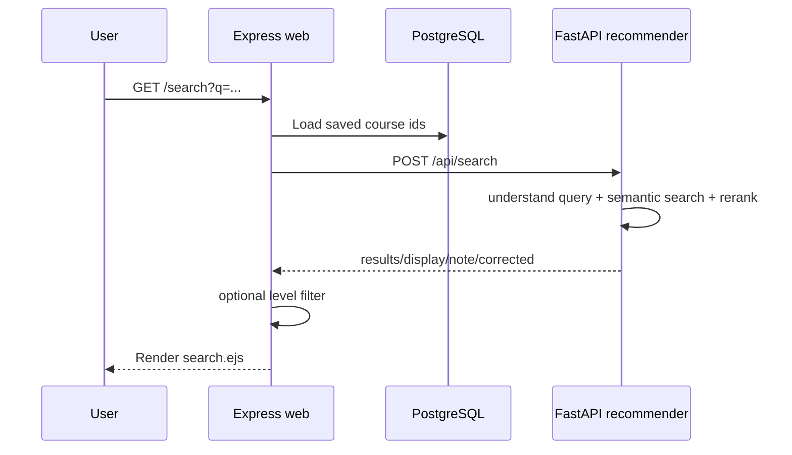

Request flow chat:

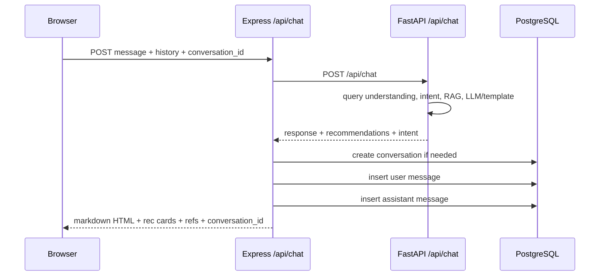

### 7.7. Client JS

`web/src/public/app.js` chịu trách nhiệm nhiều behavior phía browser:

- Kết nối SSE `/api/realtime`.
- Toast notifications.
- CSRF-aware `fetch`.
- Save/unsave course.
- Update enrollment progress.
- Upload attachment.
- View attachment inline.
- Chat UI:
  - prompt chips.
  - bubble rendering.
  - streaming `/api/chat/stream`.
  - fallback `/api/chat`.
  - recommendations block.
  - Google reference links.
  - conversation sidebar.
- Password generator/toggle visibility.
- Blog post create/like/share/delete/comment.
- Friend request modal with intro.
- Lesson add/complete/delete.
- Messages:
  - polling fallback every 25s.
  - SSE DM events.
  - typing.
  - read receipt.
  - file chips.
  - media rendering.
  - share course/post to friend.

---

## 8. Data workflows

### 8.1. Synthetic data generation

`itlr/data/generate_items.py` sinh catalog synthetic:

- Mặc định 50.000 item.
- Taxonomy CNTT nhiều category:
  - Lập trình, Web, DSA, Database, AI, Data Science, Big Data, Cloud, DevOps, Security,
    Mobile, Game, Software Engineering, CS, Networking, Testing, UI/UX, Blockchain, IoT,
    MLOps, Linux, PM, AR/VR, Graphics, BA, Quantum.
- Mỗi category có topics theo level:
  - `Cơ bản`
  - `Trung cấp`
  - `Nâng cao`
- Sinh title/description đa dạng để retrieval có tín hiệu.

`itlr/data/generate_interactions.py` sinh interaction synthetic:

- Latent-factor simulation.
- Mỗi item có latent vector từ category/topic.
- Mỗi user có latent preference quanh archetype.
- Xác suất tương tác tỉ lệ `exp(p_u dot q_i)`.
- Có popularity bias.
- Mục tiêu là tạo co-occurrence có cấu trúc thật để CF học được.

### 8.2. Real/scraped catalog workflow

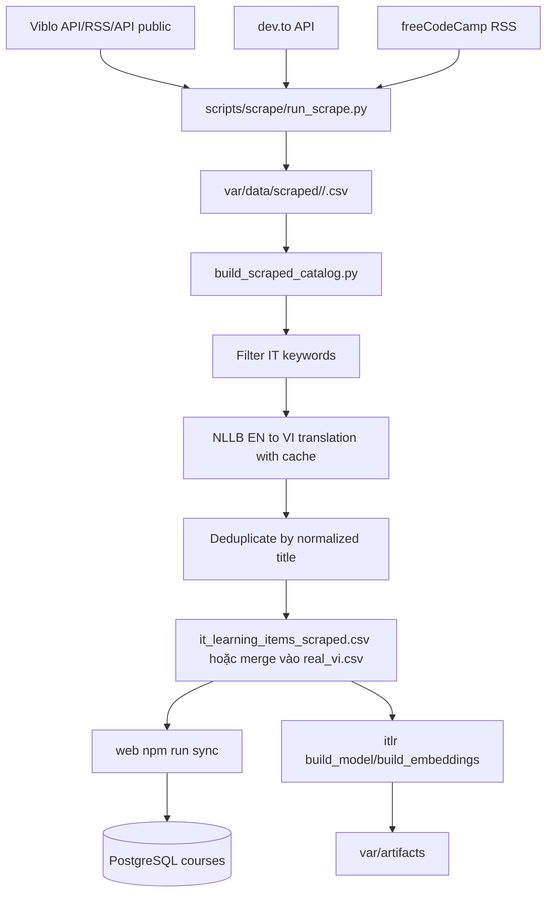

Scraper design:

- Base class tôn trọng `robots.txt`.
- User-Agent định danh.
- Rate-limit bằng delay.
- Retry/backoff cho HTTP 429/5xx.
- Output schema thô chuẩn:
  - title
  - description
  - category
  - topics
  - instructor
  - platform
  - link
  - level

Nguồn scraper:

- `VibloScraper`: tiếng Việt, API public/trending.
- `DevtoScraper`: tiếng Anh, dev.to API theo tags.
- `FreeCodeCampScraper`: tiếng Anh, RSS public.

### 8.3. Update data one-command workflow

`scripts/update_data.py`:

1. Scrape web data.
2. Merge into catalog, optional translate.
3. UPSERT PostgreSQL courses bằng `web npm run sync`.
4. Rebuild artifacts `build_model`.
5. Nếu số item đổi và `--embeddings auto`, rebuild embeddings.
6. Nếu `--restart`, gọi recommender `/admin/reload`.

Đặc điểm đáng chú ý:

- Fail-fast từng bước.
- Không truncate courses khi sync, giữ enrollments.
- Có guard tránh lệch `item_list` và `embeddings` khi số item đổi mà không rebuild embeddings.
- Có PowerShell wrapper `scripts/update_data.ps1` cho Windows Task Scheduler.

### 8.4. User contribution workflow

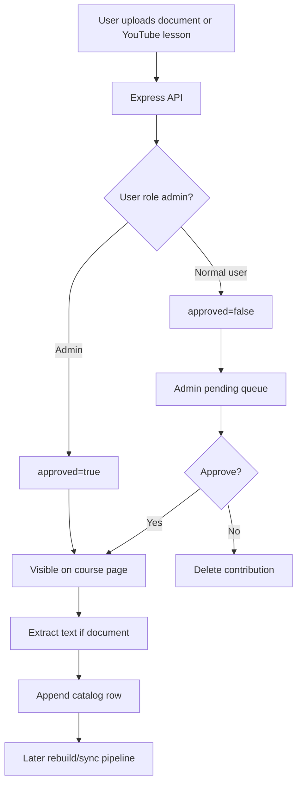

Tài liệu upload:

- Cho course attachment:
  - PDF, DOC, DOCX, XLS, XLSX.
  - Max 10MB.
  - Lưu BYTEA trong PostgreSQL.
  - Extract text bằng `pdf-parse`, `mammoth`, `xlsx`.
- Cho post/DM:
  - ảnh, video, document.
  - Max 60MB với video/media.

---

## 9. DataLake subsystem

### 9.1. Vai trò

`DataLake/` chứng minh năng lực Data Engineering riêng biệt và tích hợp ngược với sản phẩm ITLR.
Nó gồm hai domain:

1. **Olist domain**
   - Dataset e-commerce công khai.
   - MySQL source.
   - Batch ETL qua Dagster/Spark.
   - CDC streaming qua Debezium/Kafka.
   - Medallion architecture.
   - BI/ML/Streamlit.

2. **ITLR domain**
   - Dữ liệu từ PostgreSQL web app thật.
   - Batch extract bằng Dagster.
   - Tạo fact interaction cho learning platform.
   - Có thể sync về recommender CF.

### 9.2. Container services

`DataLake/docker-compose.yaml` định nghĩa các service chính:

| Service | Vai trò |
|---|---|
| `minio` | Object storage cho Delta tables và MLflow artifacts |
| `mc` | MinIO client bootstrap bucket |
| `spark-master` | Spark master |
| `spark-worker-1` | Spark worker |
| `spark-notebook` | Jupyter/Spark notebook |
| `metabase` | BI dashboard |
| `mysql` | Olist source database và MLflow backend store |
| `mlflow_server` | MLflow tracking server |
| `mariadb` | Hive Metastore backend |
| `hive-metastore` | Catalog metadata |
| `de_psql` | Postgres cho Dagster internal storage |
| `spark-thrift-server` | JDBC/SQL access |
| `de_dagster_dagit` | Dagster UI |
| `de_dagster_daemon` | Dagster daemon |
| `etl_pipeline` | Dagster code location |
| `trino` | Interactive SQL engine |
| `kafka` | CDC broker |
| `debezium` | MySQL CDC connector |
| `streamlit` | App serving ML/SQL demo |

### 9.3. Olist Medallion architecture

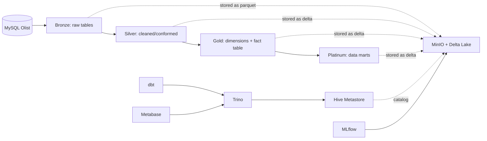

Bronze assets:

- `bronze_customer`
- `bronze_seller`
- `bronze_product`
- `bronze_order`
- `bronze_order_item`
- `bronze_payment`
- `bronze_order_review`
- `bronze_product_category`
- `bronze_geolocation`

Silver assets:

- Drop null/duplicates.
- Clean seller by unique seller id.
- Cast product numeric columns.
- Round price/freight/payment values.
- Drop review title.
- Filter geolocation to Brazil bounds.
- Create `silver_date` from order purchase timestamps.

Gold assets:

- `dim_customer`
- `dim_seller`
- `dim_review`
- `dim_product`
- `dim_order`
- `dim_date`
- `fact_table`

Platinum asset:

- `cube_sale`: fact table joined with all dimensions for BI.

### 9.4. ITLR domain in DataLake

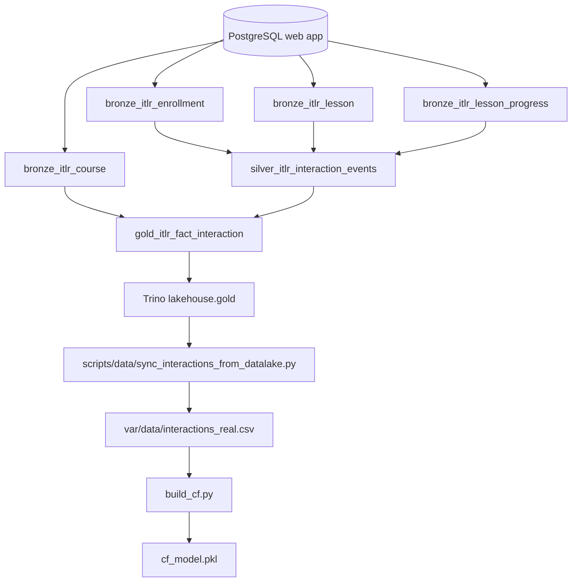

Thiết kế quan trọng:

- Không extract bảng `users` vì chứa PII như email.
- `saved` enrollment không được xem là tương tác thật.
- Chỉ lấy:
  - enrollment `in_progress`
  - enrollment `completed`
  - lesson `completed`
- Gold fact denormalize `category` trực tiếp, không tạo star schema đầy đủ vì domain nhỏ.
- Group name riêng:
  - `itlr_bronze`
  - `itlr_silver`
  - `itlr_gold`
- Job `reload_data` của Olist không chọn nhầm assets ITLR. Có test xác nhận điều này.

### 9.5. Dagster definitions

`DataLake/etl_pipeline/etl_pipeline/__init__.py` đăng ký:

- Assets từ module `assets`.
- Asset checks:
  - `fact_table_valid`
  - `dim_customer_unique`
  - `itlr_fact_interaction_valid`
- Jobs:
  - `reload_data`
  - `sync_itlr_interactions`
- Schedules:
  - `reload_data_schedule`
  - `sync_itlr_interactions_schedule`
- Resources:
  - `MySQLIOManager`
  - `PostgresIOManager`
  - `MinIOIOManager`
  - `SparkIOManager`
  - notebook output IO manager.

### 9.6. IO managers

| IO manager | Vai trò |
|---|---|
| `MySQLIOManager` | Extract-only từ MySQL bằng Polars `read_database` |
| `PostgresIOManager` | Extract-only từ PostgreSQL ITLR bằng Polars |
| `MinIOIOManager` | Lưu/đọc Polars DataFrame dạng Parquet trên MinIO |
| `SparkIOManager` | Ghi Spark DataFrame thành Delta table, overwrite hoặc Delta merge |

`SparkIOManager`:

- Tạo SparkSession có Delta extensions.
- Cấu hình S3A tới MinIO.
- Cấu hình Hive Metastore.
- Nếu asset metadata có `merge_keys` và table tồn tại, dùng Delta merge.
- Nếu không, overwrite table.

### 9.7. CDC streaming

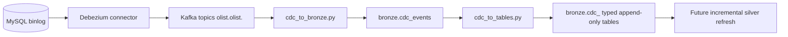

CDC files:

- `DataLake/cdc/register-mysql-connector.json`: connector config.
- `DataLake/streaming/cdc_to_bronze.py`: raw Kafka value/key/topic/timestamp vào Delta.
- `DataLake/streaming/cdc_to_tables.py`: parse `payload.after` thành typed Delta tables.

### 9.8. dbt marts

`DataLake/dbt/` dùng Trino profile và materialize table.

Models:

- `monthly_revenue.sql`
  - orders/revenue/freight theo year/month.
- `revenue_by_category.sql`
  - orders/revenue theo product category.
- `course_popularity.sql`
  - interaction count, distinct users, distinct courses theo ITLR category.
- `course_completion_funnel.sql`
  - event counts theo `in_progress`, `completed`, `lesson_completed`.

Schema tests:

- `not_null`
- `unique`

### 9.9. MLflow và Streamlit

ML asset `DataLake/etl_pipeline/etl_pipeline/assets/ml.py`:

- Dữ liệu: `silver_cleaned_order_review`.
- Text cleaning.
- Label mapping:
  - score 1,2,3 -> negative.
  - score 4,5 -> positive.
- TF-IDF vectorizer `max_features=15000`.
- Logistic Regression.
- GridSearchCV trên:
  - `C`
  - `penalty`
  - `solver`
- Train/test split stratified.
- Log MLflow:
  - accuracy.
  - classification report.
  - confusion matrix.
  - vectorizer artifact/model.

Streamlit `DataLake/app/`:

- Page `Show_comments`:
  - nhập product id.
  - xem review comments.
  - filter date range.
  - filter positive/negative/all.
- Page `Predict_comment`:
  - predict sentiment từ text hoặc file CSV.
  - dùng model/vectorizer từ MLflow Model Registry.
- Page `Chatbot`:
  - LangChain SQLDatabase.
  - ChatOpenAI sinh SQL query từ schema.
  - Chạy query trên MySQL Olist.
  - Sinh natural language response.

Lưu ý: `DataLake/app/🏚️Home.py` hiện rỗng trong workspace.

---

## 10. Evaluation framework

### 10.1. Mục tiêu

Evaluation trong dự án không chỉ đo một vài sample thủ công. Nó tạo một khung đánh giá có thể tái
lập:

- Ranking metrics chuẩn ngành.
- Kiểm định thống kê.
- Human-label agreement.
- Collaborative Filtering evaluation.
- Off-policy/counterfactual evaluation.
- Latency benchmark.
- LTR training/evaluation.
- Off-topic gate ROC/AUC.

### 10.2. Metrics

`itlr/eval/metrics.py` hỗ trợ các metric:

- Precision@K.
- Recall@K.
- NDCG@K.
- MAP.
- MRR.
- HitRate@K.
- Aggregate per query.

### 10.3. Statistical testing

`itlr/eval/significance.py`:

- Paired bootstrap.
- Paired t-test.
- Confidence interval 95%.
- p-value bootstrap.
- Cohen's Kappa cho agreement nhãn.

### 10.4. Retrieval evaluation

`scripts/eval/make_judgments.py`:

- Sinh qrels từ glossary/category.
- Có mode natural query.
- Có human labeling sheet.
- Có simulate-human để chạy nhanh.

`scripts/eval/run_evaluation.py`:

- Nạp artifacts.
- Chạy các ablation config.
- Tính P@5, R@5, NDCG@10, MAP, MRR, R@100.
- Xuất:
  - `reports/results*.csv`
  - `reports/per_query*.csv`
  - `reports/tables*.md`
- So sánh best config với baseline bằng kiểm định.

### 10.5. Collaborative Filtering evaluation

`scripts/eval/eval_cf.py`:

- Leave-one-out.
- Popularity baseline.
- Temporal split.
- Temporal split không rò rỉ bằng cách train lại item similarity chỉ trên phần quá khứ.
- Metrics:
  - HitRate@1/5/10.
  - MRR.
  - Recall@5/10.
  - NDCG@10.
  - MAP.

Claim trong README gốc:

- CF vượt popularity baseline rõ rệt: HitRate@10 `0.611 vs 0.043`.
- Temporal split không rò rỉ có NDCG@10 `0.274`.

### 10.6. Off-policy evaluation

`itlr/eval/off_policy.py` và `scripts/eval/eval_off_policy.py`:

- IPS.
- SNIPS.
- Doubly Robust.
- Bootstrap CI 95%.
- Effective sample size.
- Simulated bandit ground-truth.

Mục đích:

- Chứng minh estimator ước lượng được giá trị target policy từ logged data.
- Cho thấy naive observed CTR bị lệch so với target policy.

Claim trong README gốc:

- CI 95% của SNIPS/DR phủ đúng giá trị thật.
- Naive lệch khoảng `-0.076`.

### 10.7. LTR và latency

`scripts/eval/build_ltr.py`:

- Train LightGBM LambdaMART objective `lambdarank`.
- Feature extraction từ `itlr/eval/ltr_features.py`.
- Group theo query.
- So sánh LTR với heuristic bằng NDCG@10 và kiểm định.
- Có optional SHAP/cali plots.

`scripts/eval/bench_latency.py`:

- Đo latency từng tầng ranking.
- So FAISS vs brute-force.
- Memory footprint.
- So Cross-Encoder với LightGBM LTR.

Claim trong README gốc:

- LTR không khác biệt có ý nghĩa thống kê với Cross-Encoder trên benchmark đã ghi.
- LTR nhanh hơn khoảng `~74x` khi serving.

### 10.8. Off-topic gate evaluation

`scripts/eval/eval_offtopic.py`:

- Tập test 40 câu trong/ngoài IT.
- Tính ROC AUC.
- Đo precision/recall/F1 tại threshold hiện tại.
- Tìm threshold tối ưu F1.

Claim trong README gốc:

- AUC ROC khoảng `0.99`.

### 10.9. One-command evaluation

`scripts/eval/run_all.py` chạy:

1. Sinh judgments natural.
2. Sinh keyword judgments.
3. Run retrieval evaluation clean.
4. Run retrieval evaluation noisy.
5. CF evaluation.
6. Off-policy evaluation.
7. Human evaluation.
8. Latency benchmark.
9. Optional LTR.

Lệnh:

```bash
uv run scripts/eval/run_all.py
uv run scripts/eval/run_all.py --quick
uv run scripts/eval/run_all.py --with-ltr
```

---

## 11. CI/CD và DevOps

### 11.1. App Docker Compose

Root `docker-compose.yml` chạy ba service:

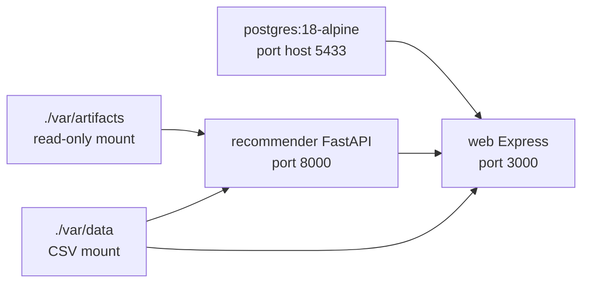

Services:

- `postgres`
  - database `it_learning`.
  - port host `5433` để tránh đụng local PostgreSQL 5432.
- `recommender`
  - build từ root `Dockerfile`.
  - mount `./var/artifacts` read-only.
  - mount `./var/data` read-only.
  - HuggingFace cache volume.
  - optional OpenAI/Ollama.
- `web`
  - build từ `web/Dockerfile`.
  - depends on postgres healthy và recommender healthy.
  - tự migrate + seed qua entrypoint.
  - mount `./var/data` để seed/sync catalog và append contribution.

### 11.2. Recommender Dockerfile

Root `Dockerfile`:

- Base `python:3.11-slim`.
- Install `build-essential`, `libgomp1`, `curl`.
- Install `requirements.txt`.
- Copy `itlr`, `scripts`, `pyproject.toml`.
- Healthcheck gọi `http://localhost:8000/`.
- CMD uvicorn `itlr.api.server:app`.

### 11.3. Web Dockerfile

`web/Dockerfile` multi-stage:

- Builder:
  - Node 20.
  - `npm ci`.
  - `npm run build`.
  - Copy EJS views, public assets, schema.sql vào `dist`.
- Runtime:
  - `npm ci --omit=dev`.
  - Copy `dist`.
  - Chạy `docker-entrypoint.sh`.
  - Healthcheck `fetch('/login')`.

`web/docker-entrypoint.sh`:

1. `node dist/db/migrate.js`
2. `node dist/db/seed-courses.js` hoặc bỏ qua nếu đã có dữ liệu/thiếu CSV.
3. `node dist/server.js`

### 11.4. GitHub Actions

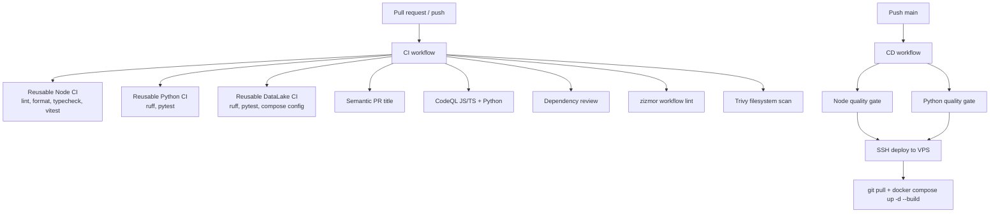

CI workflows:

- `.github/workflows/ci.yml`
  - Node quality gate.
  - Python quality gate.
  - DataLake quality gate.
  - PR title conventional commits.
  - CodeQL.
  - dependency-review.
  - zizmor.
  - Trivy.
- `.github/workflows/reusable-node-ci.yml`
  - Node versions 22 và 24.
  - `npm ci`, `npm run lint`, `npm run format:check`, `npm run typecheck`, `npm test`.
  - Upload coverage.
- `.github/workflows/reusable-python-ci.yml`
  - Python 3.10.
  - `pip install -r requirements.txt`.
  - `ruff check itlr/ scripts/ tests/`.
  - `python -m pytest tests/ -q`.
  - Khi chạy local theo chuẩn workspace này nên dùng `uv run ...`; CI hiện tại mô tả đúng command trong workflow.
- `.github/workflows/reusable-datalake-ci.yml`
  - Python 3.11.
  - Ruff DataLake.
  - Pytest `etl_pipeline_tests`.
  - `docker compose config -q`.
- `.github/workflows/eval.yml`
  - Smoke import eval modules.
  - Chạy `tests/test_eval.py -q`.
  - Lưu ý: trong workspace hiện tại inventory không thấy `tests/test_eval.py`, nên workflow này có
    thể cần bổ sung file test tương ứng hoặc chỉnh command nếu chạy CI thật.
- `.github/workflows/cd.yml`
  - Push `main`.
  - Quality gate web + itlr.
  - Deploy VPS qua SSH action.

Security hardening trong workflows:

- `permissions: contents: read` mặc định.
- Actions bên thứ ba trong CI chính được pin SHA.
- `persist-credentials: false` ở checkout.
- Trivy fail HIGH/CRITICAL nếu có fix.

---

## 12. Cách chạy

### 12.1. Chạy recommender local

Theo chuẩn workspace, nên dùng `uv` cho Python. Repo có `pyproject.toml` và dependencies động từ
`requirements.txt`, nên `uv sync` có thể dựng môi trường từ cấu hình hiện có.

```bash
uv sync
uv run scripts/build_all.py
uv run uvicorn itlr.api.server:app --port 8000
```

Trên Windows có thể chạy các lệnh `uv run ...` tương tự trong terminal của dự án.

### 12.2. Chạy web local

```bash
cd web
npm install
cp .env.example .env
npm run migrate
npm run seed
npm run dev
```

Mở:

```text
http://localhost:3000
```

### 12.3. Chạy app stack bằng Docker

```bash
uv run scripts/build_all.py
cp .env.docker.example .env
docker compose up -d --build
docker compose logs -f web recommender
```

Endpoints:

- Web: `http://localhost:3000`
- Recommender: `http://localhost:8000`
- PostgreSQL host port: `localhost:5433`

Dừng:

```bash
docker compose down
docker compose down -v
```

### 12.4. Chạy DataLake

```bash
cd DataLake
cp env.example .env
docker compose up -d --build
make mysql_create
make mysql_load
```

Endpoints:

| Service | URL |
|---|---|
| Dagster | `http://localhost:3001` |
| MinIO console | `http://localhost:9001` |
| Trino | `http://localhost:8082` |
| Metabase | `http://localhost:3000` |
| MLflow | `http://localhost:7893` |
| Streamlit | `http://localhost:8501` |
| Jupyter | `http://localhost:8888` |
| Spark master UI | `http://localhost:8081` |
| Debezium Connect | `http://localhost:8083` |
| MySQL source | `localhost:3307` |

### 12.5. Chạy CDC

```bash
cd DataLake
make register_cdc
make cdc_status
make stream_cdc
make stream_cdc_tables
```

### 12.6. Chạy dbt

```bash
cd DataLake
make dbt_build
```

### 12.7. Sync tương tác thật từ DataLake về CF

Điều kiện:

- DataLake đang chạy.
- Trino đang nghe `localhost:8082`.
- Dagster job `sync_itlr_interactions` đã materialize `gold.itlr_fact_interaction`.

```bash
uv run scripts/data/sync_interactions_from_datalake.py
uv run scripts/data/sync_interactions_from_datalake.py --rebuild-cf
```

Windows scheduled wrapper:

```powershell
powershell -ExecutionPolicy Bypass -File scripts\sync_interactions.ps1 --rebuild-cf
```

### 12.8. Chạy test

Python:

```bash
uv run pytest tests/ -q
uv run ruff check itlr/ scripts/ tests/
```

Web:

```bash
cd web
npm run lint
npm run format:check
npm run typecheck
npm test
```

DataLake:

```bash
cd DataLake/etl_pipeline
uv run pytest etl_pipeline_tests/ -q
```

Evaluation:

```bash
uv run scripts/eval/run_all.py --quick
```

---

## 13. Bảo mật và privacy

### 13.1. Secrets

Repo gitignore:

- `.env`
- `web/.env`
- `docker-compose.override.yml`
- generated artifacts và reports.

File example:

- `.env.docker.example`
- `web/.env.example`
- `DataLake/env.example`

Production guards:

- `web/src/config/env.ts` bắt `JWT_SECRET` mạnh hơn khi `NODE_ENV=production`.
- `ADMIN_PASSCODE` không được là default `1` khi production.
- Cookie `secure` bật khi production.

### 13.2. Auth và session

- User auth dùng JWT cookie httpOnly.
- Admin dashboard dùng cookie admin riêng.
- Password hash bằng bcrypt.
- Forgot password:
  - sinh mật khẩu mới mạnh.
  - gửi email nếu SMTP cấu hình.
  - nếu không gửi được, hiển thị dev password trên màn hình.

### 13.3. CSRF và rate limit

- CSRF token cookie non-httpOnly để client JS đọc và gửi `X-CSRF-Token`.
- Unsafe methods bắt buộc token.
- Auth route có rate limiter riêng.
- Global limiter giảm spam request.

### 13.4. Upload safety

- File type filter theo extension/mime.
- Size limit:
  - attachments 10MB.
  - avatar 4MB.
  - post/DM media 60MB.
- User contribution mặc định chờ duyệt.
- File lưu trong PostgreSQL giúp deploy nhiều máy không phụ thuộc local filesystem.

### 13.5. Privacy trong DataLake

Domain `itlr` không extract bảng `users` vì chứa email/PII.

Chỉ extract:

- courses
- enrollments
- lessons
- lesson_progress

Điều này đủ cho interaction analytics và CF retraining nhưng giảm rủi ro privacy.

---

## 14. Điểm mạnh kỹ thuật

### 14.1. Full-stack thật, không chỉ demo notebook

Dự án có:

- Web product dùng được.
- AI backend serving qua API.
- PostgreSQL schema nghiệp vụ.
- Admin/cộng đồng/realtime.
- Docker Compose.
- CI/CD.
- DataLake.
- Evaluation framework.

### 14.2. Retrieval nhiều tầng và có ablation

Không phụ thuộc một kỹ thuật duy nhất. Hệ thống kết hợp:

- TF-IDF.
- BM25.
- Sentence embeddings.
- Char n-gram bỏ dấu.
- ANN.
- Cross-Encoder.
- MMR.
- RAG-Fusion.
- LTR thử nghiệm.

### 14.3. Chatbot có guardrails rõ

- Off-topic gate trước khi trả lời.
- Intent routing cho các use case giáo dục.
- KB offline để không hoàn toàn phụ thuộc LLM.
- LLM chỉ là tầng sinh câu trả lời, không được bịa khóa học ngoài catalog khi gợi ý cụ thể.
- Fallback template giúp hệ thống vẫn chạy khi không có API key/Ollama.

### 14.4. Dữ liệu và artifacts có pipeline tái lập

- Synthetic data generation có cấu trúc.
- Real data adaptation/scraping.
- Translation cache.
- Build artifacts rõ thứ tự.
- Update pipeline có guard tránh lệch embeddings.

### 14.5. Evaluation nghiêm túc

- Có metric chuẩn ranking.
- Có kiểm định thống kê.
- Có off-policy simulation.
- Có CF no-leak temporal split.
- Có latency benchmark.
- Có human-label workflow.

### 14.6. DataLake tích hợp sản phẩm

Không chỉ là Olist demo tách biệt. Domain `itlr` kéo tương tác từ app web thật và có đường sync ngược về CF.

---

## 15. Giới hạn và rủi ro kỹ thuật

### 15.1. Dữ liệu tương tác thật còn phụ thuộc lượng user

CF hiện có thể dùng synthetic interactions hoặc `interactions_real.csv`. Script sync có guard
`--min-users` để tránh ghi đè khi quá ít user thật. Nghĩa là ở giai đoạn ít người dùng, CF vẫn chưa
phản ánh hành vi thật đầy đủ.

### 15.2. Một số claims phụ thuộc reports sinh lại local

README gốc ghi nhiều số đo tốt. Script tái lập tồn tại, nhưng để xác nhận lại trong môi trường mới
cần artifacts/data/model đầy đủ và có thể mất thời gian dài.

### 15.3. LLM local có latency cao

Ollama local trên CPU có thể chậm 30-135 giây/câu theo comment trong code. Hệ thống có streaming và
pre-warm để giảm timeout, nhưng trải nghiệm phụ thuộc máy chạy.

### 15.4. DataLake single-node

Docker Compose DataLake là môi trường học tập/demo:

- Single Spark worker.
- Single Trino.
- Single MinIO.
- Không có HA/DR.
- Secrets ở `.env`, không có secret manager.
- Chưa phải production lakehouse multi-tenant.

### 15.5. Streamlit app còn chưa đồng nhất chất lượng

Các page thật trong `DataLake/app/pages` có chức năng, nhưng `DataLake/app/🏚️Home.py` hiện rỗng.
Một số code Streamlit dùng SQL string trực tiếp với input product id, phù hợp demo nội bộ hơn là
production public.

### 15.6. Coverage test chưa bao phủ toàn bộ sản phẩm

Tests hiện có tốt cho một số logic cốt lõi:

- chatbot follow-up/multi-intent.
- markdown refs.
- DataLake settings/job selection/quality/retry/merge/text.

Nhưng chưa thấy test integration end-to-end cho:

- auth flow.
- upload flow.
- admin approval.
- realtime SSE.
- full recommender API với artifacts thật.
- DataLake Spark materialization thật trong CI.

### 15.7. Generated coverage committed trong workspace

`web/coverage/` xuất hiện trong workspace. Đây là generated output, thường không nên commit lâu dài
trừ khi có lý do trình diễn coverage tĩnh.

### 15.8. Workflow eval CI có thể cần kiểm tra

`.github/workflows/eval.yml` gọi `tests/test_eval.py`, nhưng inventory local hiện tại chỉ thấy
`tests/test_multi_intent_followup.py`. Nếu CI chạy thật, cần bổ sung `tests/test_eval.py` hoặc chỉnh
workflow.

---

## 16. Sản phẩm đạt được

Dự án đạt được các sản phẩm kỹ thuật sau:

1. **Nền tảng học tập CNTT full-stack**
   - User auth, catalog, dashboard, progress, course detail, upload, lessons.

2. **AI recommender backend**
   - Search semantic/lexical hybrid.
   - CF personalized feed.
   - FastAPI API surface.

3. **Chatbot học tập CNTT**
   - RAG.
   - KB offline.
   - Intent routing.
   - Off-topic gate.
   - LLM fallback.
   - Streaming.

4. **Cộng đồng học tập**
   - Blog, media, comment, like, share.
   - Friends.
   - Direct messages realtime.
   - Presence, typing, read receipt.

5. **Admin và governance**
   - Quản lý user/file/post/catalog.
   - Duyệt đóng góp.
   - Fail-closed content approval.

6. **Data Engineering platform**
   - Olist medallion lakehouse.
   - CDC streaming.
   - dbt marts.
   - MLflow model tracking.
   - Streamlit apps.

7. **Closed-loop learning data**
   - Web interactions -> DataLake Gold fact -> Trino -> interactions CSV -> CF retraining.

8. **Scientific evaluation**
   - Ranking metrics.
   - Statistical significance.
   - Off-policy estimators.
   - LTR and latency benchmark.

---

## 17. Tổng kết kiến trúc theo góc nhìn học tập

Nếu xem đây là một dự án học AI Engineering và Data Engineering, các bài học chính là:

- **System design:** tách web product, AI service, database và lakehouse thành các boundary rõ.
- **Information Retrieval:** phối hợp lexical, dense, rerank và diversity thay vì tin một model.
- **RAG Engineering:** query understanding, off-topic gate, multi-query, RRF, prompt construction,
  nguồn dữ liệu catalog và fallback không LLM.
- **Recommender Systems:** content-based retrieval và collaborative filtering item-based.
- **Evaluation:** không chỉ demo vài query, mà có qrels, metrics, significance, CF eval,
  off-policy và latency.
- **Data Engineering:** medallion architecture, Spark/Delta, MinIO, Hive Metastore, Trino, dbt,
  CDC streaming và MLflow.
- **Full-stack product:** auth, security middleware, SSR UI, admin, upload, realtime, social graph.
- **MLOps/DataOps:** artifacts, build scripts, reload API, Docker, CI/CD, data sync loop.

Điểm đáng giá nhất của dự án là nó nối được nhiều lớp kỹ thuật thành một hệ thống có vòng đời dữ
liệu tương đối hoàn chỉnh:

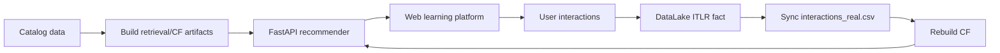

Đây là kiểu dự án phù hợp để trình bày năng lực Senior AI Engineer ở mức portfolio học thuật:
không chỉ biết gọi model, mà biết thiết kế dữ liệu, phục vụ model, đo chất lượng, tích hợp sản phẩm
và nhận diện giới hạn thật của hệ thống.
