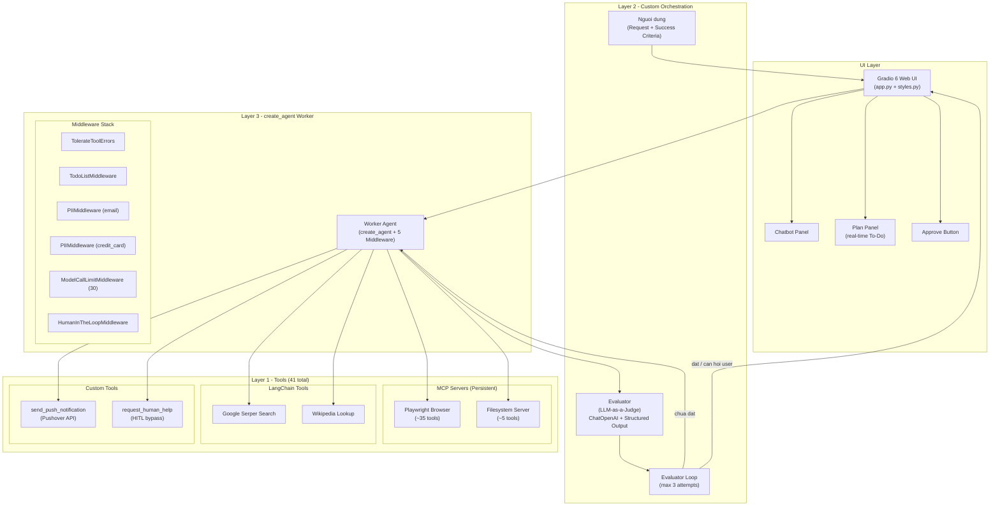
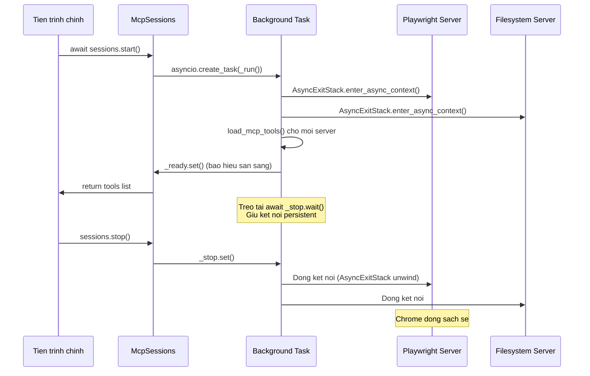
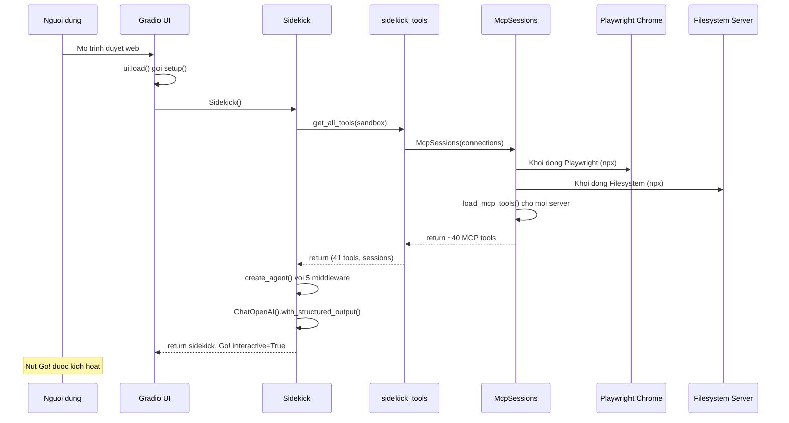
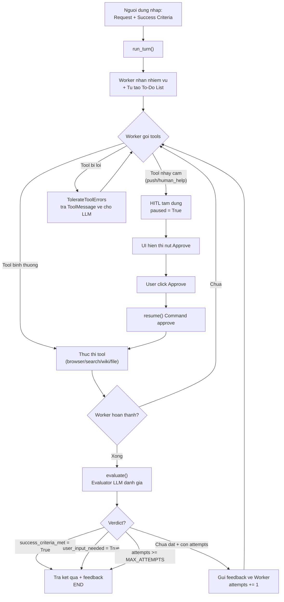
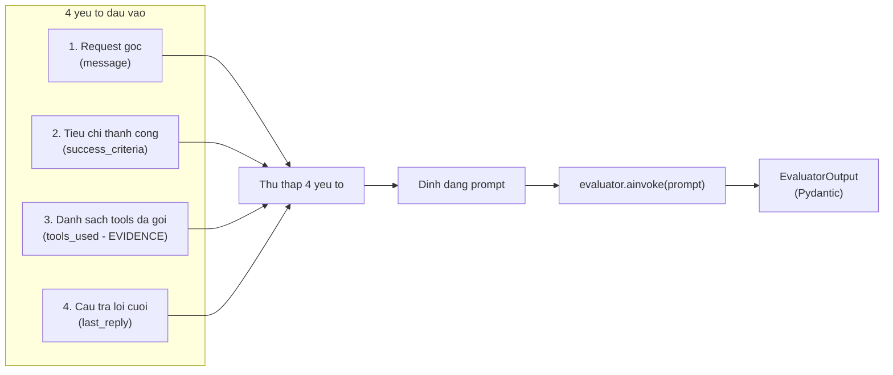

# The Sidekick - Autonomous AI Coworker

> Dự án thương mại lớn nhất của Week 4 Day 5, khóa học "AI Engineer Agentic Track: The Complete Agent & MCP Course".
> Sidekick là một tác nhân AI tự chủ (Autonomous Agent) có khả năng duyệt web thật, tương tác hệ thống tệp tin, tìm kiếm thông tin và gửi thông báo - tất cả được điều phối bởi một vòng lặp đánh giá tự động (Evaluator Loop).

---

## 1. Mục đích chính của dự án

Xây dựng một **AI Coworker (đồng nghiệp AI)** có khả năng:

- **Tự lập kế hoạch** (To-Do List) và thực thi các tác vụ phức tạp trong thế giới thực.
- **Duyệt web thật** qua trình duyệt Chrome (Playwright) - không phải mô phỏng.
- **Tự đánh giá chất lượng** đầu ra bằng một LLM thứ hai (LLM-as-a-Judge).
- **Xin phép con người** trước khi thực hiện các hành động nhạy cảm (Human-in-the-Loop).
- **Bảo vệ dữ liệu** qua các middleware lọc PII và giới hạn chi phí API.
- Tất cả được đóng gói trong **giao diện Web UI** chuyên nghiệp (Gradio 6).

**Triết lý thiết kế:** Stack-not-a-ladder (Ngăn xếp không phải thang leo) - tự do kết hợp các tầng trừu tượng khác nhau cho từng phần của hệ thống.

---

## 2. Kiến trúc tổng quan (High-Level Architecture)



### Tóm tắt kiến trúc

| Tầng | Vai trò | Công nghệ |
|------|---------|------------|
| **Layer 1** | Tools thực thi | Playwright MCP, Filesystem MCP, Google Serper, Wikipedia, Pushover, HITL |
| **Layer 2** | Vòng lặp đánh giá (Evaluator Loop) | Python async + ChatOpenAI Structured Output |
| **Layer 3** | Worker Agent | `create_agent` + 5 Middleware + InMemorySaver |
| **UI Layer** | Giao diện người dùng | Gradio 6 Blocks + Timer + State |

---

## 3. Cấu trúc thư mục dự án

```
4_langchain_langgraph/
├── 1_lab1.ipynb              # Lab 1 - Layer 1: Direct LLM calls
├── 2_lab2.ipynb              # Lab 2 - Layer 2: LangGraph manual graphs
├── 3_lab3.ipynb              # Lab 3 - Layer 3: create_agent
├── 4_lab4.ipynb              # Lab 4 - Layer 4: Deep Agents
├── 5_lab5.ipynb              # Lab 5 - Sidekick (notebook thực nghiệm)
├── sidekick.py               # Module trung tâm: Worker + Evaluator + Sidekick class
├── sidekick_tools.py         # Module tools: MCP sessions + LangChain tools + custom tools
├── app.py                    # Gradio 6 Web UI - giao diện chính
├── styles.py                 # Theme, CSS, JS cho Gradio UI
├── slide_kit.py              # Tool tạo PowerPoint slide (Voltway Research brand)
├── sandbox/                  # Thư mục sandbox cho Filesystem MCP
│   └── skills/
│       └── fleet-slide/
│           ├── SKILL.md      # Skill hướng dẫn tạo slide recommendation
│           └── logo.png      # Logo thương hiệu Voltway Research
└── tai_lieu/                 # Tài liệu học tập
    ├── day1_summary.md       # Tóm tắt Day 1 (Layer 1)
    ├── day2_summary.md       # Tóm tắt Day 2 (Layer 2)
    ├── day3_summary.md       # Tóm tắt Day 3 (Layer 3)
    ├── day4_summary.md       # Tóm tắt Day 4 (Layer 4)
    ├── day5_summary.md       # Tóm tắt Day 5 (Sidekick)
    └── README_Project.md     # <-- File này
```

---

## 4. Phân tích chi tiết từng module

### 4.1. sidekick_tools.py - Module quản lý công cụ

**Nhiệm vụ:** Tập trung hóa toàn bộ 41 tools và quản lý vòng đời kết nối MCP servers.

#### Các thành phần chính:

**a) Custom Tools (tools tự viết):**

| Tool | Chức năng | Đặc biệt |
|------|-----------|-----------|
| `send_push_notification` | Gửi thông báo đẩy qua Pushover API | Cần HITL approval trước khi gửi |
| `request_human_help` | Yêu cầu con người hỗ trợ (captcha, login, 2FA) | Cần HITL approval, agent tạm dừng chờ |

**b) LangChain Community Tools (tools có sẵn):**

| Tool | Chức năng | Lưu ý |
|------|-----------|-------|
| `GoogleSerperRun` | Tìm kiếm Google qua Serper API | Cần `SERPER_API_KEY` |
| `WikipediaQueryRun` | Tra cứu bách khoa toàn thư | Bắt buộc set custom User-Agent |

**c) Class McpSessions - Quản lý kết nối persistent:**



**Tại sao cần persistent sessions?**
- Nếu mở/đóng session mỗi lần gọi tool -> Chrome khởi động lại liên tục -> mất cookies, session đăng nhập -> agent kẹt vòng lặp login vô hạn.
- Giữ persistent -> Chrome duy trì trạng thái y hệt con người duyệt web trên 1 tab liên tục.

**d) Hàm `get_all_tools(sandbox)`:**
- Khởi tạo `McpSessions` -> nạp ~40 tools từ MCP servers.
- Gộp thêm 4 tools cục bộ (search, push, wikipedia, human help).
- Trả về tuple `(tools, sessions)` cho module `sidekick.py`.

---

### 4.2. sidekick.py - Module trung tâm vận hành

**Nhiệm vụ:** Định nghĩa toàn bộ logic cốt lõi của Sidekick: Worker agent, Evaluator, và vòng lặp điều phối.

#### Các thành phần chính:

**a) Pydantic Model `EvaluatorOutput`:**

```python
class EvaluatorOutput(BaseModel):
    feedback: str           # Nhan xet chi tiet ve ket qua cua Worker
    success_criteria_met: bool  # Da dat tieu chi thanh cong chua?
    user_input_needed: bool     # Agent bi ket va can hoi nguoi dung?
```

Ba trường này quyết định luồng đi tiếp theo:
- `success_criteria_met = True` -> Kết thúc, trả kết quả.
- `user_input_needed = True` -> Kết thúc, trả câu hỏi về cho người dùng.
- Cả hai `False` + chưa hết attempts -> Gửi feedback quay lại Worker.

**b) Prompt hệ thống `WORKER_PROMPT`:**

Prompt chứa các chỉ dẫn nghiệp vụ thực chiến:
- Ưu tiên **snapshot (đọc nhanh)** thay vì click bừa bãi khi duyệt web.
- Tự tắt cookie banners/popups.
- Gọi `request_human_help` khi gặp captcha, login, 2FA.
- Dùng **Google Flights URL query NLP** (truyền `?q=...`) thay vì click chọn lịch.
- Ngày hiện tại (`Today is...`) được đặt ở **cuối prompt** để tối ưu prompt caching.

**c) Custom Middleware `TolerateToolErrors`:**

```python
class TolerateToolErrors(AgentMiddleware):
    async def awrap_tool_call(self, request, handler):
        try:
            return await handler(request)
        except Exception as error:
            return ToolMessage(
                content=f"That tool call failed: {error}. Try another approach.",
                tool_call_id=request.tool_call["id"],
            )
```

**Tại sao cần?** Tools tương tác thế giới thực (browser, API) hay lỗi. Thay vì crash toàn bộ graph, lỗi được chuyển thành `ToolMessage` -> LLM tự tìm hướng giải quyết khác.

**d) Class `Sidekick` - Trung tâm điều phối:**

| Phương thức | Chức năng |
|-------------|-----------|
| `__init__()` | Khởi tạo ID, memory, trạng thái ban đầu |
| `setup()` | Tạo sandbox, nạp tools, khởi tạo Worker (create_agent + 5 middleware) và Evaluator |
| `evaluate()` | Đánh giá kết quả Worker dựa trên evidence (tools_used) + success criteria |
| `run_turn()` | Một lượt hội thoại hoàn chỉnh: Worker chạy -> Evaluator chấm -> retry nếu cần |
| `resume()` | Tiếp tục sau khi người dùng approve các hành động HITL |
| `_advance()` | Logic vòng lặp chính (private method) |
| `cleanup()` | Đóng MCP sessions, tắt Chrome |

**e) 5 Middleware được cấu hình cho Worker:**

| # | Middleware | Tác dụng |
|---|-----------|----------|
| 1 | `TolerateToolErrors()` | Bọc lỗi tool -> trả ToolMessage thay vì crash |
| 2 | `TodoListMiddleware()` | Tự động tạo/cập nhật kế hoạch to-do -> sync lên UI |
| 3 | `PIIMiddleware("email")` | Lọc/che email trong tin nhắn |
| 4 | `PIIMiddleware("credit_card", apply_to_tool_results=True)` | Lọc/che số thẻ tín dụng trong cả kết quả tool |
| 5 | `ModelCallLimitMiddleware(run_limit=30)` | Giới hạn tối đa 30 lần gọi LLM mỗi lượt chạy |
| 6 | `HumanInTheLoopMiddleware(interrupt_on={...})` | Tạm dừng xin phép trước khi gửi push hoặc gọi human help |

---

### 4.3. app.py - Giao diện Gradio Web UI

**Nhiệm vụ:** Đóng gói toàn bộ logic Sidekick vào giao diện web tương tác chuyên nghiệp.

#### Cấu trúc UI:

```
+-----------------------------------------------------+
|  Your personal co-worker                            |
|  Sidekick                                           |
|  =============== (gradient bar)                     |
+--------------------------------+--------------------+
|                                |     Plan           |
|      Chatbot Panel             |  o Search flights  |
|      (height=320, scale=3)     |  * Compare prices  |
|                                |  # Write report    |
|                                |     (scale=1)      |
+--------------------------------+--------------------+
|  [ Your request to the Sidekick                   ] |
|  [ What are your success criteria?                ] |
+-----------------------------------------------------+
|  [Reset]    [Approve and continue]    [Go!]         |
+-----------------------------------------------------+
```

#### Các hàm xử lý sự kiện:

| Hàm | Trigger | Chức năng |
|-----|---------|-----------|
| `setup()` | `ui.load` | Khởi tạo Sidekick + MCP servers, bật nút Go! |
| `process_message()` | Click Go / Enter | Gửi task + criteria -> chạy `run_turn()` |
| `approve()` | Click Approve | Gọi `resume()` -> tiếp tục sau HITL |
| `watch_todos()` | `gr.Timer(1)` mỗi giây | Poll `sidekick.todos` -> render HTML plan panel |
| `reset()` | Click Reset | Dọn dẹp sessions cũ -> khởi tạo Sidekick mới |
| `free_resources()` | `delete_callback` | Tự động dọn dẹp khi user đóng tab |

#### Kỹ thuật quan trọng:

**Timer-based polling cho To-Do List:**
- `gr.Timer(1)` gọi `watch_todos()` mỗi 1 giây.
- Panel plan được cập nhật **độc lập** với Chatbot.
- Nếu gắn trực tiếp `todos_panel` làm output của sự kiện click Go -> Gradio khóa cứng panel -> không thấy cập nhật real-time.

**gr.State với delete_callback:**
- Khi user đóng tab -> WebSocket ngắt -> Gradio kích hoạt `free_resources()` -> `sidekick.cleanup()` -> đóng Chrome + MCP servers sạch sẽ.
- Ngăn chặn zombie processes và tràn RAM.

---

### 4.4. styles.py - Theme và mỹ thuật

**Nhiệm vụ:** Định nghĩa tập trung toàn bộ giao diện thị giác cho ứng dụng.

#### Bảng màu thương hiệu:

| Biến | Mã màu | Vai trò |
|------|--------|---------|
| `NAVY` | `#032147` | Văn bản chính, tiêu đề |
| `BLUE` | `#209DD7` | Màu chủ đạo, nút Go!, trạng thái hoạt động |
| `GOLD` | `#FFB706` | Nút Approve (cần sự chú ý của con người) |
| `PURPLE` | `#753991` | Accent phụ, trạng thái in_progress |
| `GRAY` | `#888888` | Văn bản phụ, placeholder |
| `BACKGROUND` | `#F2F2F2` | Nền ứng dụng |

#### Ba thành phần chính:

1. **THEME** - `gr.themes.Soft` customized:
   - Primary hue: dải BLUE 11 cấp (c50->c950).
   - Font: Montserrat (Google Fonts).

2. **CSS** - Định dạng chi tiết:
   - Header với gradient bar (BLUE -> PURPLE -> GOLD).
   - Chat/Plan/Ask panels với bo góc, bóng đổ.
   - To-do markers: `pending` (xanh nhạt), `in_progress` (tím), `completed` (vàng).
   - Nút Go! (xanh), Approve (vàng), Reset (đỏ viền).

3. **JS** - Force light mode:
   - Script chạy **trước khi app mount** -> kiểm tra `__theme` param -> ép về `light`.
   - Ngăn dark flash (nhấp nháy tối) khi khởi động.

**Lưu ý Gradio 6:** `theme`, `css`, `js` phải truyền vào `ui.launch()` thay vì `gr.Blocks()`.

---

### 4.5. slide_kit.py - Tool tạo PowerPoint

**Nhiệm vụ:** Tạo slide PowerPoint một trang theo thương hiệu Voltway Research.

#### Cách hoạt động:
- Nhận 4 tham số: `title`, `key_points` (list 3 items), `recommendation`, `outfile`.
- Tạo slide 13.333" x 7.5" nền navy với:
  - Logo + tên thương hiệu góc trái trên.
  - Tiêu đề trắng lớn + thanh teal phân cách.
  - 3 key points với marker teal hình vuông.
  - Banner recommendation teal bo góc ở dưới cùng.

#### Kết hợp với SKILL.md:
- File `SKILL.md` hướng dẫn LLM cách sử dụng tool.
- LLM chỉ cần biên tập nội dung -> đẩy vào tham số -> `slide_kit.py` xử lý layout chính xác tuyệt đối.
- Tách biệt: **Content (LLM)** vs **Design (Code)**.

---

### 4.6. 5_lab5.ipynb - Notebook thực nghiệm

**Nhiệm vụ:** Hướng dẫn từng bước xây dựng và kiểm thử Sidekick.

#### Các bước chính:
1. **Step 1** - Simple Worker: Chatbot cơ bản dùng `create_agent` không middleware.
2. **Step 2** - Human-in-the-Loop: Thêm `HumanInTheLoopMiddleware` + `book_meeting` tool -> test approve/reject.
3. **Step 3** - Full Sidekick: Khởi tạo Sidekick hoàn chỉnh -> test duyệt Hacker News -> test tìm chuyến bay.
4. **Bonus** - Gradio UI: Chạy `app.py` xuất bản sản phẩm.

---

## 5. Workflow End-to-End (Luồng hoạt động đầy đủ)

### 5.1. Luồng khởi tạo ứng dụng



### 5.2. Luồng xử lý một tác vụ hoàn chỉnh



### 5.3. Luồng Evaluator đánh giá



**Tại sao cần `tools_used` làm evidence?**
- Agent có thể nói dối: "Tôi đã tìm thấy chuyến bay" nhưng thực tế không hề gọi browser tool.
- `tools_used` là bằng chứng thực thi khách quan -> Evaluator đối chiếu trước khi ra verdict.

---

## 6. Tech Stack (Ngăn xếp công nghệ)

| Thành phần | Công nghệ | Phiên bản/Chi tiết |
|------------|-----------|---------------------|
| **LLM** | OpenAI GPT-5.4-mini | Worker + Evaluator |
| **Agent Framework** | LangChain `create_agent` | Layer 3 |
| **Graph/State** | LangGraph | `InMemorySaver` checkpointer |
| **Browser Automation** | Playwright MCP Server | Headed Chrome, persistent session |
| **File System** | Filesystem MCP Server | Sandbox directory |
| **Web Search** | Google Serper API | `GoogleSerperRun` wrapper |
| **Encyclopedia** | Wikipedia API | `WikipediaQueryRun` wrapper |
| **Push Notifications** | Pushover API | HTTP POST |
| **UI Framework** | Gradio 6 | Blocks + Timer + State |
| **Slide Generation** | python-pptx | Voltway Research brand |
| **Async Runtime** | Python asyncio | `AsyncExitStack`, background tasks |
| **Data Validation** | Pydantic v2 | `EvaluatorOutput` model |
| **Telemetry** | LangSmith | Multi-trace monitoring |
| **Package Manager** | uv | `uv run app.py` |

---

## 7. Tính năng chính

### 7.1. Autonomous Task Execution (Thực thi tác vụ tự chủ)
- Worker tự lập kế hoạch (To-Do List) và thực thi mà không cần hướng dẫn từng bước.
- Duyệt web thật qua Chrome (Playwright): đọc trang, click, điền form, chụp snapshot.
- Tìm kiếm Google, tra cứu Wikipedia, đọc/ghi file hệ thống.

### 7.2. LLM-as-a-Judge (Tự đánh giá chất lượng)
- Evaluator độc lập đánh giá kết quả dựa trên evidence (tools_used).
- Tối đa 3 lần thử (MAX_ATTEMPTS) trước khi trả kết quả.
- Structured Output đảm bảo kết quả parse sạch sẽ.

### 7.3. Human-in-the-Loop (Con người kiểm duyệt)
- Tự động tạm dừng trước hành động nhạy cảm (gửi push, gọi human help).
- Hỗ trợ 3 loại quyết định: `approve`, `edit`, `reject`.
- `reject` gửi feedback ngược cho LLM tự sửa sai.

### 7.4. Safety Middleware Stack (Ngăn xếp bảo vệ)
- **PII Redaction**: Lọc email và số thẻ tín dụng khỏi tin nhắn và kết quả tool.
- **Budget Cap**: Giới hạn 30 lần gọi LLM mỗi lượt -> ngăn cạn kiệt API.
- **Error Tolerance**: Bọc lỗi tool -> LLM tự phục hồi thay vì crash.

### 7.5. Real-time Progress Tracking (Theo dõi tiến độ thời gian thực)
- `TodoListMiddleware` tự động tạo/cập nhật kế hoạch.
- `gr.Timer(1)` poll mỗi giây -> render plan panel live.
- Trạng thái: `pending` (chờ) -> `in_progress` (đang chạy) -> `completed` (xong).

### 7.6. Professional Web UI (Giao diện web chuyên nghiệp)
- Gradio 6 Blocks layout: Chatbot + Plan panel + Input fields.
- Thương hiệu nhất quán: palette navy/blue/gold/purple.
- Force light mode, resource cleanup tự động.

### 7.7. PowerPoint Slide Generation (Tạo slide tự động)
- Tool `build_slide()` tạo slide Voltway Research brand.
- SKILL.md hướng dẫn LLM cách sử dụng.
- Tách biệt Content (LLM) vs Design (Code).

---

## 8. Cách chạy dự án

### Yêu cầu:
- Python 3.11+ với `uv` package manager.
- Node.js (cho MCP servers via `npx`).
- API keys trong file `.env`:

```env
OPENAI_API_KEY=sk-...
SERPER_API_KEY=...
PUSHOVER_TOKEN=...
PUSHOVER_USER=...
LANGSMITH_API_KEY=...     # (tùy chọn, cho telemetry)
```

### Chạy Web UI:
```bash
uv run app.py
```

### Chạy trong Notebook:
Mở `5_lab5.ipynb` và chạy tuần tự các cell.

---

## 9. Trade-offs (Bản đồ lựa chọn thiết kế)

### 9.1. Layer 3 create_agent + Layer 2 custom loop vs Layer 4 Deep Agents

| Tiêu chí | create_agent + custom loop (Da chon) | Deep Agents (Layer 4) |
|-----------|--------------------------------------|----------------------|
| **Tùy biến UI** | Tự do hoàn toàn (Gradio, React, ...) | Bị gắn cứng terminal harness |
| **Evaluator** | Tự lập trình, toàn quyền kiểm soát | Không hỗ trợ sẵn |
| **Middleware** | Có đầy đủ (PII, todo, budget, HITL) | Có, nhưng bị bọc kín |
| **Độ phức tạp code** | Cần viết thêm scaffolding ngoài | Gần zero boilerplate |
| **Phù hợp cho** | Sản phẩm thương mại | Prototype nhanh |

### 9.2. Persistent MCP Sessions vs Mo/Dong moi lan goi tool

| Tiêu chí | Persistent (Da chon) | Mo/Dong moi lan |
|-----------|----------------------|-------------------|
| **Browser state** | Giữ cookies, session, lịch sử | Mất hết sau mỗi lần |
| **Hiệu suất** | Tối ưu, không khởi động lại Chrome | Cực kỳ chậm, tốn CPU/RAM |
| **Độ phức tạp** | Cao (AsyncExitStack, background task) | Rất thấp |
| **Phù hợp cho** | Agent duyệt web nhiều bước | Tool đơn giản, stateless |

### 9.3. Evaluator doc lap vs Worker tu danh gia

| Tiêu chí | Evaluator doc lap (Da chon) | Worker tu danh gia |
|-----------|------------------------------|---------------------|
| **Tính khách quan** | Cao (LLM riêng biệt) | Thấp (tự chấm mình) |
| **Chi phí** | +1 cuộc gọi LLM/lượt | Miễn phí |
| **Chống hallucination** | Mạnh (dùng tools_used evidence) | Yếu |
| **Phù hợp cho** | Sản xuất, tác vụ quan trọng | Tác vụ đơn giản |

### 9.4. Timer polling vs Tra plan sau khi agent xong

| Tiêu chí | Timer polling (Da chon) | Tra sau khi xong |
|-----------|-------------------------|-------------------|
| **UX** | Real-time, biết agent đang làm gì | Black box, chờ mù |
| **Độ phức tạp** | Cần gr.Timer + watch function | Đơn giản |
| **Tải backend** | +1 request nhẹ/giây | Không |
| **Phù hợp cho** | Agent chạy lâu (> 5 giây) | Agent nhanh (< 5 giây) |

---

## 10. Pitfalls (Bẫy thường gặp)

### 10.1. Agent chạy vòng lặp vô hạn, cạn API
- **Nguyên nhân:** Thiếu `ModelCallLimitMiddleware` hoặc `MAX_ATTEMPTS`.
- **Dấu hiệu:** Thời gian chạy kéo dài, hàng chục API calls trong LangSmith.
- **Phòng tránh:** Luôn cấu hình `run_limit=30` và `MAX_ATTEMPTS=3`.

### 10.2. Wikipedia API trả lỗi HTTP 403
- **Nguyên nhân:** User-Agent mặc định bị Wikimedia chặn.
- **Phòng tránh:** Gọi `wikipedia.set_user_agent("app_name (url)")` đầu file.

### 10.3. Resume HITL không hoạt động
- **Nguyên nhân:** Quên truyền `config` chứa `thread_id` cùng phiên.
- **Phòng tránh:** Luôn truyền `config = {"configurable": {"thread_id": "..."}}` qua mọi lần gọi `.ainvoke()`.

### 10.4. Evaluator luôn phê duyệt dù agent chưa làm gì
- **Nguyên nhân:** Prompt đánh giá chỉ dựa trên câu trả lời văn bản, không kiểm tra tool calls.
- **Phòng tránh:** Bắt buộc đưa `tools_used` vào prompt làm evidence.

### 10.5. Đồ thị Mermaid render lỗi
- **Nguyên nhân:** Tên middleware sinh ra chứa ký tự `[` và `]`.
- **Phòng tránh:** `.replace("[", " ").replace("]", " ")` trước khi render.

### 10.6. To-Do List không cập nhật real-time trên UI
- **Nguyên nhân:** Gắn `todos_panel` làm output trực tiếp của sự kiện click Go.
- **Phòng tránh:** Chỉ cho phép `gr.Timer.tick()` sở hữu output `todos_panel`.

### 10.7. Chrome trình duyệt bị tràn (zombie processes)
- **Nguyên nhân:** User đóng tab nhưng MCP sessions không được dọn dẹp.
- **Phòng tránh:** Dùng `gr.State(delete_callback=free_resources)`.

---

## 11. Telemetry và Monitoring

Khi chạy với LangSmith, mỗi tác vụ Sidekick tạo ra **3 traces riêng biệt**:

| Trace | Trigger | Nội dung |
|-------|---------|----------|
| **Trace 1** | `.ainvoke()` lần 1 | Worker chạy -> gặp HITL -> tạm dừng |
| **Trace 2** | `.ainvoke()` với `Command(resume=...)` | Tiếp tục sau approve -> Worker hoàn thành |
| **Trace 3** | `evaluator.ainvoke()` | Evaluator đánh giá kết quả |

**Tại sao 3 traces?** Mỗi lần gọi `.ainvoke()` là một request API riêng lẻ -> LangSmith ghi nhận thành trace riêng, dù chia sẻ chung `thread_id` trong checkpointer.

---

## 12. Sản phẩm đạt được

Khi hoàn thành dự án, người học có:

1. **Một ứng dụng Web UI hoàn chỉnh** - tác nhân AI tự chủ chạy trên trình duyệt web thật.
2. **Hiểu sâu kiến trúc stack-not-a-ladder** - kết hợp linh hoạt Layer 1/2/3 cho từng phần.
3. **Nắm vững 5 middleware bảo vệ** - PII, budget, HITL, todo, error tolerance.
4. **Thực hành LLM-as-a-Judge** - evaluator độc lập dựa trên evidence.
5. **Quản lý MCP persistent sessions** - AsyncExitStack + background tasks.
6. **Xây dựng Gradio 6 UI chuyên nghiệp** - timer polling, state cleanup, force light mode.
7. **Tool tạo PowerPoint tự động** - kết hợp SKILL.md + python-pptx.

---

## 13. Bối cảnh trong khóa học

Dự án Sidekick là đỉnh cao của tuần học thứ 4, tổng hợp kiến thức từ 4 tầng trừu tượng:

| Day | Tầng | Nội dung |
|-----|------|----------|
| Day 1 | Layer 1 | Direct LLM calls, prompt engineering |
| Day 2 | Layer 2 | LangGraph manual graphs, state machines |
| Day 3 | Layer 3 | `create_agent`, middleware, tools |
| Day 4 | Layer 4 | Deep Agents, harness tích hợp |
| **Day 5** | **Layer 2+3** | **Sidekick: create_agent + custom evaluator loop + Gradio UI** |

Sidekick chứng minh triết lý: **không bị giam trong một tầng duy nhất**, mà tự do chọn lựa tầng phù hợp nhất cho từng phần của hệ thống.
