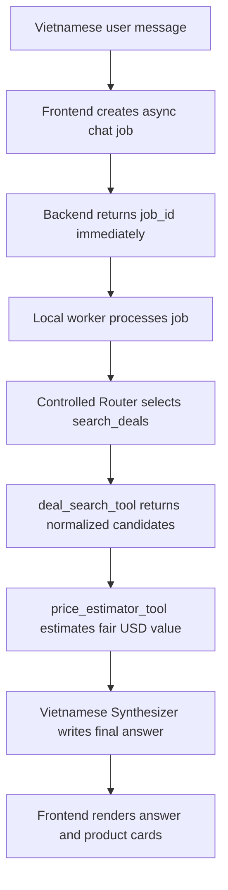
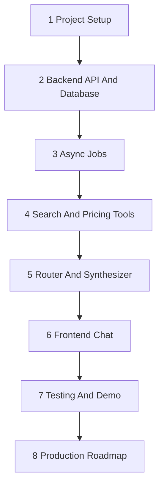
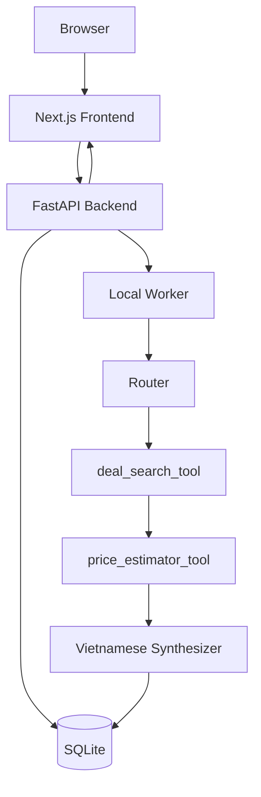
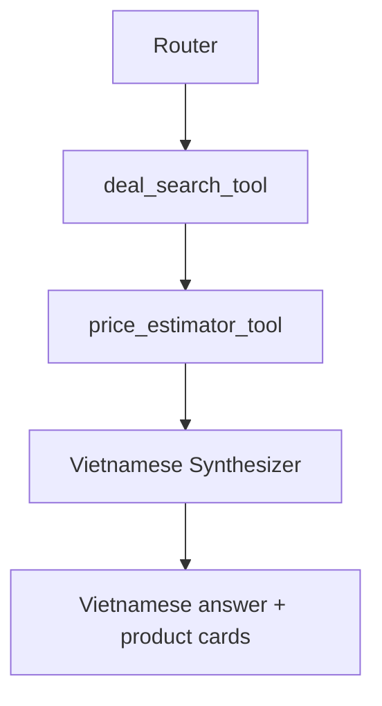
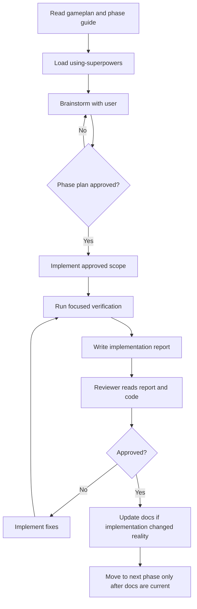

# Shopping Assistant V3 Gameplan

## Project Identity

Shopping Assistant V3 is a documentation-first reset of the DATN shopping
assistant plan. It keeps the V2 product direction but reduces scattered
Markdown into one gameplan, two architecture guides, eight phase guides, and
mandatory implementation reports.

The project is a local-first, DATN/CV-ready assistant. It should prove a
working end-to-end product loop before production infrastructure or extra
agents are added.

## Product Positioning

The product is a Vietnamese-speaking US deal assistant.

Users write Vietnamese messages. The system may search and price English product
data from:

- Amazon
- BestBuy

Product names, specifications, source labels, and URLs can remain English when
that is clearer. Prices are USD. The assistant response must be Vietnamese and
must explain deal value from tool evidence.

This is not a Vietnamese marketplace assistant in the first MVP. The earlier
Vietnamese marketplace pricing-first direction remains valuable research, but
text-only Vietnamese price prediction is not strong enough to be the product
core. V3 therefore reuses the stronger English `segment4/search_key.py`
pipeline concept and adds a Vietnamese chat/summary layer.

## MVP Goal

Build a local app where a Vietnamese user can ask for product deals and receive
Amazon/BestBuy results with sale price, estimated fair value, discount, source,
URL, and Vietnamese explanation.

MVP flow:



Required MVP capabilities:

- Next.js chat-first frontend.
- FastAPI local backend.
- SQLite persistence.
- Async job lifecycle using `job_id`.
- `demo_user` identity.
- Controlled Router, not free-form ReAct.
- Deal search and price estimator tool contracts.
- Vietnamese final answer.
- Product result cards.
- Structured logs and audit events correlated by `job_id`.
- Mock/fixture mode by default.

## Non-Goals

For the first MVP:

- No Vietnamese marketplace scraping.
- No new Vietnamese price model training.
- No AWS deployment.
- No Clerk auth.
- No payment/subscription.
- No mobile app.
- No free-form ReAct loop.
- No production scraper scaling.
- No live Amazon/BestBuy scraping unless explicitly approved.
- No paid model calls unless explicitly approved.

## Source Of Truth Priority

When instructions or documents conflict, use this order:

1. System/developer/user instructions for the current session.
2. Repository `AGENTS.md`.
3. `shopping_assistant_v3/gameplan.md`.
4. `shopping_assistant_v3/guides/architecture.md`.
5. `shopping_assistant_v3/guides/agent_architecture.md`.
6. Current phase guide in `shopping_assistant_v3/guides/`.
7. Approved implementation reports in `shopping_assistant_v3/reports/`.
8. `shopping_assistant_v2/` as migration/reference only.
9. `segment4/` as prototype/reference only.

V3 must not create `docs/`, `plans/`, or `specs/` unless the user explicitly
approves a new documentation structure.

## Required Reading Order

For every new implementation session:

1. Read `shopping_assistant_v3/gameplan.md`.
2. Read `shopping_assistant_v3/guides/architecture.md`.
3. Read `shopping_assistant_v3/guides/agent_architecture.md`.
4. Read the guide for the phase being implemented.
5. Read relevant approved reports in `shopping_assistant_v3/reports/`.
6. If the phase references `segment4`, inspect the required flow with CodeGraph
   before planning edits.

## Agent Workflow Requirements

Every implementation or review session must start by loading the correct
workflow skills and clarifying phase scope before code changes.

Required process:

1. Start with `using-superpowers`.
2. Use `brainstorming` as the main process before every phase.
3. Use `rich-elicitation` only when there are still two or more important
   ambiguity dimensions, and each dimension has three or more reasonable
   options.
4. Ask questions until scope, design, verification, and implementation plan are
   clear enough to avoid rework.
5. Prefer multiple-choice questions with one recommended option.
6. Do not ask broad or decorative questions. Each question must change scope,
   design, test strategy, or implementation plan.
7. Do not write runtime code until the user has approved the phase plan.
8. Use `writing-plans` after brainstorming if a detailed implementation plan is
   needed.
9. Use quality skills when relevant:
   - `test-driven-development`
   - `systematic-debugging`
   - `requesting-code-review`
   - `receiving-code-review`
   - `verification-before-completion`
10. In this repo, skills live at:

```text
/home/hieu0606sunny/.codex/skills/
```

## Target Folder Structure

Documentation structure:

```text
shopping_assistant_v3/
├── README.md
├── gameplan.md
├── guides/
│   ├── architecture.md
│   ├── agent_architecture.md
│   ├── 1_project_setup.md
│   ├── 2_backend_api_and_database.md
│   ├── 3_async_jobs.md
│   ├── 4_search_and_pricing_tools.md
│   ├── 5_router_and_synthesizer.md
│   ├── 6_frontend_chat.md
│   ├── 7_testing_and_demo.md
│   └── 8_production_roadmap.md
└── reports/
    ├── README.md
    └── TEMPLATE_IMPLEMENTATION_REPORT.md
```

Future runtime structure, created only by approved implementation phases:

```text
shopping_assistant_v3/
├── backend/
│   ├── shared/
│   ├── database/
│   ├── api/
│   ├── router/
│   ├── tools/
│   │   ├── deal_search/
│   │   └── price_estimator/
│   └── synthesizer/
├── frontend/
├── scripts/
├── guides/
└── reports/
```

## Phase Overview

V3 uses eight implementation phases.



| Phase | Guide | Goal |
|---|---|---|
| 1 | `1_project_setup.md` | Prepare local project structure and tooling decisions. |
| 2 | `2_backend_api_and_database.md` | Build FastAPI API, SQLite schema, repositories, and job endpoints. |
| 3 | `3_async_jobs.md` | Implement local async worker and deterministic mock job completion. |
| 4 | `4_search_and_pricing_tools.md` | Implement mock tools, then extract real search/pricing behavior from `segment4` when approved. |
| 5 | `5_router_and_synthesizer.md` | Implement controlled Router and Vietnamese Synthesizer from evidence. |
| 6 | `6_frontend_chat.md` | Build Next.js chat UI with polling and product cards. |
| 7 | `7_testing_and_demo.md` | Harden tests, fixtures, demo flow, and known limitations. |
| 8 | `8_production_roadmap.md` | Document production path after local MVP is stable. |

Phase 4 is intentionally one guide with internal milestones:

- 4A: mock tool contracts and fixtures.
- 4B: real Amazon/BestBuy search extraction.
- 4C: real price estimator extraction.

Reports may be written per milestone when that improves review quality.

## Architecture Summary

Local MVP architecture:



Principles:

- Local-first before production.
- Async jobs before long-running scraping/model work.
- Tool evidence before model narrative.
- Vietnamese UX, English product data.
- SQLite first, schema designed to migrate to Postgres.
- Mock mode must work without network or paid model calls.
- Real search/model calls are explicit opt-in.

## Agent Workflow Summary

MVP agent workflow:



The Router classifies the Vietnamese user request and produces a normalized
English query. The search tool returns product evidence. The pricing tool
returns fair value estimates. The Synthesizer writes Vietnamese output only from
that evidence.

Allowed intents:

- `search_deals`
- `estimate_price`
- `general_product_qa`
- `compare`
- `advisor`
- `unsupported`

MVP executes only `search_deals`. Other intents return safe fallback or remain
future work.

## Implementation And Review Workflow

Every phase follows this gate:



1. Coding agent reads `gameplan.md`, architecture guides, and current phase
   guide.
2. Coding agent runs a focused brainstorming/research pass with the user.
3. Coding agent implements only the approved phase scope.
4. Coding agent runs the smallest relevant verification first.
5. Coding agent writes a report in `reports/`.
6. Reviewer reads the report and inspects code as needed.
7. Reviewer returns blocker/major/minor findings.
8. Implementer fixes required issues.
9. Reviewer approves the phase.
10. Reviewer updates `gameplan.md` and the phase guide if implementation changed
    reality.
11. Only after docs are updated may the project move to the next phase.

Do not claim a feature is complete unless implementation and verification prove
it.

## Coding Agent Rules

- Communicate in Vietnamese. Keep technical terms in English when clearer.
- Code and comments must be in English.
- Use `uv` for Python commands.
- Do not use `pip` directly.
- Do not modify `segment4/`.
- Do not modify `shopping_assistant_v2/`.
- Do not stage, commit, or push unless explicitly asked.
- Do not read, print, or summarize secrets from `.env`, credentials, tokens, or
  auth files.
- Do not call paid model APIs unless explicitly approved.
- Do not live scrape Amazon/BestBuy unless explicitly approved.
- Do not deploy AWS/Terraform until a later approved production phase.
- Prefer surgical changes and small verification steps.
- If a guide is ambiguous, update the guide before implementation after user
  approval.

## Verification Rules

Default verification must be deterministic and local:

- Use fixtures/mocks for search, pricing, Router, and Synthesizer tests.
- Backend tests must not require network/model calls.
- Frontend smoke tests must not require real search/model calls.
- Manual real-mode tests must be separately documented and opt-in.
- Failed jobs must store safe error messages.
- Logs and audit rows must be traceable by `job_id`.

Expected test layers by MVP:

- API validation tests.
- Database repository tests.
- Job lifecycle tests.
- Tool schema and fixture tests.
- Router and Synthesizer fixture tests.
- Backend integration test for job completion.
- Frontend smoke/component tests.
- Manual demo checklist.

## Cost And Safety Rules

- `ENABLE_REAL_SEARCH=false` by default.
- `ENABLE_REAL_MODEL_CALLS=false` by default.
- No OpenAI/Modal/API calls in default tests.
- No AWS commands without explicit approval.
- No secrets in logs, reports, or docs.
- Store only sanitized input/output summaries in logs and reports.
- If scraping/model calls fail, preserve useful partial results and warnings.

## Current Phase Status

Current V3 status:

- Documentation structure is being created.
- No V3 runtime backend/frontend is implemented yet.
- `shopping_assistant_v2/` remains reference-only.
- `segment4/` remains prototype/reference-only.

Next recommended implementation phase after documentation review:

1. Phase 1: Project Setup.
2. Phase 2: Backend API and Database.
3. Phase 3: Async Jobs.
