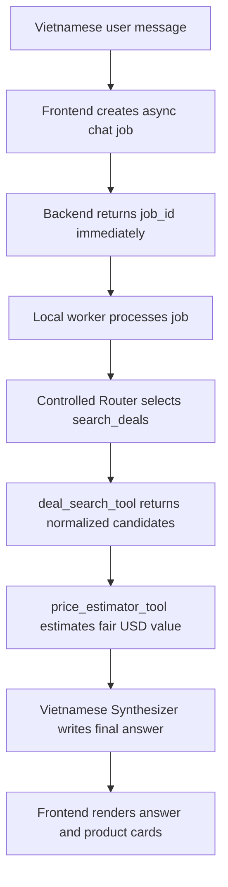
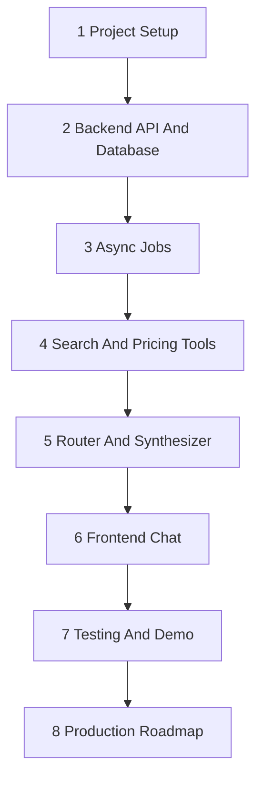
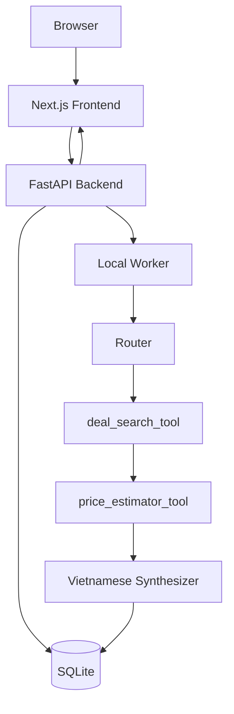
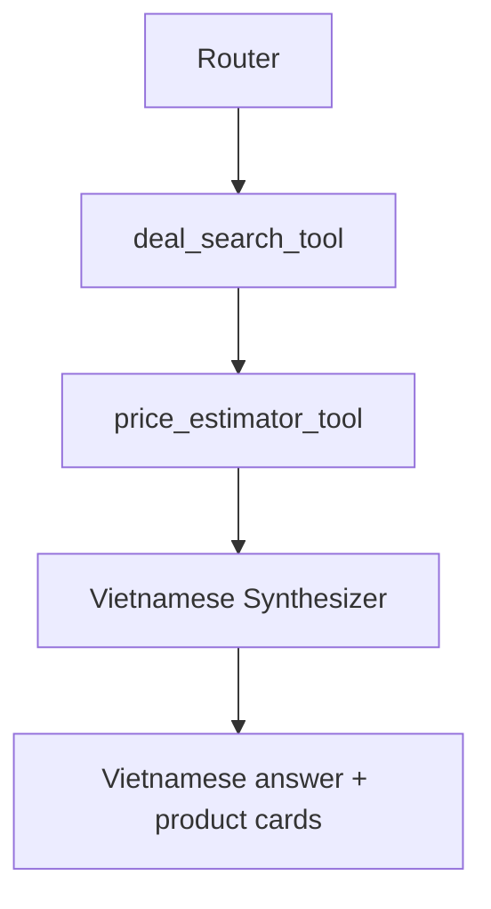
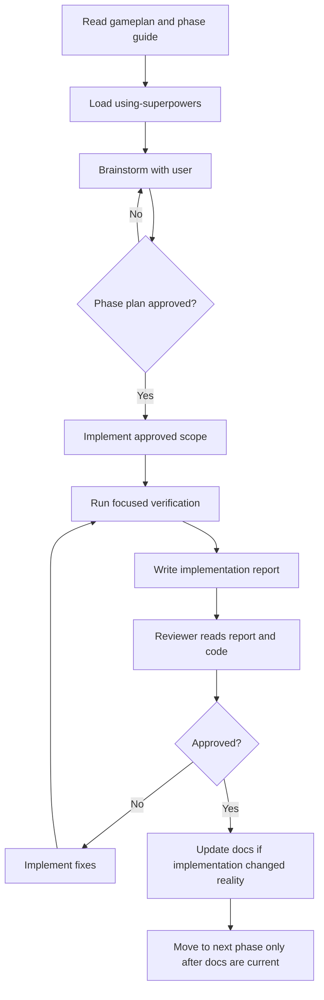

# Shopping Assistant V3 Gameplan

## Danh Tính Project

Shopping Assistant V3 là bản reset documentation-first của kế hoạch DATN
shopping assistant. Nó giữ product direction của V2 nhưng gom các Markdown rải
rác thành một gameplan, hai architecture guides, tám phase guides, và các
implementation reports bắt buộc.

Project là assistant local-first, sẵn sàng cho DATN/CV. Nó cần chứng minh một
end-to-end product loop hoạt động được trước khi thêm production infrastructure
hoặc agents phụ.

## Định Vị Product

Product là US deal assistant nói tiếng Việt.

Users viết messages bằng tiếng Việt. Hệ thống có thể search và price dữ liệu
product tiếng Anh từ:

- Amazon
- BestBuy

Product names, specifications, source labels, và URLs có thể giữ tiếng Anh khi
rõ hơn. Prices dùng USD. Assistant response phải bằng tiếng Việt và phải giải
thích deal value từ tool evidence.

Đây không phải Vietnamese marketplace assistant trong MVP đầu tiên. Hướng
Vietnamese marketplace pricing-first trước đó vẫn là research có giá trị, nhưng
text-only Vietnamese price prediction chưa đủ mạnh để làm product core. Vì vậy
V3 tái sử dụng concept pipeline tiếng Anh mạnh hơn từ `segment4/search_key.py`
và thêm một Vietnamese chat/summary layer.

## Mục Tiêu MVP

Xây một local app nơi user tiếng Việt có thể hỏi về product deals và nhận kết
quả Amazon/BestBuy với sale price, estimated fair value, discount, source, URL,
và giải thích bằng tiếng Việt.

MVP flow:



Các capabilities bắt buộc của MVP:

- Next.js frontend ưu tiên chat.
- FastAPI local backend.
- SQLite persistence.
- Async job lifecycle dùng `job_id`.
- Identity `demo_user`.
- Controlled Router, không dùng free-form ReAct.
- Deal search và price estimator tool contracts.
- Câu trả lời cuối cùng bằng tiếng Việt.
- Product result cards.
- Structured logs và audit events được correlate bằng `job_id`.
- Mock/fixture mode theo mặc định.

## Non-Goals

Với MVP đầu tiên:

- Không Vietnamese marketplace scraping.
- Không training Vietnamese price model mới.
- Không AWS deployment.
- Không Clerk auth.
- Không payment/subscription.
- Không mobile app.
- Không free-form ReAct loop.
- Không production scraper scaling.
- Không live Amazon/BestBuy scraping trừ khi được explicitly approved.
- Không paid model calls trừ khi được explicitly approved.

## Thứ Tự Ưu Tiên Source Of Truth

Khi instructions hoặc documents mâu thuẫn, dùng thứ tự này:

1. System/developer/user instructions trong current session.
2. Repository `AGENTS.md`.
3. `shopping_assistant_v3/gameplan.md`.
4. `shopping_assistant_v3/guides/architecture.md`.
5. `shopping_assistant_v3/guides/agent_architecture.md`.
6. Current phase guide trong `shopping_assistant_v3/guides/`.
7. Approved implementation reports trong `shopping_assistant_v3/reports/`.
8. `shopping_assistant_v2/` chỉ là migration/reference.
9. `segment4/` chỉ là prototype/reference.

V3 không được tạo `docs/`, `plans/`, hoặc `specs/` trừ khi user explicitly
approves một documentation structure mới.

## Thứ Tự Đọc Bắt Buộc

Với mọi implementation session mới:

1. Đọc `shopping_assistant_v3/gameplan.md`.
2. Đọc `shopping_assistant_v3/guides/architecture.md`.
3. Đọc `shopping_assistant_v3/guides/agent_architecture.md`.
4. Đọc guide của phase đang được implement.
5. Đọc các approved reports liên quan trong `shopping_assistant_v3/reports/`.
6. Nếu phase references `segment4`, inspect required flow bằng CodeGraph trước
   khi planning edits.

## Yêu Cầu Agent Workflow

Mọi implementation hoặc review session phải bắt đầu bằng việc load đúng
workflow skills và làm rõ phase scope trước khi code changes.

Quy trình bắt buộc:

1. Bắt đầu với `using-superpowers`.
2. Dùng `brainstorming` làm main process trước mỗi phase.
3. Chỉ dùng `rich-elicitation` khi vẫn còn từ hai ambiguity dimensions quan
   trọng trở lên, và mỗi dimension có từ ba reasonable options trở lên.
4. Hỏi cho tới khi scope, design, verification, và implementation plan đủ rõ để
   tránh rework.
5. Ưu tiên multiple-choice questions với một recommended option.
6. Không hỏi câu broad hoặc decorative. Mỗi câu hỏi phải thay đổi scope,
   design, test strategy, hoặc implementation plan.
7. Không viết runtime code cho tới khi user đã approve phase plan.
8. Dùng `writing-plans` sau brainstorming nếu cần detailed implementation plan.
9. Dùng quality skills khi liên quan:
   - `test-driven-development`
   - `systematic-debugging`
   - `requesting-code-review`
   - `receiving-code-review`
   - `verification-before-completion`
10. Trong repo này, skills nằm tại:

```text
/home/hieu0606sunny/.codex/skills/
```

## Target Folder Structure

Documentation structure:

```text
shopping_assistant_v3/
├── README.md
├── gameplan.md
├── guides/
│   ├── architecture.md
│   ├── agent_architecture.md
│   ├── 1_project_setup.md
│   ├── 2_backend_api_and_database.md
│   ├── 3_async_jobs.md
│   ├── 4_search_and_pricing_tools.md
│   ├── 5_router_and_synthesizer.md
│   ├── 6_frontend_chat.md
│   ├── 7_testing_and_demo.md
│   └── 8_production_roadmap.md
└── reports/
    ├── README.md
    └── TEMPLATE_IMPLEMENTATION_REPORT.md
```

Future runtime structure, chỉ được tạo bởi approved implementation phases:

```text
shopping_assistant_v3/
├── backend/
│   ├── shared/
│   ├── database/
│   ├── api/
│   ├── router/
│   ├── tools/
│   │   ├── deal_search/
│   │   └── price_estimator/
│   └── synthesizer/
├── frontend/
├── scripts/
├── guides/
└── reports/
```

## Tổng Quan Phase

V3 dùng tám implementation phases.



| Phase | Guide | Goal |
|---|---|---|
| 1 | `1_project_setup.md` | Chuẩn bị local project structure và tooling decisions. |
| 2 | `2_backend_api_and_database.md` | Xây FastAPI API, SQLite schema, repositories, và job endpoints. |
| 3 | `3_async_jobs.md` | Implement local async worker và deterministic mock job completion. |
| 4 | `4_search_and_pricing_tools.md` | Implement mock tools, sau đó extract real search/pricing behavior từ `segment4` khi được approve. |
| 5 | `5_router_and_synthesizer.md` | Implement controlled Router và Vietnamese Synthesizer từ evidence. |
| 6 | `6_frontend_chat.md` | Xây Next.js chat UI với polling và product cards. |
| 7 | `7_testing_and_demo.md` | Harden tests, fixtures, demo flow, và known limitations. |
| 8 | `8_production_roadmap.md` | Document production path sau khi local MVP ổn định. |

Phase 4 cố ý là một guide với internal milestones:

- 4A: mock tool contracts and fixtures.
- 4B: real Amazon/BestBuy search extraction.
- 4C: real price estimator extraction.

Reports có thể được viết theo từng milestone khi việc đó cải thiện review
quality.

## Tóm Tắt Architecture

Local MVP architecture:



Nguyên tắc:

- Local-first trước production.
- Async jobs trước long-running scraping/model work.
- Tool evidence trước model narrative.
- Vietnamese UX, English product data.
- SQLite trước, schema được thiết kế để migrate sang Postgres.
- Mock mode phải hoạt động không cần network hoặc paid model calls.
- Real search/model calls là explicit opt-in.

## Tóm Tắt Agent Workflow

MVP agent workflow:



Router classify Vietnamese user request và tạo normalized English query. Search
tool trả về product evidence. Pricing tool trả về fair value estimates.
Synthesizer viết output tiếng Việt chỉ từ evidence đó.

Allowed intents:

- `search_deals`
- `estimate_price`
- `general_product_qa`
- `compare`
- `advisor`
- `unsupported`

MVP executes only `search_deals`. Other intents return safe fallback or remain
future work.

## Implementation Và Review Workflow

Mọi phase tuân theo gate này:



1. Coding agent đọc `gameplan.md`, architecture guides, và current phase guide.
2. Coding agent chạy một focused brainstorming/research pass với user.
3. Coding agent chỉ implement approved phase scope.
4. Coding agent chạy smallest relevant verification trước.
5. Coding agent viết report trong `reports/`.
6. Reviewer đọc report và inspect code khi cần.
7. Reviewer trả về findings mức blocker/major/minor.
8. Implementer sửa required issues.
9. Reviewer approve phase.
10. Reviewer cập nhật `gameplan.md` và phase guide nếu implementation đã làm
    thay đổi thực tế.
11. Chỉ sau khi docs được cập nhật thì project mới được chuyển sang phase tiếp
    theo.

Không claim một feature đã hoàn thành trừ khi implementation và verification
chứng minh điều đó.

## Quy Tắc Coding Agent

- Giao tiếp bằng tiếng Việt. Giữ technical terms bằng tiếng Anh khi rõ hơn.
- Code và comments phải bằng tiếng Anh.
- Dùng `uv` cho Python commands.
- Không dùng trực tiếp `pip`.
- Không modify `segment4/`.
- Không modify `shopping_assistant_v2/`.
- Không stage, commit, hoặc push trừ khi được yêu cầu rõ.
- Không đọc, in, hoặc summarize secrets từ `.env`, credentials, tokens, hoặc
  auth files.
- Không gọi paid model APIs trừ khi được explicitly approved.
- Không live scrape Amazon/BestBuy trừ khi được explicitly approved.
- Không deploy AWS/Terraform cho tới một approved production phase sau này.
- Ưu tiên surgical changes và small verification steps.
- Nếu một guide ambiguous, cập nhật guide trước implementation sau khi user
  approval.

## Quy Tắc Verification

Default verification phải deterministic và local:

- Dùng fixtures/mocks cho search, pricing, Router, và Synthesizer tests.
- Backend tests không được yêu cầu network/model calls.
- Frontend smoke tests không được yêu cầu real search/model calls.
- Manual real-mode tests phải được document riêng và opt-in.
- Failed jobs phải lưu safe error messages.
- Logs và audit rows phải trace được bằng `job_id`.

Các test layers kỳ vọng theo MVP:

- API validation tests.
- Database repository tests.
- Job lifecycle tests.
- Tool schema and fixture tests.
- Router and Synthesizer fixture tests.
- Backend integration test for job completion.
- Frontend smoke/component tests.
- Manual demo checklist.

## Quy Tắc Cost Và Safety

- `ENABLE_REAL_SEARCH=false` by default.
- `ENABLE_REAL_MODEL_CALLS=false` by default.
- Không có OpenAI/Modal/API calls trong default tests.
- Không có AWS commands nếu không có explicit approval.
- Không có secrets trong logs, reports, hoặc docs.
- Chỉ lưu sanitized input/output summaries trong logs và reports.
- Nếu scraping/model calls fail, giữ useful partial results và warnings.

## Current Phase Status

Current V3 status:

- Phase 1 Project Setup đã được approve.
- Runtime skeleton folders cho `backend/`, `frontend/`, và `scripts/` tồn tại.
- Chưa có V3 runtime backend/frontend code nào được implement.
- Phase 2 Backend API and Database là implementation phase tiếp theo.
- `shopping_assistant_v2/` vẫn chỉ là reference.
- `segment4/` vẫn chỉ là prototype/reference.

Next recommended implementation phase:

1. Phase 2: Backend API and Database.
2. Phase 3: Async Jobs.
3. Phase 4A: Mock Search and Pricing Tools.
