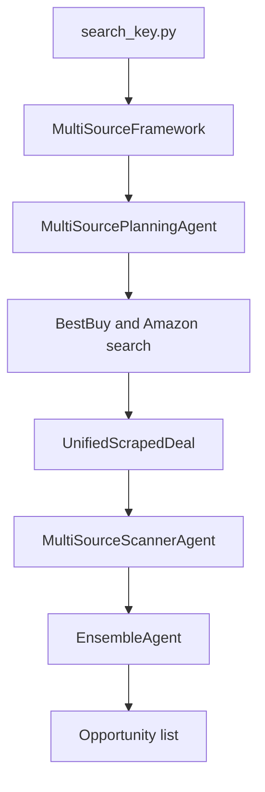

# Phase 4: Search And Pricing Tools

## Purpose

Implement V3 tool interfaces for product search and price estimation.

This phase first builds deterministic mock tools, then optionally extracts real
Amazon/BestBuy search and English ensemble pricing behavior from `segment4`
without modifying `segment4`.

## Current Status

Phase 4 starts after the backend job lifecycle works with a mock result.

`segment4/search_key.py` is the prototype reference:



## Scope

Phase 4 includes three internal milestones:

### 4A: Mock Tool Contracts

- Define schemas for `deal_search_tool`.
- Define schemas for `price_estimator_tool`.
- Add fixture data for Amazon and BestBuy candidates.
- Add fixture price estimates.
- Add tests that require no network/model calls.

### 4B: Real Search Extraction

Only after explicit approval:

- Inspect `segment4` call paths with CodeGraph.
- Adapt minimal BestBuy search behavior.
- Adapt minimal Amazon search behavior.
- Normalize output to V3 schema.
- Add opt-in real search test.

### 4C: Real Pricing Extraction

Only after explicit approval:

- Inspect `EnsembleAgent` flow with CodeGraph.
- Adapt/wrap preprocessor behavior as needed.
- Adapt/wrap Frontier, Specialist, and Neural model calls.
- Return V3 price estimate schema.
- Add opt-in real model test.

## Non-Goals

- No modification to `segment4/`.
- No Gradio UI extraction.
- No Pushover notification extraction.
- No DealNews RSS/autonomous workflow.
- No t-SNE visualization.
- No live scraping/model calls in default tests.
- No direct import from `segment4` unless explicitly approved and documented.

## Inputs From Previous Phases

Required:

- Phase 3 job lifecycle.
- `guides/agent_architecture.md`.
- `segment4/mo_ta_du_an/DOCUMENTATION_SEARCHKEY.md`.

For 4B/4C:

- CodeGraph query evidence for the exact flow being extracted.

## Contracts

### `deal_search_tool`

Input:

```json
{
  "query_en": "gaming laptop under 800 dollars",
  "source": "All",
  "max_results_per_source": 6
}
```

Output:

```json
{
  "products": [
    {
      "source": "BestBuy",
      "title": "Example Laptop",
      "brand": "Example",
      "sale_price_usd": 699.99,
      "url": "https://www.bestbuy.com/...",
      "features": "16GB RAM, RTX GPU...",
      "raw_source_payload": {}
    }
  ],
  "warnings": []
}
```

### `price_estimator_tool`

Input:

```json
{
  "product": {
    "source": "Amazon",
    "title": "Example Laptop",
    "brand": "Example",
    "sale_price_usd": 699.99,
    "features": "16GB RAM, RTX GPU",
    "url": "https://www.amazon.com/..."
  }
}
```

Output:

```json
{
  "estimated_value_usd": 890.0,
  "discount_usd": 190.01,
  "deal_score": "good",
  "confidence": null,
  "model_breakdown": {
    "frontier": 900.0,
    "specialist": 850.0,
    "neural": 880.0
  },
  "warnings": []
}
```

Deal score:

- `hot`: discount >= 200
- `good`: discount >= 100
- `ok`: discount > 0
- `overpriced`: discount <= 0

## Segment4 Reference Contract

Relevant reference behavior:

- BestBuy uses `curl_cffi` with Chrome impersonation and internal APIs.
- Amazon uses `curl_cffi`, sets ZIP 96150, parses search HTML, and may scrape
  product pages for missing features.
- `MultiSourcePlanningAgent.search_and_scrape()` runs BestBuy and Amazon in
  parallel when source is `All`.
- `UnifiedScrapedDeal` normalizes source-specific deals.
- `MultiSourceScannerAgent` uses GPT structured output to choose top deals.
- `EnsembleAgent.price()` preprocesses text, calls Specialist, Frontier, and
  Neural estimators, then combines:

```text
combined = frontier * 0.8 + specialist * 0.1 + neural * 0.1
```

V3 tool modules must expose clean V3 schemas even if behavior is adapted from
old code.

## Workflow Gate

Before coding:

- Load `using-superpowers`.
- Use `brainstorming` with the user.
- Ask only questions that change scope, design, tests, or implementation plan.
- Decide explicitly whether the phase includes only 4A, or also 4B/4C.
- Use CodeGraph before any real `segment4` extraction.
- Present the Phase 4 plan.
- Wait for explicit approval.

## Implementation Order

1. Confirm Phase 3 report and tests pass.
2. Brainstorm whether Phase 4 should execute only 4A or include 4B/4C.
3. Implement 4A schemas and fixtures first.
4. Add tests for mock tools.
5. Integrate mock tools into worker/router path if Phase 5 is ready or planned.
6. For 4B, run CodeGraph query:

```text
How does search_key.py run Amazon and BestBuy search through MultiSourcePlanningAgent?
```

7. Extract/adapt minimal real search behind `ENABLE_REAL_SEARCH=true`.
8. For 4C, run CodeGraph query:

```text
How does EnsembleAgent estimate prices using frontier specialist neural network?
```

9. Extract/adapt real pricing behind `ENABLE_REAL_MODEL_CALLS=true`.
10. Preserve mock tests.
11. Write Phase 4 report, or milestone reports for 4A/4B/4C.

## Verification

Default required:

```bash
uv run pytest <tool schema and fixture tests>
```

Mock verification:

- `deal_search_tool` returns Amazon and BestBuy fixture candidates.
- `price_estimator_tool` returns deterministic estimate/discount/score.
- invalid input is rejected.
- warnings are preserved.
- tests pass without network/model calls.

Opt-in real search verification, only with approval:

- `ENABLE_REAL_SEARCH=true`
- source-specific test for BestBuy.
- source-specific test for Amazon.
- `segment4/` unchanged.

Opt-in real pricing verification, only with approval:

- `ENABLE_REAL_MODEL_CALLS=true`
- required env/model files available.
- price tool returns estimate and breakdown.
- costs/risks documented in report.

## Report Requirements

Possible reports:

```text
reports/phase_4a_mock_tools_report.md
reports/phase_4b_real_search_report.md
reports/phase_4c_real_pricing_report.md
```

Or one combined report:

```text
reports/phase_4_search_and_pricing_tools_report.md
```

Report must include:

- whether only mock or real modes were implemented;
- CodeGraph questions used;
- files adapted from `segment4`;
- tests run;
- real calls made, if any;
- `segment4` unchanged confirmation;
- remaining scraper/model risks.

## Risks And Open Questions

- Amazon/BestBuy scraping can break or be blocked.
- Ensemble pricing has heavy dependencies and paid/remote components.
- Directly importing from `segment4` can create hidden coupling.
- Source-specific partial failures must become warnings, not hallucinated data.
- The GPT top-deal selector from `segment4` may belong in Router/tool orchestration
  later; do not add it to default tests if it calls a model.
