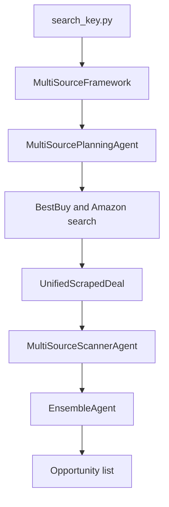

# Phase 4: Search And Pricing Tools

## Mục Đích

Implement V3 tool interfaces cho product search và price estimation.

Phase này trước tiên xây deterministic mock tools, sau đó optionally extract
real Amazon/BestBuy search và English ensemble pricing behavior từ `segment4`
mà không modify `segment4`.

## Trạng Thái Hiện Tại

Phase 4 bắt đầu sau khi backend job lifecycle hoạt động với mock result.

`segment4/search_key.py` is the prototype reference:



## Scope

Phase 4 gồm ba internal milestones:

### 4A: Mock Tool Contracts

- Define schemas cho `deal_search_tool`.
- Define schemas cho `price_estimator_tool`.
- Thêm fixture data cho Amazon và BestBuy candidates.
- Thêm fixture price estimates.
- Thêm tests không yêu cầu network/model calls.
- Chuẩn bị Sidekick-style evidence cho các phase sau: tool outputs phải giữ
  `source`, normalized product fields, estimate fields, và `warnings` rõ ràng
  để Phase 5 có thể tạo deterministic progress steps và Phase 7 có thể validate
  final answer dựa trên evidence.

### 4B: Real Search Extraction

Chỉ sau explicit approval:

- Inspect `segment4` call paths bằng CodeGraph.
- Adapt minimal BestBuy search behavior.
- Adapt minimal Amazon search behavior.
- Normalize output sang V3 schema.
- Thêm opt-in real search test.

### 4C: Real Pricing Extraction

Chỉ sau explicit approval:

- Inspect `EnsembleAgent` flow bằng CodeGraph.
- Adapt/wrap preprocessor behavior khi cần.
- Adapt/wrap Frontier, Specialist, và Neural model calls.
- Return V3 price estimate schema.
- Thêm opt-in real model test.

Approved status:

- 4C.1 Neural Adapter + Formatter + Boundary đã được approve.
- 4C.2 Frontier Adapter + Boundary đã được approve.
- 4C.3 Specialist Adapter + Boundary đã được approve.
- Phase 4C real pricing boundary hiện có opt-in Neural, Frontier, và
  Specialist adapters. Khi cả ba model available, real estimator dùng formula
  gốc `0.8*frontier + 0.1*specialist + 0.1*neural`; partial cases dùng
  deterministic fallback priority với warnings rõ ràng.

## Non-Goals

- Không modification `segment4/`.
- Không Gradio UI extraction.
- Không Pushover notification extraction.
- Không DealNews RSS/autonomous workflow.
- Không t-SNE visualization.
- Không live scraping/model calls trong default tests.
- Không direct import từ `segment4` trừ khi được explicitly approved và
  documented.

## Inputs From Previous Phases

Required:

- Phase 3 job lifecycle.
- `guides/agent_architecture.md`.
- `segment4/mo_ta_du_an/DOCUMENTATION_SEARCHKEY.md`.

Cho 4B/4C:

- CodeGraph query evidence cho exact flow đang được extract.

## Contracts

### Sidekick Pattern Boundary

V3 được định vị như một Vietnamese Shopping Sidekick, nhưng Phase 4 vẫn giữ
controlled tool architecture. Không đưa LangChain/LangGraph Sidekick framework,
free-form browser agent, dynamic LLM todo list, hoặc autonomous evaluator vào
Phase 4.

Phase 4A chỉ chuẩn bị evidence contracts. `progress_steps` chưa bắt buộc xuất
hiện ở API response trong phase này; backend progress source of truth được
định nghĩa ở Phase 5.

### `deal_search_tool`

Input:

```json
{
  "query_en": "gaming laptop under 800 dollars",
  "source": "All",
  "max_results_per_source": 5
}
```

Output:

```json
{
  "products": [
    {
      "source": "BestBuy",
      "title": "Example Laptop",
      "brand": "Example",
      "sale_price_usd": 699.99,
      "url": "https://www.bestbuy.com/...",
      "features": "16GB RAM, RTX GPU...",
      "raw_source_payload": {}
    }
  ],
  "warnings": []
}
```

### `price_estimator_tool`

Input:

```json
{
  "product": {
    "source": "Amazon",
    "title": "Example Laptop",
    "brand": "Example",
    "sale_price_usd": 699.99,
    "features": "16GB RAM, RTX GPU",
    "url": "https://www.amazon.com/..."
  }
}
```

Output:

```json
{
  "estimated_value_usd": 890.0,
  "discount_usd": 190.01,
  "deal_score": "good",
  "confidence": null,
  "model_breakdown": {
    "frontier": 900.0,
    "specialist": 850.0,
    "neural": 880.0
  },
  "warnings": []
}
```

Deal score:

- `hot`: discount >= 200
- `good`: discount >= 100
- `ok`: discount > 0
- `overpriced`: discount <= 0

## Segment4 Reference Contract

Relevant reference behavior:

- BestBuy dùng `curl_cffi` với Chrome impersonation và internal APIs.
- Amazon dùng `curl_cffi`, set ZIP 96150, parse search HTML, và có thể scrape
  product pages để lấy missing features.
- `MultiSourcePlanningAgent.search_and_scrape()` chạy BestBuy và Amazon song
  song khi source là `All`.
- `UnifiedScrapedDeal` normalize source-specific deals.
- `MultiSourceScannerAgent` dùng GPT structured output để chọn top deals.
- `EnsembleAgent.price()` preprocess text, gọi Specialist, Frontier, và Neural
  estimators, sau đó combine:

```text
combined = frontier * 0.8 + specialist * 0.1 + neural * 0.1
```

V3 tool modules phải expose clean V3 schemas ngay cả khi behavior được adapt từ
old code.

## Workflow Gate

Trước khi code:

- Load `using-superpowers`.
- Dùng `brainstorming` với user.
- Chỉ hỏi các câu thay đổi scope, design, tests, hoặc implementation plan.
- Quyết định rõ phase chỉ gồm 4A, hay cũng gồm 4B/4C.
- Dùng CodeGraph trước bất kỳ real `segment4` extraction nào.
- Trình bày Phase 4 plan.
- Chờ explicit approval.

## Implementation Order

1. Xác nhận Phase 3 report và tests pass.
2. Brainstorm xem Phase 4 nên chỉ thực hiện 4A hay gồm cả 4B/4C.
3. Implement 4A schemas và fixtures trước.
4. Thêm tests cho mock tools.
5. Integrate mock tools vào worker/router path nếu Phase 5 sẵn sàng hoặc đã
   planned.
6. Với 4B, chạy CodeGraph query:

```text
How does search_key.py run Amazon and BestBuy search through MultiSourcePlanningAgent?
```

7. Extract/adapt minimal real search sau `ENABLE_REAL_SEARCH=true`.
8. Với 4C, chạy CodeGraph query:

```text
How does EnsembleAgent estimate prices using frontier specialist neural network?
```

9. Extract/adapt real pricing sau `ENABLE_REAL_MODEL_CALLS=true`.
10. Giữ mock tests.
11. Viết Phase 4 report, hoặc milestone reports cho 4A/4B/4C.

## Verification

Default required:

```bash
uv run pytest <tool schema and fixture tests>
```

Mock verification:

- `deal_search_tool` trả về Amazon và BestBuy fixture candidates.
- `price_estimator_tool` trả về deterministic estimate/discount/score.
- invalid input bị reject.
- warnings được preserve.
- tool outputs có đủ evidence để map sang các future progress steps
  `search_deals` và `estimate_prices` mà không cần đọc raw scraped payload.
- tests pass mà không cần network/model calls.

Opt-in real search verification, chỉ khi có approval:

- `ENABLE_REAL_SEARCH=true`
- source-specific test for BestBuy.
- source-specific test for Amazon.
- `segment4/` unchanged.

Opt-in real pricing verification, chỉ khi có approval:

- `ENABLE_REAL_MODEL_CALLS=true`
- required env/model files available.
- price tool returns estimate and breakdown.
- costs/risks documented in report.

## Report Requirements

Reports có thể dùng:

```text
reports/phase_4a_mock_tools_report.md
reports/phase_4b_real_search_report.md
reports/phase_4c_real_pricing_report.md
```

Hoặc một combined report:

```text
reports/phase_4_search_and_pricing_tools_report.md
```

Report phải bao gồm:

- chỉ mock hay real modes đã được implement;
- CodeGraph questions đã dùng;
- files được adapt từ `segment4`;
- tests đã chạy;
- real calls đã thực hiện, nếu có;
- xác nhận `segment4` unchanged;
- evidence/warnings fields nào đã được expose để Phase 5/6 progress panel và
  Phase 7 evidence validator dùng lại;
- remaining scraper/model risks.

## Risks And Open Questions

- Amazon/BestBuy scraping có thể break hoặc bị blocked.
- Ensemble pricing có heavy dependencies và paid/remote components.
- Direct import từ `segment4` có thể tạo hidden coupling.
- Source-specific partial failures phải trở thành warnings, không phải
  hallucinated data.
- GPT top-deal selector từ `segment4` có thể thuộc Router/tool orchestration về
  sau; không thêm nó vào default tests nếu nó gọi model.
