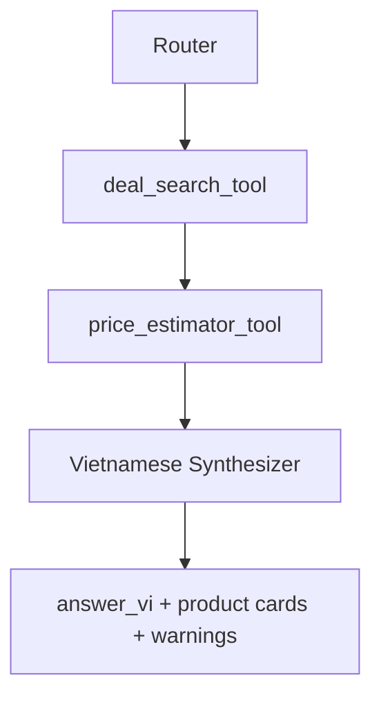

# Agent Architecture Guide

## Purpose

This guide defines the V3 agent workflow, tool contracts, model provider policy,
and evidence rules. It replaces the separate V2 agent docs, tool specs, and
agent specs.

## Current Status

No V3 agents or tools are implemented yet. `segment4/` contains the reference
pipeline and must remain unchanged.

The V3 MVP uses controlled routing plus explicit tools. It does not use a
free-form ReAct loop.

## MVP Workflow



The Router chooses the allowed path. Tools produce structured evidence. The
Synthesizer writes the final Vietnamese answer from evidence only.

## Router Contract

Input:

```json
{
  "message_vi": "Tìm laptop gaming dưới 800 đô",
  "conversation_context": []
}
```

Output:

```json
{
  "intent": "search_deals",
  "query_en": "gaming laptop under 800 dollars",
  "source": "All",
  "max_results_per_source": 6,
  "confidence": 0.9,
  "needs_tool": true
}
```

Allowed intents:

- `search_deals`
- `estimate_price`
- `general_product_qa`
- `compare`
- `advisor`
- `unsupported`

MVP executes only `search_deals`. Unsupported or not-yet-implemented intents
must return safe Vietnamese fallback.

Router responsibilities:

- Classify Vietnamese user intent.
- Produce a concise English search query.
- Preserve source filter and result limits.
- Avoid free-form tool selection loops.
- Save an `agent_runs` audit record.

## Deal Search Tool Contract

Responsibility:

Search Amazon and/or BestBuy and return normalized product candidates. The tool
must not generate Vietnamese final answers.

Input:

```json
{
  "query_en": "gaming laptop under 800 dollars",
  "source": "All",
  "max_results_per_source": 6
}
```

Validation:

- `query_en`: non-empty English query.
- `source`: `All`, `Amazon`, or `BestBuy`.
- `max_results_per_source`: 1 to 20.

Output:

```json
{
  "products": [
    {
      "source": "BestBuy",
      "title": "Example Laptop",
      "brand": "Example",
      "sale_price_usd": 699.99,
      "url": "https://www.bestbuy.com/...",
      "features": "16GB RAM, RTX GPU...",
      "raw_source_payload": {}
    }
  ],
  "warnings": []
}
```

Failure modes:

- source blocked
- no results
- parse failed
- network timeout

If one source fails and another succeeds, return useful results with warnings.

## Price Estimator Tool Contract

Responsibility:

Estimate fair value in USD from normalized product evidence. The tool must not
search the web.

Input:

```json
{
  "product": {
    "source": "Amazon",
    "title": "Example Laptop",
    "brand": "Example",
    "sale_price_usd": 699.99,
    "features": "16GB RAM, RTX GPU",
    "url": "https://www.amazon.com/..."
  }
}
```

Output:

```json
{
  "estimated_value_usd": 890.0,
  "discount_usd": 190.01,
  "deal_score": "good",
  "confidence": null,
  "model_breakdown": {
    "frontier": 900.0,
    "specialist": 850.0,
    "neural": 880.0
  },
  "warnings": []
}
```

Recommended MVP deal score:

- `hot`: discount >= 200
- `good`: discount >= 100
- `ok`: discount > 0
- `overpriced`: discount <= 0

## Vietnamese Synthesizer Contract

Input:

```json
{
  "message_vi": "Tìm laptop gaming dưới 800 đô",
  "products": [],
  "price_estimates": [],
  "warnings": []
}
```

Output:

```json
{
  "answer_vi": "Mình tìm được vài lựa chọn đáng chú ý...",
  "summary_cards": [],
  "warnings_vi": []
}
```

Rules:

- Answer in Vietnamese.
- Keep product names in English when clearer.
- Prices remain USD.
- Do not invent price, URL, source, specs, or discount.
- Mention partial source/tool failures when relevant.
- Sort or highlight by deal value only from tool data.

## Model Provider Policy

Use LiteLLM abstraction for model calls.

MVP defaults:

- OpenAI-compatible provider for Router.
- OpenAI-compatible provider for Synthesizer.

Required config:

- `MODEL_PROVIDER`
- `MODEL_ID_ROUTER`
- `MODEL_ID_SYNTHESIZER`

Future providers:

- Qwen/vLLM local or remote OpenAI-compatible endpoint.
- Other providers only after contracts are stable.

## Mock Mode Policy

Default local/test mode must not call external services.

Default flags:

```text
ENABLE_REAL_SEARCH=false
ENABLE_REAL_MODEL_CALLS=false
```

Mock mode must cover:

- Router fixture outputs.
- Deal search fixture outputs.
- Price estimate fixture outputs.
- Synthesizer fixture outputs.

## Evidence Rules

Tool outputs are source of truth for:

- URLs
- prices
- product titles
- product features
- estimated value
- discount
- source warnings

The Synthesizer cannot invent fields not present in tool outputs.

If data is missing, use `unknown`, `not_available`, or a warning instead of
guessing.

## Segment4 Reference

Use `segment4/mo_ta_du_an/DOCUMENTATION_SEARCHKEY.md` and CodeGraph for search
and pricing extraction.

Important reference files:

- `segment4/search_key.py`
- `segment4/multi_source_framework.py`
- `segment4/price_agents/multi_source_planning_agent.py`
- `segment4/price_agents/bestbuy_deals.py`
- `segment4/price_agents/amazon_deals.py`
- `segment4/bestbuy_untils/unified_deal.py`
- `segment4/bestbuy_untils/multi_source_scanner_agent.py`
- `segment4/price_agents/ensemble_agent.py`
- `segment4/price_agents/frontier_agent.py`
- `segment4/price_agents/specialist_agent.py`
- `segment4/price_agents/neural_network_agent.py`

Do not extract initially:

- Gradio UI.
- Pushover notification.
- DealNews RSS autonomous workflow.
- `memory.json` workflow.
- t-SNE visualization.

## Trace And Audit

Each agent/tool run should save:

- `job_id`
- component name
- run type: `router`, `tool`, `synthesizer`, or `worker`
- start and end time
- status
- duration
- model provider and model name if used
- sanitized input summary
- sanitized output summary
- safe error message if failed

## Later Agents

Later agents are planned but not required for MVP:

- Comparer Agent.
- Advisor Agent.

They must not be implemented before search + price + Vietnamese summary is
stable.
