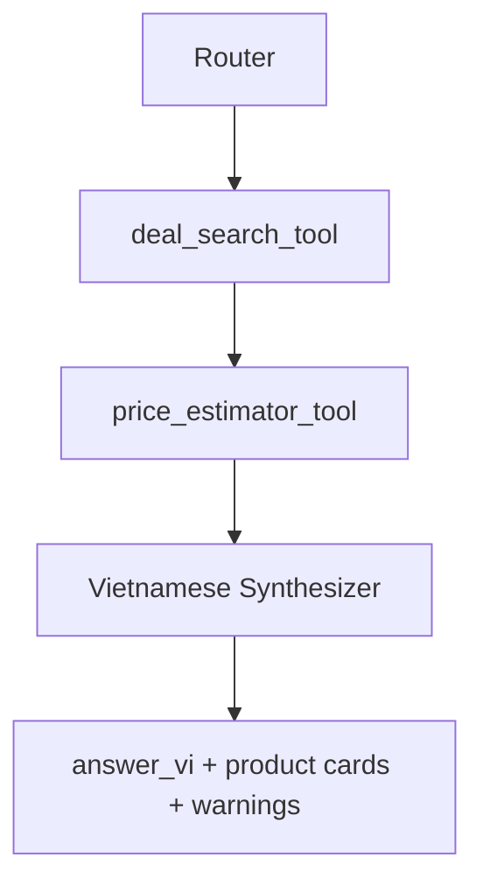

# Agent Architecture Guide

## Mục Đích

Guide này định nghĩa V3 agent workflow, tool contracts, model provider policy,
và evidence rules. Nó thay thế các V2 agent docs, tool specs, và agent specs
tách rời.

## Trạng Thái Hiện Tại

Chưa có V3 agents hoặc tools nào được implement. `segment4/` chứa reference
pipeline và phải giữ nguyên.

V3 MVP dùng controlled routing cộng với explicit tools. Nó không dùng
free-form ReAct loop.

## MVP Workflow



Router chọn allowed path. Tools tạo structured evidence. Synthesizer viết câu
trả lời tiếng Việt cuối cùng chỉ từ evidence.

## Router Contract

Input:

```json
{
  "message_vi": "Tìm laptop gaming dưới 800 đô",
  "conversation_context": []
}
```

Output:

```json
{
  "intent": "search_deals",
  "query_en": "gaming laptop under 800 dollars",
  "source": "All",
  "max_results_per_source": 6,
  "confidence": 0.9,
  "needs_tool": true
}
```

Allowed intents:

- `search_deals`
- `estimate_price`
- `general_product_qa`
- `compare`
- `advisor`
- `unsupported`

MVP chỉ thực thi `search_deals`. Unsupported hoặc not-yet-implemented intents
phải trả về safe Vietnamese fallback.

Trách nhiệm của Router:

- Classify Vietnamese user intent.
- Tạo concise English search query.
- Giữ source filter và result limits.
- Tránh free-form tool selection loops.
- Lưu một `agent_runs` audit record.

## Deal Search Tool Contract

Trách nhiệm:

Search Amazon và/hoặc BestBuy rồi trả về normalized product candidates. Tool
không được tạo Vietnamese final answers.

Input:

```json
{
  "query_en": "gaming laptop under 800 dollars",
  "source": "All",
  "max_results_per_source": 6
}
```

Validation:

- `query_en`: non-empty English query.
- `source`: `All`, `Amazon`, or `BestBuy`.
- `max_results_per_source`: 1 to 20.

Output:

```json
{
  "products": [
    {
      "source": "BestBuy",
      "title": "Example Laptop",
      "brand": "Example",
      "sale_price_usd": 699.99,
      "url": "https://www.bestbuy.com/...",
      "features": "16GB RAM, RTX GPU...",
      "raw_source_payload": {}
    }
  ],
  "warnings": []
}
```

Failure modes:

- source blocked
- no results
- parse failed
- network timeout

Nếu một source fail và source khác succeed, trả về useful results kèm warnings.

## Price Estimator Tool Contract

Trách nhiệm:

Estimate fair value bằng USD từ normalized product evidence. Tool không được
search web.

Input:

```json
{
  "product": {
    "source": "Amazon",
    "title": "Example Laptop",
    "brand": "Example",
    "sale_price_usd": 699.99,
    "features": "16GB RAM, RTX GPU",
    "url": "https://www.amazon.com/..."
  }
}
```

Output:

```json
{
  "estimated_value_usd": 890.0,
  "discount_usd": 190.01,
  "deal_score": "good",
  "confidence": null,
  "model_breakdown": {
    "frontier": 900.0,
    "specialist": 850.0,
    "neural": 880.0
  },
  "warnings": []
}
```

MVP deal score khuyến nghị:

- `hot`: discount >= 200
- `good`: discount >= 100
- `ok`: discount > 0
- `overpriced`: discount <= 0

## Vietnamese Synthesizer Contract

Input:

```json
{
  "message_vi": "Tìm laptop gaming dưới 800 đô",
  "products": [],
  "price_estimates": [],
  "warnings": []
}
```

Output:

```json
{
  "answer_vi": "Mình tìm được vài lựa chọn đáng chú ý...",
  "summary_cards": [],
  "warnings_vi": []
}
```

Quy tắc:

- Trả lời bằng tiếng Việt.
- Giữ product names bằng tiếng Anh khi rõ hơn.
- Prices giữ USD.
- Không bịa price, URL, source, specs, hoặc discount.
- Nhắc tới partial source/tool failures khi liên quan.
- Chỉ sort hoặc highlight theo deal value từ tool data.

## Model Provider Policy

Dùng LiteLLM abstraction cho model calls.

MVP defaults:

- OpenAI-compatible provider cho Router.
- OpenAI-compatible provider cho Synthesizer.

Required config:

- `MODEL_PROVIDER`
- `MODEL_ID_ROUTER`
- `MODEL_ID_SYNTHESIZER`

Future providers:

- Qwen/vLLM local or remote OpenAI-compatible endpoint.
- Other providers only after contracts are stable.

## Mock Mode Policy

Default local/test mode không được gọi external services.

Default flags:

```text
ENABLE_REAL_SEARCH=false
ENABLE_REAL_MODEL_CALLS=false
```

Mock mode phải cover:

- Router fixture outputs.
- Deal search fixture outputs.
- Price estimate fixture outputs.
- Synthesizer fixture outputs.

## Evidence Rules

Tool outputs là source of truth cho:

- URLs
- prices
- product titles
- product features
- estimated value
- discount
- source warnings

Synthesizer không được bịa fields không có trong tool outputs.

Nếu thiếu data, dùng `unknown`, `not_available`, hoặc warning thay vì đoán.

## Segment4 Reference

Dùng `segment4/mo_ta_du_an/DOCUMENTATION_SEARCHKEY.md` và CodeGraph cho search
và pricing extraction.

Các reference files quan trọng:

- `segment4/search_key.py`
- `segment4/multi_source_framework.py`
- `segment4/price_agents/multi_source_planning_agent.py`
- `segment4/price_agents/bestbuy_deals.py`
- `segment4/price_agents/amazon_deals.py`
- `segment4/bestbuy_untils/unified_deal.py`
- `segment4/bestbuy_untils/multi_source_scanner_agent.py`
- `segment4/price_agents/ensemble_agent.py`
- `segment4/price_agents/frontier_agent.py`
- `segment4/price_agents/specialist_agent.py`
- `segment4/price_agents/neural_network_agent.py`

Ban đầu không extract:

- Gradio UI.
- Pushover notification.
- DealNews RSS autonomous workflow.
- `memory.json` workflow.
- t-SNE visualization.

## Trace Và Audit

Mỗi agent/tool run nên lưu:

- `job_id`
- component name
- run type: `router`, `tool`, `synthesizer`, or `worker`
- start and end time
- status
- duration
- model provider and model name if used
- sanitized input summary
- sanitized output summary
- safe error message if failed

## Agents Sau Này

Các agents sau này đã được lên kế hoạch nhưng không bắt buộc cho MVP:

- Comparer Agent.
- Advisor Agent.

Chúng không được implement trước khi search + price + Vietnamese summary ổn
định.
