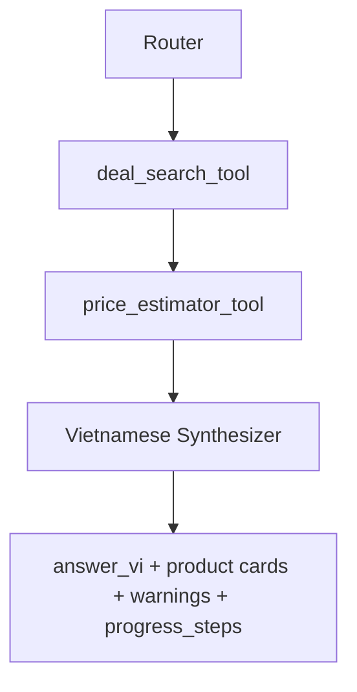

# Agent Architecture Guide

## Mục Đích

Guide này định nghĩa V3 agent workflow, tool contracts, model provider policy,
và evidence rules. Nó thay thế các V2 agent docs, tool specs, và agent specs
tách rời.

## Trạng Thái Hiện Tại

Chưa có V3 agents hoặc tools nào được implement. `segment4/` chứa reference
pipeline và phải giữ nguyên.

V3 MVP dùng controlled routing cộng với explicit tools. Nó không dùng
free-form ReAct loop.

Sidekick pattern boundary: V3 có thể được gọi là Vietnamese Shopping Sidekick,
nhưng nó là specialist sidekick cho shopping. V3 lấy các pattern như
deterministic progress, evidence-first validation, và future HITL roadmap; nó
không dùng LangChain/LangGraph Sidekick framework, free-form browser agent, hay
LLM-generated todo list trong MVP.

## MVP Workflow



Router chọn allowed path. Tools tạo structured evidence. Synthesizer viết câu
trả lời tiếng Việt cuối cùng chỉ từ evidence.

Worker/orchestration tạo `progress_steps` deterministic để frontend hiển thị
kế hoạch mua sắm đang chạy. Progress không do LLM tự do sinh ra.

## ITLR-Inspired Agent Patterns

`shopping_assistant_v2/ITLR_Fullstack_Recommender_RAG_TECHNICAL_DOSSIER.md`
co một số bài học agent/retrieval hữu ích, nhưng V3 chỉ nhận những pattern có
boundary rõ và phù hợp với shopping assistant:

- query understanding có thể thêm typo correction, abbreviation expansion, và
  short follow-up resolution qua `conversation_context` sau này;
- Router và Synthesizer phải giữ deterministic/default path trước khi bất kỳ
  model-backed provider nào được xem là authoritative;
- retrieval/ranking improvements phải đo được bằng fixture-based metrics trước
  khi ảnh hưởng user-facing ranking;
- off-topic và unsupported-request gates nên có labeled examples, không dựa vào
  ad hoc prompts;
- chất lượng văn phong đứng sau evidence correctness: product title, price,
  URL, source, discount, và warnings vẫn phải đến từ tool output.

Không chấp nhận cho MVP:

- biến V3 thành general learning recommender hoặc social platform;
- expose search/pricing tools cho free-form agent loop;
- thêm full RAG/recommender stacks trước khi Amazon/BestBuy deal path ổn định;
- runtime LLM-as-a-Judge trong default execution.

## Router Contract

Input:

```json
{
  "message_vi": "Tìm laptop gaming dưới 800 đô",
  "conversation_context": []
}
```

Output:

```json
{
  "intent": "search_deals",
  "query_en": "gaming laptop under 800 dollars",
  "source": "All",
  "max_results_per_source": 5,
  "confidence": 0.9,
  "needs_tool": true
}
```

Allowed intents:

- `search_deals`
- `estimate_price`
- `general_product_qa`
- `compare`
- `advisor`
- `unsupported`

MVP chỉ thực thi `search_deals`. Unsupported hoặc not-yet-implemented intents
phải trả về safe Vietnamese fallback.

Trách nhiệm của Router:

- Classify Vietnamese user intent.
- Tạo concise English search query.
- Giữ source filter và result limits.
- Tránh free-form tool selection loops.
- Lưu một `agent_runs` audit record.

## Deal Search Tool Contract

Trách nhiệm:

Search Amazon và/hoặc BestBuy rồi trả về normalized product candidates. Tool
không được tạo Vietnamese final answers.

Input:

```json
{
  "query_en": "gaming laptop under 800 dollars",
  "source": "All",
  "max_results_per_source": 5
}
```

Validation:

- `query_en`: non-empty English query.
- `source`: `All`, `Amazon`, or `BestBuy`.
- `max_results_per_source`: 1 to 20.

Output:

```json
{
  "products": [
    {
      "source": "BestBuy",
      "title": "Example Laptop",
      "brand": "Example",
      "sale_price_usd": 699.99,
      "url": "https://www.bestbuy.com/...",
      "features": "16GB RAM, RTX GPU...",
      "raw_source_payload": {}
    }
  ],
  "warnings": []
}
```

Failure modes:

- source blocked
- no results
- parse failed
- network timeout

Nếu một source fail và source khác succeed, trả về useful results kèm warnings.

## Price Estimator Tool Contract

Trách nhiệm:

Estimate fair value bằng USD từ normalized product evidence. Tool không được
search web.

Input:

```json
{
  "product": {
    "source": "Amazon",
    "title": "Example Laptop",
    "brand": "Example",
    "sale_price_usd": 699.99,
    "features": "16GB RAM, RTX GPU",
    "url": "https://www.amazon.com/..."
  }
}
```

Output:

```json
{
  "estimated_value_usd": 890.0,
  "discount_usd": 190.01,
  "deal_score": "good",
  "confidence": null,
  "model_breakdown": {
    "frontier": 900.0,
    "specialist": 850.0,
    "neural": 880.0
  },
  "warnings": []
}
```

MVP deal score khuyến nghị:

- `hot`: discount >= 200
- `good`: discount >= 100
- `ok`: discount > 0
- `overpriced`: discount <= 0

## Vietnamese Synthesizer Contract

Input:

```json
{
  "message_vi": "Tìm laptop gaming dưới 800 đô",
  "products": [],
  "price_estimates": [],
  "warnings": []
}
```

Output:

```json
{
  "answer_vi": "Mình tìm được vài lựa chọn đáng chú ý...",
  "summary_cards": [],
  "warnings_vi": []
}
```

Quy tắc:

- Trả lời bằng tiếng Việt.
- Giữ product names bằng tiếng Anh khi rõ hơn.
- Prices giữ USD.
- Không bịa price, URL, source, specs, hoặc discount.
- Nhắc tới partial source/tool failures khi liên quan.
- Chỉ sort hoặc highlight theo deal value từ tool data.

## Progress Steps Contract

Initial contract:

```json
{
  "progress_steps": [
    {
      "step_id": "route_request",
      "title_vi": "Hiểu nhu cầu mua sắm",
      "status": "completed",
      "detail_vi": "Đã xác định yêu cầu và tạo truy vấn tìm kiếm."
    }
  ]
}
```

Allowed `step_id` values:

```text
route_request
search_deals
estimate_prices
synthesize_answer
```

Allowed `status` values:

```text
pending
running
completed
failed
skipped
```

Future optional fields:

```text
component
started_at
completed_at
warnings
agent_run_id
```

Progress steps must be backed by orchestration/tool evidence. A step must not
be marked `completed` before the matching Router, tool, pricing, or Synthesizer
evidence exists.

Future query-understanding fields chỉ được thêm sau khi Phase 5/6 contracts ổn
định:

```text
corrected_message_vi
normalized_query_en
follow_up_of_message_id
router_notes
```

Các fields này phải được persist hoặc audit bằng bounded summaries và không
được chứa secrets, raw scraped payloads, hoặc large model traces.

## Model Provider Policy

Default MVP behavior vẫn là mock/fixture và không gọi external services.
Model-backed behavior chỉ chạy sau opt-in config.

Approved exception: Phase 4C.2 Frontier pricing uses the OpenAI Python SDK
directly inside an opt-in tool adapter. This is an intentional extraction
boundary because `segment4` FrontierAgent used OpenAI directly and the V3
adapter has one narrow model call.

Approved Phase 5 direction: use hybrid controlled OpenAI Agents SDK for
Router/Synthesizer model-backed behavior. FastAPI, SQLite, local worker,
deterministic progress, and V3 tool contracts remain the orchestration source
of truth. The SDK must be an optional runtime layer, not a replacement for the
worker-owned `Router -> tools -> Synthesizer` pipeline.

LiteLLM remains a future-compatible option for non-OpenAI providers after the
Router/Synthesizer contracts are stable, but it is no longer the required Phase
5 abstraction.

MVP defaults:

- OpenAI-compatible provider cho Router.
- OpenAI-compatible provider cho Synthesizer.

Required config:

- `MODEL_PROVIDER`
- `MODEL_ID_ROUTER`
- `MODEL_ID_SYNTHESIZER`
- `ENABLE_AGENTS_SDK`

Future providers:

- Qwen/vLLM local or remote OpenAI-compatible endpoint.
- Other providers only after contracts are stable.

OpenAI Agents SDK policy for Phase 5:

- SDK path requires `ENABLE_REAL_MODEL_CALLS=true` and
  `ENABLE_AGENTS_SDK=true`.
- Router Agent and Synthesizer Agent may use structured outputs.
- The worker still calls search and pricing tools in fixed order.
- Do not expose Amazon/BestBuy search or price estimation as free-form tools to
  a main LLM in Phase 5.
- Tracing must use safe metadata correlated by `job_id`.
- Sensitive trace payload capture must be disabled by default.
- SDK sessions must not replace V3 SQLite conversation/message persistence in
  MVP.

## Mock Mode Policy

Default local/test mode không được gọi external services.

Default flags:

```text
ENABLE_REAL_SEARCH=false
ENABLE_REAL_MODEL_CALLS=false
```

Mock mode phải cover:

- Router fixture outputs.
- Deal search fixture outputs.
- Price estimate fixture outputs.
- Synthesizer fixture outputs.

## Evidence Rules

Tool outputs là source of truth cho:

- URLs
- prices
- product titles
- product features
- estimated value
- discount
- source warnings

Synthesizer không được bịa fields không có trong tool outputs.

Nếu thiếu data, dùng `unknown`, `not_available`, hoặc warning thay vì đoán.

Phase 7 should add a rule-based test-only evidence evaluator. It should verify
that final answers, product cards, warnings, and progress steps are backed by
tool/result evidence. Runtime LLM-as-a-Judge remains future opt-in work.

ITLR-style evaluation ideas chỉ được đưa vào deterministic tests trước:

- small labeled unsupported/off-topic examples cho Router behavior;
- fixture queries với expected source/product evidence shape;
- ranking checks như top product theo `discount_usd`, source coverage, và
  warning preservation;
- latency snapshots cho Router/tools/Synthesizer trong mock mode.

## Segment4 Reference

Dùng `segment4/mo_ta_du_an/DOCUMENTATION_SEARCHKEY.md` và CodeGraph cho search
và pricing extraction.

Các reference files quan trọng:

- `segment4/search_key.py`
- `segment4/multi_source_framework.py`
- `segment4/price_agents/multi_source_planning_agent.py`
- `segment4/price_agents/bestbuy_deals.py`
- `segment4/price_agents/amazon_deals.py`
- `segment4/bestbuy_untils/unified_deal.py`
- `segment4/bestbuy_untils/multi_source_scanner_agent.py`
- `segment4/price_agents/ensemble_agent.py`
- `segment4/price_agents/frontier_agent.py`
- `segment4/price_agents/specialist_agent.py`
- `segment4/price_agents/neural_network_agent.py`

Ban đầu không extract:

- Gradio UI.
- Pushover notification.
- DealNews RSS autonomous workflow.
- `memory.json` workflow.
- t-SNE visualization.

## Trace Và Audit

Mỗi agent/tool run nên lưu:

- `job_id`
- component name
- run type: `router`, `tool`, `synthesizer`, or `worker`
- start and end time
- status
- duration
- model provider and model name if used
- sanitized input summary
- sanitized output summary
- safe error message if failed

## Agents Sau Này

Các agents sau này đã được lên kế hoạch nhưng không bắt buộc cho MVP:

- Comparer Agent.
- Advisor Agent.

Chúng không được implement trước khi search + price + Vietnamese summary ổn
định.
