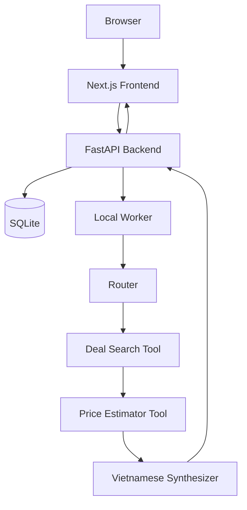

# Architecture Guide

## Purpose

This guide defines the target architecture for Shopping Assistant V3. It merges
the V2 architecture, local/backend/frontend plans, and persistence direction into
one source-of-truth guide.

Use this guide before any runtime implementation phase.

## Current Status

V3 is documentation-first. Runtime folders such as `backend/` and `frontend/`
do not exist yet unless a later approved phase creates them.

`segment4/` contains the working prototype for Amazon/BestBuy search and English
price estimation. It is reference-only.

`shopping_assistant_v2/` contains the previous documentation set. It is
migration reference only.

## Local MVP Architecture



The backend returns `job_id` immediately. Long-running work happens outside the
request handler through a local worker or background task.

## Backend Architecture

Target structure:

```text
backend/
├── README.md
├── shared/
├── database/
├── api/
├── router/
├── tools/
│   ├── deal_search/
│   └── price_estimator/
└── synthesizer/
```

Optional later folders:

```text
backend/comparer/
backend/advisor/
```

Responsibilities:

| Module | Responsibility |
|---|---|
| `shared/` | Config, logging, common schemas, guardrails, error types, retry helpers. |
| `database/` | SQLite schema, repositories, migrations if needed, job/product/estimate persistence. |
| `api/` | FastAPI app, validation, safe error responses, job endpoints. |
| `router/` | Job orchestration, intent routing, tool invocation, result saving. |
| `tools/deal_search/` | Amazon/BestBuy search and normalized candidates. |
| `tools/price_estimator/` | USD fair value estimation and deal score calculation. |
| `synthesizer/` | Vietnamese final answer from structured evidence. |

Rules:

- `shared/` must not import from specific tools or agents.
- FastAPI route handlers stay thin.
- Route handlers must not run scraping/model work directly.
- Database access should go through repositories, not scattered SQL.
- Every module with owned schemas should define them explicitly.

## API Contract

Base URL for local backend:

```text
http://localhost:8000
```

Required endpoints:

### `GET /health`

Response:

```json
{
  "status": "ok",
  "service": "shopping-assistant-v3"
}
```

### `POST /api/chat-jobs`

Creates a job and returns immediately.

Request:

```json
{
  "message": "Tìm laptop gaming dưới 800 đô",
  "conversation_id": null,
  "source": "All",
  "max_results_per_source": 6
}
```

Validation:

- `message`: string, 2 to 1000 chars.
- `conversation_id`: nullable string.
- `source`: one of `All`, `Amazon`, `BestBuy`.
- `max_results_per_source`: integer, 1 to 20.

Response:

```json
{
  "job_id": "uuid",
  "status": "pending",
  "message": "Job created. Poll status endpoint for results."
}
```

### `GET /api/chat-jobs/{job_id}`

Pending/running response:

```json
{
  "job_id": "uuid",
  "status": "running",
  "created_at": "iso8601",
  "started_at": "iso8601",
  "completed_at": null,
  "result": null,
  "error_message": null
}
```

Completed response:

```json
{
  "job_id": "uuid",
  "status": "completed",
  "created_at": "iso8601",
  "started_at": "iso8601",
  "completed_at": "iso8601",
  "result": {
    "answer_vi": "Đây là các lựa chọn đáng chú ý...",
    "products": [
      {
        "source": "Amazon",
        "title": "Example laptop",
        "brand": "Example",
        "sale_price_usd": 699.99,
        "estimated_value_usd": 890.0,
        "discount_usd": 190.01,
        "deal_score": "good",
        "url": "https://www.amazon.com/..."
      }
    ],
    "warnings": []
  },
  "error_message": null
}
```

Failed response:

```json
{
  "job_id": "uuid",
  "status": "failed",
  "result": null,
  "error_message": "Search failed. Try again later."
}
```

Optional debug endpoint:

```text
GET /api/chat-jobs/{job_id}/events
```

Errors use safe shape:

```json
{
  "error": {
    "code": "VALIDATION_ERROR",
    "message": "Invalid request.",
    "details": []
  }
}
```

## Database Architecture

MVP uses SQLite. Schema should stay close to Postgres to avoid later redesign.

Core tables:

- `jobs`
- `conversations`
- `messages`
- `agent_runs`
- `products`
- `price_estimates`

Status values:

```text
pending
running
completed
failed
```

Future status values:

```text
queued
partial
cancelled
```

Table responsibilities:

| Table | Purpose |
|---|---|
| `jobs` | Async lifecycle, request payload, result payload, safe error. |
| `conversations` | Chat sessions for `demo_user` now and real users later. |
| `messages` | User/assistant/system/tool messages. |
| `agent_runs` | Audit trail for Router, tools, Synthesizer, worker. |
| `products` | Normalized product candidates linked to job. |
| `price_estimates` | Fair value estimate, discount, score, breakdown. |

Use JSON text in SQLite for payloads and metadata. Future Postgres migration can
move these fields to `jsonb`.

## Frontend Architecture

Target structure:

```text
frontend/
├── README.md
├── app/ or pages/
├── components/
│   ├── ChatPanel
│   ├── JobStatus
│   ├── ProductCard
│   ├── ProductResults
│   └── DebugLogPanel
├── lib/
│   ├── apiClient
│   └── types
└── styles/
```

Recommended for a new app: Next.js App Router, unless a phase guide or user
decision chooses Pages Router for simplicity.

Required UI states:

- `idle`
- `submitting`
- `pending`
- `running`
- `completed`
- `failed`

Required product card fields:

- source
- title
- brand if available
- sale price USD
- estimated value USD
- discount USD
- deal score
- URL
- warning if data is partial

The MVP UI should be chat-first, not a marketing landing page.

## Local Services

Recommended local ports:

- Backend: `http://localhost:8000`
- Frontend: `http://localhost:3000`

Expected environment categories:

- `DATABASE_URL`
- `MODEL_PROVIDER`
- `MODEL_ID_ROUTER`
- `MODEL_ID_SYNTHESIZER`
- `OPENAI_API_KEY`
- `PRICER_PREPROCESSOR_MODEL`
- `ENABLE_REAL_SEARCH`
- `ENABLE_REAL_MODEL_CALLS`

Never log secret values.

## Logging And Observability

Every backend log related to a request or worker run must include `job_id`.
Before a job exists, use `request_id`.

Required local events:

- `JOB_CREATED`
- `JOB_STARTED`
- `ROUTER_STARTED`
- `ROUTER_COMPLETED`
- `TOOL_STARTED`
- `TOOL_COMPLETED`
- `SYNTHESIZER_STARTED`
- `SYNTHESIZER_COMPLETED`
- `JOB_COMPLETED`
- `JOB_FAILED`

Recommended log shape:

```json
{
  "event": "TOOL_COMPLETED",
  "job_id": "uuid",
  "component": "deal_search_tool",
  "duration_ms": 1234,
  "status": "success",
  "timestamp": "iso8601"
}
```

Do not log:

- API keys
- tokens
- `.env` content
- credentials
- private auth headers
- huge raw scraped payloads

## Future Production Mapping

| Local MVP | Future |
|---|---|
| SQLite | Postgres, Supabase, Aurora |
| Local worker | Queue-backed worker, SQS |
| Console logs | CloudWatch, traces, LangFuse |
| `demo_user` | Clerk user id |
| localhost CORS | configured production origins |

AWS, Terraform, Clerk, and production observability are deferred until the local
MVP works reliably.
