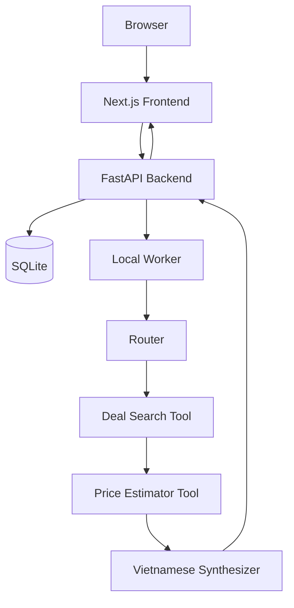

# Architecture Guide

## Mục Đích

Guide này định nghĩa target architecture cho Shopping Assistant V3. Nó hợp nhất
V2 architecture, local/backend/frontend plans, và persistence direction vào một
source-of-truth guide.

Dùng guide này trước bất kỳ runtime implementation phase nào.

## Trạng Thái Hiện Tại

V3 là documentation-first. Runtime folders như `backend/` và `frontend/` chưa
tồn tại trừ khi một approved phase sau này tạo chúng.

`segment4/` chứa working prototype cho Amazon/BestBuy search và English price
estimation. Nó chỉ dùng để reference.

`shopping_assistant_v2/` chứa bộ documentation trước đó. Nó chỉ là migration
reference.

## Local MVP Architecture



Backend trả về `job_id` ngay lập tức. Long-running work diễn ra bên ngoài
request handler thông qua local worker hoặc background task.

## Backend Architecture

Target structure:

```text
backend/
├── README.md
├── shared/
├── database/
├── api/
├── router/
├── tools/
│   ├── deal_search/
│   └── price_estimator/
└── synthesizer/
```

Các folders tùy chọn về sau:

```text
backend/comparer/
backend/advisor/
```

Trách nhiệm:

| Module | Trách nhiệm |
|---|---|
| `shared/` | Config, logging, schemas chung, guardrails, error types, retry helpers. |
| `database/` | SQLite schema, repositories, migrations nếu cần, job/product/estimate persistence. |
| `api/` | FastAPI app, validation, safe error responses, job endpoints. |
| `router/` | Job orchestration, intent routing, tool invocation, result saving. |
| `tools/deal_search/` | Amazon/BestBuy search và normalized candidates. |
| `tools/price_estimator/` | USD fair value estimation và deal score calculation. |
| `synthesizer/` | Vietnamese final answer từ structured evidence. |

Quy tắc:

- `shared/` không được import từ specific tools hoặc agents.
- FastAPI route handlers phải mỏng.
- Route handlers không được chạy trực tiếp scraping/model work.
- Database access nên đi qua repositories, không dùng SQL rải rác.
- Mọi module sở hữu schemas nên định nghĩa chúng rõ ràng.

## API Contract

Base URL cho local backend:

```text
http://localhost:8000
```

Các endpoints bắt buộc:

### `GET /health`

Response:

```json
{
  "status": "ok",
  "service": "shopping-assistant-v3"
}
```

### `POST /api/chat-jobs`

Tạo một job và trả về ngay lập tức.

Request:

```json
{
  "message": "Tìm laptop gaming dưới 800 đô",
  "conversation_id": null,
  "source": "All",
  "max_results_per_source": 6
}
```

Validation:

- `message`: string, 2 to 1000 chars.
- `conversation_id`: nullable string.
- `source`: một trong `All`, `Amazon`, `BestBuy`.
- `max_results_per_source`: integer, 1 to 20.

Response:

```json
{
  "job_id": "uuid",
  "status": "pending",
  "message": "Job created. Poll status endpoint for results."
}
```

### `GET /api/chat-jobs/{job_id}`

Pending/running response:

```json
{
  "job_id": "uuid",
  "status": "running",
  "created_at": "iso8601",
  "started_at": "iso8601",
  "completed_at": null,
  "result": null,
  "error_message": null
}
```

Completed response:

```json
{
  "job_id": "uuid",
  "status": "completed",
  "created_at": "iso8601",
  "started_at": "iso8601",
  "completed_at": "iso8601",
  "result": {
    "answer_vi": "Đây là các lựa chọn đáng chú ý...",
    "products": [
      {
        "source": "Amazon",
        "title": "Example laptop",
        "brand": "Example",
        "sale_price_usd": 699.99,
        "estimated_value_usd": 890.0,
        "discount_usd": 190.01,
        "deal_score": "good",
        "url": "https://www.amazon.com/..."
      }
    ],
    "warnings": []
  },
  "error_message": null
}
```

Failed response:

```json
{
  "job_id": "uuid",
  "status": "failed",
  "result": null,
  "error_message": "Search failed. Try again later."
}
```

Optional debug endpoint:

```text
GET /api/chat-jobs/{job_id}/events
```

Errors dùng safe shape:

```json
{
  "error": {
    "code": "VALIDATION_ERROR",
    "message": "Invalid request.",
    "details": []
  }
}
```

## Database Architecture

MVP dùng SQLite. Schema nên giữ gần với Postgres để tránh redesign về sau.

Core tables:

- `jobs`
- `conversations`
- `messages`
- `agent_runs`
- `products`
- `price_estimates`

Status values:

```text
pending
running
completed
failed
```

Future status values:

```text
queued
partial
cancelled
```

Trách nhiệm của bảng:

| Table | Mục đích |
|---|---|
| `jobs` | Async lifecycle, request payload, result payload, safe error. |
| `conversations` | Chat sessions cho `demo_user` hiện tại và real users sau này. |
| `messages` | User/assistant/system/tool messages. |
| `agent_runs` | Audit trail for Router, tools, Synthesizer, worker. |
| `products` | Normalized product candidates linked với job. |
| `price_estimates` | Fair value estimate, discount, score, breakdown. |

Dùng JSON text trong SQLite cho payloads và metadata. Future Postgres migration
có thể chuyển các fields này sang `jsonb`.

## Frontend Architecture

Target structure:

```text
frontend/
├── README.md
├── app/ or pages/
├── components/
│   ├── ChatPanel
│   ├── JobStatus
│   ├── ProductCard
│   ├── ProductResults
│   └── DebugLogPanel
├── lib/
│   ├── apiClient
│   └── types
└── styles/
```

Khuyến nghị cho app mới: Next.js App Router, trừ khi phase guide hoặc user
decision chọn Pages Router vì simplicity.

Các UI states bắt buộc:

- `idle`
- `submitting`
- `pending`
- `running`
- `completed`
- `failed`

Các product card fields bắt buộc:

- source
- title
- brand nếu có
- sale price USD
- estimated value USD
- discount USD
- deal score
- URL
- warning nếu data partial

MVP UI nên ưu tiên chat, không phải marketing landing page.

## Local Services

Local ports khuyến nghị:

- Backend: `http://localhost:8000`
- Frontend: `http://localhost:3000`

Các environment categories kỳ vọng:

- `DATABASE_URL`
- `MODEL_PROVIDER`
- `MODEL_ID_ROUTER`
- `MODEL_ID_SYNTHESIZER`
- `OPENAI_API_KEY`
- `PRICER_PREPROCESSOR_MODEL`
- `ENABLE_REAL_SEARCH`
- `ENABLE_REAL_MODEL_CALLS`

Không bao giờ log secret values.

## Logging Và Observability

Mọi backend log liên quan tới request hoặc worker run phải có `job_id`. Trước
khi job tồn tại, dùng `request_id`.

Các local events bắt buộc:

- `JOB_CREATED`
- `JOB_STARTED`
- `ROUTER_STARTED`
- `ROUTER_COMPLETED`
- `TOOL_STARTED`
- `TOOL_COMPLETED`
- `SYNTHESIZER_STARTED`
- `SYNTHESIZER_COMPLETED`
- `JOB_COMPLETED`
- `JOB_FAILED`

Log shape khuyến nghị:

```json
{
  "event": "TOOL_COMPLETED",
  "job_id": "uuid",
  "component": "deal_search_tool",
  "duration_ms": 1234,
  "status": "success",
  "timestamp": "iso8601"
}
```

Không log:

- API keys
- tokens
- `.env` content
- credentials
- private auth headers
- huge raw scraped payloads

## Future Production Mapping

| Local MVP | Future |
|---|---|
| SQLite | Postgres, Supabase, Aurora |
| Local worker | Queue-backed worker, SQS |
| Console logs | CloudWatch, traces, LangFuse |
| `demo_user` | Clerk user id |
| localhost CORS | configured production origins |

AWS, Terraform, Clerk, và production observability được hoãn cho tới khi local
MVP hoạt động đáng tin cậy.
