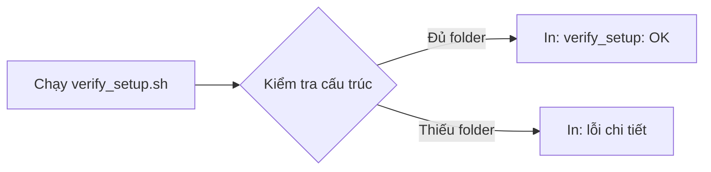

# Phase 1: Project Setup

## 1. Phase Này Là Gì?

Phase 1 là bước dựng khung cho Shopping Assistant V3. Mục tiêu của phase này
không phải viết app chạy thật, mà là tạo cấu trúc thư mục, file hướng dẫn, và
script kiểm tra để mọi phase sau có nền tảng rõ ràng.

V3 được xem là bản reset documentation-first cho DATN Shopping Assistant. Nó
giữ hướng sản phẩm của V2, nhưng tổ chức lại tài liệu và chuẩn bị runtime
structure gọn hơn.

## 2. Trước Phase Này Hệ Thống Đang Thiếu Gì?

Trước Phase 1, V3 chủ yếu là kế hoạch và guide. Chưa có runtime folder cho
backend, frontend, tools, scripts. Nếu bắt đầu code ngay, các phase sau dễ bị
lẫn với `shopping_assistant_v2/` hoặc prototype `segment4/`.

Phase 1 giải quyết vấn đề đó bằng cách tạo một khu V3 riêng, có biên giới rõ:
V3 là source of truth mới; V2 và segment4 chỉ là reference.

## 3. Phase Này Đã Xây Được Gì?

Phase 1 đã tạo skeleton cho:

- `backend/`: nơi backend FastAPI, database, worker, tools, router, synthesizer
  sẽ sống.
- `frontend/`: nơi Next.js chat UI sẽ được xây sau.
- `scripts/`: nơi chứa script kiểm tra hoặc tiện ích local.
- `.env.example`: template biến môi trường, không chứa secret thật.
- `scripts/verify_setup.sh`: script xác nhận cấu trúc folder cơ bản tồn tại.

Chưa có API, database schema, worker, scraping, model call, hoặc UI thật trong
phase này.

## 4. Chức Năng Hoạt Động Như Thế Nào?

Chức năng duy nhất ở Phase 1 là kiểm tra setup:



Nếu cấu trúc đúng, script in `verify_setup: OK`. Đây là cách đơn giản để biết
project skeleton chưa bị thiếu folder quan trọng.

## 5. Kỹ Thuật Được Sử Dụng

- Markdown README cho từng khu vực runtime.
- `.env.example` để document config mà không lộ secret.
- Bash script kiểm tra cấu trúc local.
- Chưa dùng Python package, chưa tạo `pyproject.toml`, chưa cài dependency.

Quyết định hoãn `pyproject.toml` sang Phase 2 giúp Phase 1 thật nhẹ: chỉ chuẩn
bị cấu trúc, không kéo theo môi trường runtime.

## 6. Các File Quan Trọng Và Mối Quan Hệ

```text
shopping_assistant_v3/
  .env.example
  backend/
    README.md
    shared/README.md
    database/README.md
    api/README.md
    router/README.md
    tools/deal_search/README.md
    tools/price_estimator/README.md
    synthesizer/README.md
  frontend/README.md
  scripts/README.md
  scripts/verify_setup.sh
```

Quan hệ giữa các file:

- `backend/README.md` giải thích bản đồ backend tổng thể.
- Các README con giải thích trách nhiệm từng module trước khi module có code.
- `.env.example` cho biết biến môi trường nào sẽ cần trong tương lai.
- `verify_setup.sh` kiểm tra các folder/file skeleton đó tồn tại.

## 7. Cách Tự Kiểm Tra

Chạy từ repo root:

```bash
bash shopping_assistant_v3/scripts/verify_setup.sh
```

Kết quả mong đợi:

```text
verify_setup: OK
```

Bạn cũng có thể kiểm tra rằng Phase 1 không chạm vào code cũ:

```bash
git diff --name-only -- segment4/ shopping_assistant_v2/
```

Kết quả đúng là không có output.

## 8. Giới Hạn Hiện Tại

- Chưa có backend chạy được.
- Chưa có database thật.
- Chưa có API endpoints.
- Chưa có frontend.
- Chưa có search/pricing tools.

Đây là giới hạn có chủ đích. Phase 1 chỉ dựng khung.

## 9. Phase Sau Sẽ Xây Tiếp Gì?

Phase 2 xây backend API và SQLite database trên skeleton này. Các folder
`backend/api`, `backend/database`, và `backend/shared` bắt đầu có code thật.

## 10. Tóm Tắt Ngắn

Phase 1 biến V3 từ tài liệu kế hoạch thành một project folder có cấu trúc rõ.
Nó chưa tạo sản phẩm chạy được, nhưng tạo nền để các phase sau không viết code
lẫn lộn với V2 hoặc segment4.
