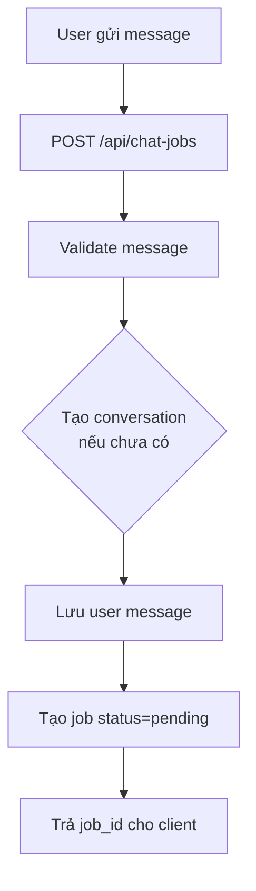
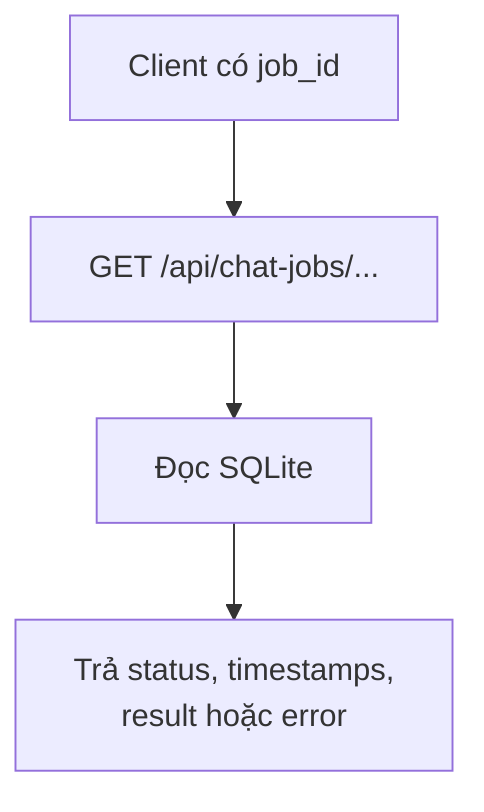

# Phase 2: Backend API And Database

## 1. Phase Này Là Gì?

Phase 2 là lúc V3 bắt đầu có backend thật. Hệ thống có FastAPI app, SQLite
database, schema lưu dữ liệu, repository layer, và các API endpoint đầu tiên để
tạo và xem trạng thái chat job.

Nói đơn giản: sau Phase 2, backend có thể nhận một tin nhắn từ user, tạo job
trong database, và cho frontend polling trạng thái job đó.

## 2. Trước Phase Này Hệ Thống Đang Thiếu Gì?

Sau Phase 1, project chỉ có folder và README. Chưa có app server, chưa có nơi
lưu job, chưa có API contract thật.

Nếu không có Phase 2, các phase worker, search, pricing, frontend sẽ không có
điểm kết nối ổn định.

## 3. Phase Này Đã Xây Được Gì?

Phase 2 tạo các phần chính:

- FastAPI app.
- SQLite database qua SQLAlchemy ORM.
- 6 bảng dữ liệu chính.
- Repository functions để tạo và đọc data.
- Error format an toàn, thống nhất.
- Test suite backend đầu tiên.

Các endpoint có trong phase này:

```text
GET  /health
POST /api/chat-jobs
GET  /api/chat-jobs/{job_id}
```

## 4. Chức Năng Hoạt Động Như Thế Nào?

Luồng tạo job:



Luồng xem job:



Ở Phase 2, job mới chỉ ở trạng thái `pending`. Worker xử lý nền chưa có, nên
chưa tự chạy sang `completed`.

## 5. Kỹ Thuật Được Sử Dụng

- `FastAPI`: xây HTTP API.
- `Pydantic`: validate request/response schemas.
- `SQLAlchemy ORM`: định nghĩa bảng và thao tác SQLite.
- `SQLite`: database local-first cho MVP.
- `pytest` và `FastAPI TestClient`: test API bằng temp database.
- `uv`: quản lý môi trường Python riêng cho V3.

Một quyết định quan trọng: V3 có `.venv` và `pyproject.toml` riêng trong
`shopping_assistant_v3/`, tách khỏi root project và tách khỏi prototype
`segment4/`.

## 6. Các File Quan Trọng Và Mối Quan Hệ

```text
backend/api/main.py
backend/api/schemas.py
backend/database/schema.py
backend/database/session.py
backend/database/repository.py
backend/shared/config.py
backend/shared/errors.py
tests/test_api.py
```

Quan hệ:

- `api/main.py` là entry point FastAPI. Nó định nghĩa endpoints.
- `api/schemas.py` định nghĩa request/response models.
- `database/schema.py` định nghĩa các bảng: jobs, conversations, messages,
  agent_runs, products, price_estimates.
- `database/session.py` tạo DB engine, session factory, và dependency cho API.
- `database/repository.py` chứa functions thao tác database. API không viết SQL
  trực tiếp.
- `shared/errors.py` tạo error response an toàn.
- `shared/config.py` đọc config từ env, không log secret.
- `tests/test_api.py` kiểm tra API, validation, database side effects.

## 7. Cách Tự Kiểm Tra

Chạy từ `shopping_assistant_v3/`:

```bash
uv run pytest tests/test_api.py -v
```

Khi Phase 2 được approve, suite có 20 tests pass.

Bạn cũng có thể chạy server local:

```bash
uv run uvicorn backend.api.main:app --host 127.0.0.1 --port 8000
```

Sau đó kiểm tra:

```bash
curl http://127.0.0.1:8000/health
```

Kết quả đúng:

```json
{"status":"ok","service":"shopping-assistant-v3"}
```

## 8. Giới Hạn Hiện Tại

- Chưa có worker xử lý job, nên job chưa tự hoàn thành.
- Chưa có search tool.
- Chưa có price estimator.
- Chưa có frontend.
- Chưa có CORS, vì frontend Phase 6 mới cần.

## 9. Phase Sau Sẽ Xây Tiếp Gì?

Phase 3 thêm local async worker để job không chỉ được tạo ra, mà còn được xử lý
nền và chuyển sang `completed` hoặc `failed`.

## 10. Tóm Tắt Ngắn

Phase 2 dựng xương sống backend: API, database, schemas, repository, error
handling, và test nền. Từ đây, mọi tính năng shopping sẽ chạy qua job lifecycle
thay vì xử lý trực tiếp trong request.
