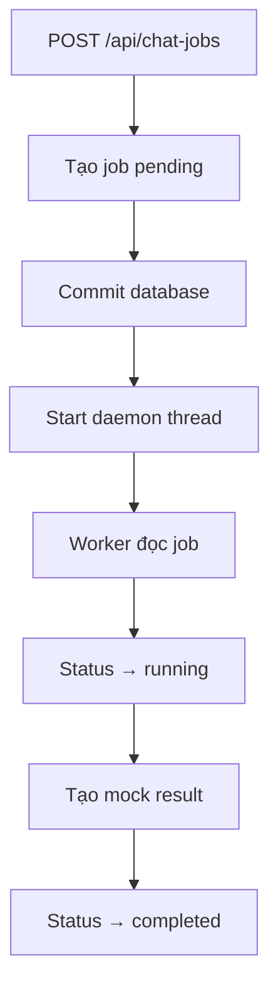
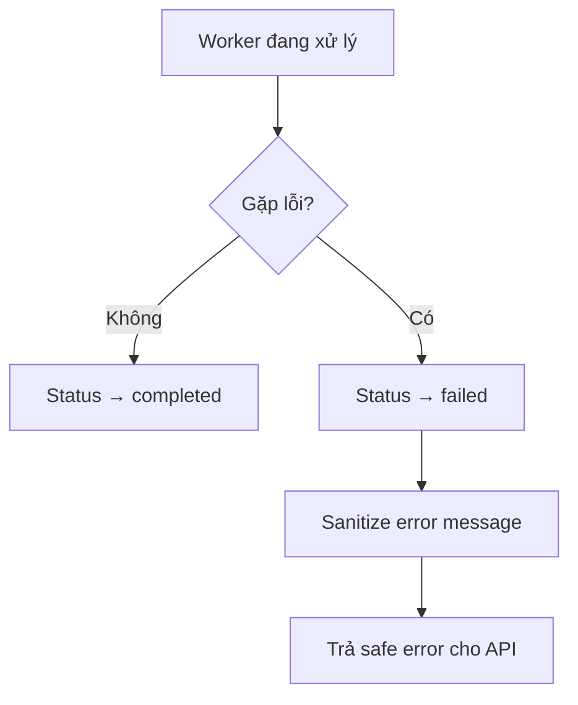

# Phase 3: Async Jobs

## 1. Phase Này Là Gì?

Phase 3 thêm cơ chế xử lý job nền. Khi user gửi request, API trả `job_id` ngay.
Worker xử lý công việc ở background, rồi frontend hoặc client dùng `job_id` để
poll kết quả.

Đây là nền tảng quan trọng vì search, scraping, và model pricing đều có thể mất
nhiều thời gian. Backend không nên bắt user chờ ngay trong HTTP request.

## 2. Trước Phase Này Hệ Thống Đang Thiếu Gì?

Phase 2 chỉ tạo job `pending`. Chưa có gì tự động xử lý job đó. Nếu gọi
`GET /api/chat-jobs/{job_id}`, user chỉ thấy job đang chờ.

Phase 3 biến job từ bản ghi tĩnh thành lifecycle thật:

```text
pending -> running -> completed
pending -> running -> failed
```

## 3. Phase Này Đã Xây Được Gì?

Phase 3 tạo:

- `backend/worker.py`: worker xử lý job.
- Mock result deterministic để job có thể hoàn thành.
- Structured JSON logs có `job_id`.
- `agent_runs` audit rows để biết worker đã chạy gì.
- Idempotency gates để không xử lý lại job đã xong.
- Stale-running recovery cho job bị kẹt ở `running`.

API `POST /api/chat-jobs` cũng được sửa để sau khi commit job vào DB thì start
daemon thread xử lý job.

## 4. Chức Năng Hoạt Động Như Thế Nào?

Luồng sau Phase 3:



Nếu worker gặp lỗi:



Error trả cho API/user được sanitize, ví dụ:

```text
Worker failed. Try again later.
```

Raw exception không được đưa ra API response.

## 5. Kỹ Thuật Được Sử Dụng

- `threading.Thread` daemon cho local MVP worker.
- SQLAlchemy session riêng cho worker.
- JSON structured logging.
- Audit table `agent_runs`.
- Polling pattern qua `GET /api/chat-jobs/{job_id}`.
- Pytest test trực tiếp worker và API-triggered async flow.

Ban đầu có cân nhắc FastAPI `BackgroundTasks`, nhưng khi test thực tế nó không
ổn định với sync SQLAlchemy session và TestClient. Daemon thread được chọn vì
deterministic hơn cho local MVP.

## 6. Các File Quan Trọng Và Mối Quan Hệ

```text
backend/api/main.py
backend/worker.py
backend/database/repository.py
backend/database/schema.py
tests/test_worker.py
tests/test_api.py
```

Quan hệ:

- `api/main.py` tạo job và start daemon thread.
- `worker.py` chứa `process_job()`, xử lý status và result.
- `repository.py` có functions update job status, result, error, agent run.
- `schema.py` có bảng `jobs` và `agent_runs`.
- `test_worker.py` kiểm tra worker logic trực tiếp.
- `test_api.py` kiểm tra API tạo job và job eventually completed.

## 7. Cách Tự Kiểm Tra Và Chạy Code

### 7.1 Mục Tiêu Khi Chạy

Phase 3 cần chứng minh job không còn đứng yên ở `pending`. Sau khi chạy xong,
bạn nên thấy lifecycle:

```text
pending -> running -> completed
```

hoặc failure path an toàn:

```text
pending -> running -> failed
```

### 7.2 Command An Toàn

Chạy từ `shopping_assistant_v3/`:

```bash
uv run pytest tests/test_worker.py -v
uv run pytest tests/ -v
```

Khi Phase 3 được approve, toàn bộ suite có 36 tests pass.

Bạn cũng có thể thử flow manual bằng backend local:

```bash
uv run uvicorn backend.api.main:app --host 127.0.0.1 --port 8000
```

Gửi job:

```bash
curl -X POST http://127.0.0.1:8000/api/chat-jobs \
  -H "Content-Type: application/json" \
  -d '{"message":"test"}'
```

Sau đó dùng `job_id` để poll:

```bash
curl http://127.0.0.1:8000/api/chat-jobs/<job_id>
```

Kết quả mong đợi trên current code Phase 5A là job chuyển tới `completed` và có
`result`. Nếu bạn đang đọc đúng lịch sử Phase 3, result vẫn là mock result đơn
giản chứ chưa có real search/pricing.

### 7.3 Cách Đọc Kết Quả

- `tests/test_worker.py` pass: worker xử lý status, idempotency, stale-running
  recovery và safe failure đúng.
- Full suite pass: API và worker phối hợp được.
- Trong manual flow, `POST` trả `job_id` ngay. `GET` sau đó mới trả kết quả.
- Nếu status vẫn `pending` ngay lần poll đầu, đợi ngắn rồi gọi `GET` lại; đó là
  polling pattern bình thường.

### 7.4 Notebook Companion

Notebook tương ứng:

```text
shopping_assistant_v3/reports/notebooks/phase_3_async_jobs.ipynb
```

Notebook này chạy worker tests, map lifecycle states, và ghi manual API flow
riêng. Nó không tự mở server trong notebook để tránh cell treo.

### 7.5 Lỗi Thường Gặp

- Poll quá nhanh và thấy `pending`: gọi lại `GET` sau một khoảng ngắn.
- Server vẫn chạy từ lần trước: dừng terminal cũ hoặc đổi port.
- SQLite file local bị cũ khi demo manual: có thể dùng test suite vì tests tự
  tạo temp database sạch.

### 7.6 Safety Notes

Phase 3 vẫn mock-only. Không có live scraping, không có OpenAI/Modal calls, và
không cần secrets.

## 8. Giới Hạn Hiện Tại

- Daemon thread chỉ phù hợp local MVP, không phải production queue.
- Nếu server chết giữa lúc xử lý, job có thể bị kẹt `running`; stale recovery
  xử lý một phần nhưng không thay thế queue thật.
- Chưa có retry cho failed jobs.
- Result vẫn là mock, chưa phải search/pricing thật.

## 9. Phase Sau Sẽ Xây Tiếp Gì?

Phase 4A thay mock result chung bằng pipeline tool rõ ràng: deal search tool và
price estimator tool. Worker bắt đầu gọi tools và lưu products/estimates.

## 10. Tóm Tắt Ngắn

Phase 3 biến backend từ “tạo job rồi để đó” thành “tạo job và xử lý nền”. Đây
là bước bắt buộc trước khi thêm scraping hoặc model work, vì các tác vụ đó không
nên chạy trực tiếp trong request handler.
