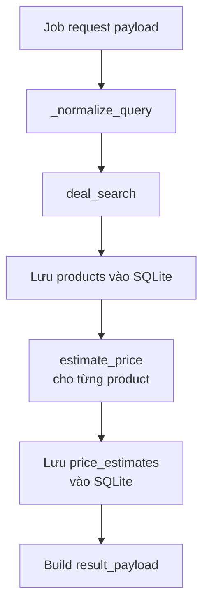

# Phase 4A: Mock Search/Pricing Tools

## 1. Phase Này Là Gì?

Phase 4A đưa pipeline shopping thật vào worker, nhưng dùng mock data. Hệ thống
bắt đầu có hai tool chính:

- `deal_search_tool`: tìm sản phẩm.
- `price_estimator_tool`: ước lượng giá trị hợp lý của sản phẩm.

Mọi thứ vẫn chạy bằng fixtures local, không scrape web và không gọi model.

## 2. Trước Phase Này Hệ Thống Đang Thiếu Gì?

Phase 3 chỉ tạo mock result cố định. Worker có thể hoàn thành job, nhưng chưa
thật sự “tìm sản phẩm” hoặc “định giá”.

Phase 4A thay mock result bằng pipeline có cấu trúc. Dù dữ liệu vẫn mock, các
schema, DB persistence, và audit trail đã giống đường đi thật.

## 3. Phase Này Đã Xây Được Gì?

Phase 4A tạo:

- Schemas cho deal search input/output.
- Schemas cho price estimate input/output.
- JSON fixtures cho 10 sản phẩm mock: Amazon và BestBuy.
- JSON fixtures cho một số price estimates.
- Fallback rule định giá nếu sản phẩm không có trong fixture.
- Worker pipeline gọi search tool, lưu products, gọi pricing tool, lưu
  estimates, rồi build result.
- Audit rows cho worker và từng tool call.

Default `max_results_per_source` được chốt là `5`.

## 4. Chức Năng Hoạt Động Như Thế Nào?

Luồng worker sau Phase 4A:



Ví dụ user nhập tiếng Việt `Tìm Gaming LAPTOP dưới 800`. Worker tạm normalize
thành `gaming laptop 800`. Đây chỉ là bridge tạm — Router thật sẽ đến ở Phase 5.

## 5. Kỹ Thuật Được Sử Dụng

- Pydantic schemas cho tool contracts.
- JSON fixtures để test deterministic.
- SQLite persistence cho products và price estimates.
- Rule-based fallback pricing: `sale_price * 1.10`.
- Injectable runner pattern trong worker để test success/failure dễ hơn.
- Safe failure handling khi real-mode flags chưa implement.

Deal score rule:

```text
hot        discount >= 200
good       discount >= 100
ok         discount > 0
overpriced discount <= 0
```

## 6. Các File Quan Trọng Và Mối Quan Hệ

```text
backend/tools/deal_search/schemas.py
backend/tools/deal_search/tool.py
backend/tools/deal_search/fixtures/mock_products.json
backend/tools/price_estimator/schemas.py
backend/tools/price_estimator/tool.py
backend/tools/price_estimator/fixtures/mock_estimates.json
backend/worker.py
backend/database/repository.py
tests/test_tools.py
tests/test_repository.py
tests/test_worker.py
```

Quan hệ:

- `deal_search/schemas.py` định nghĩa product candidate format.
- `deal_search/tool.py` đọc `mock_products.json` và match query.
- `price_estimator/schemas.py` định nghĩa output gồm estimated value,
  discount, deal score, model breakdown, warnings.
- `price_estimator/tool.py` đọc `mock_estimates.json` hoặc fallback 10%.
- `worker.py` orchestration: gọi search rồi pricing.
- `repository.py` lưu products và price estimates.
- `tests/test_tools.py` kiểm tra tool contracts và fixture behavior.
- `tests/test_worker.py` kiểm tra cả pipeline worker.

## 7. Cách Tự Kiểm Tra Và Chạy Code

### 7.1 Mục Tiêu Khi Chạy

Phase 4A cần chứng minh shopping pipeline đã có shape thật:

```text
search products -> estimate prices -> save products/estimates -> build result
```

Nhưng toàn bộ dữ liệu vẫn đến từ fixtures local. Sau khi chạy xong, bạn nên
thấy product candidates, estimated values, discounts, deal scores, warnings, và
audit rows mà không cần mạng.

### 7.2 Command An Toàn

Chạy từ `shopping_assistant_v3/`:

```bash
uv run pytest tests/test_tools.py -v
uv run pytest tests/test_worker.py -v
uv run pytest tests/ -v
```

Khi Phase 4A được approve, suite mock-only có 81 tests pass.

Bạn có thể hiểu đúng trạng thái này như sau:

- Search có kết quả, nhưng từ file JSON.
- Pricing có estimate, nhưng từ fixture hoặc rule.
- Không có Amazon/BestBuy live request.
- Không có model call.

### 7.3 Cách Đọc Kết Quả

- `tests/test_tools.py` pass: tool schemas, fixture search, fixture pricing và
  fallback pricing hoạt động.
- `tests/test_worker.py` pass: worker đã gọi search tool và price estimator
  theo thứ tự đúng, rồi lưu products/estimates.
- `Results truncated...` nếu xuất hiện là warning hợp lệ khi số kết quả vượt
  `max_results_per_source`.
- `No products found...` là warning hợp lệ khi query không match fixture.

### 7.4 Notebook Companion

Notebook tương ứng:

```text
shopping_assistant_v3/reports/notebooks/phase_4a_mock_tools.ipynb
```

Notebook này gọi trực tiếp `deal_search()` và `estimate_price()` bằng mock
fixtures để bạn thấy output Pydantic thực tế trước khi đọc worker pipeline.

### 7.5 Lỗi Thường Gặp

- Query không ra sản phẩm: thử `gaming laptop`, `phone`, hoặc để query rỗng để
  xem fixture pool.
- Nhầm real mode: giữ `ENABLE_REAL_SEARCH=false` và
  `ENABLE_REAL_MODEL_CALLS=false` khi chạy default.
- Kỳ vọng answer tiếng Việt hoàn chỉnh ở Phase 4A: chưa có; Synthesizer thuộc
  Phase 5A.

### 7.6 Safety Notes

Default commands của Phase 4A không scrape web và không gọi model. Nếu bạn bật
real flags trong shell hiện tại, hãy tắt hoặc mở terminal sạch trước khi chạy
mock verification.

## 8. Giới Hạn Hiện Tại

- Search chưa dùng Amazon/BestBuy thật.
- Pricing chưa dùng model thật.
- `answer_vi` vẫn là placeholder, chưa phải Synthesizer.
- `_normalize_query()` chỉ là bridge tạm, chưa phải Router.
- Real flags ở Phase 4A vẫn fail safe vì real search/pricing chưa implement.

## 9. Phase Sau Sẽ Xây Tiếp Gì?

Phase 4B thay mock search bằng real Amazon/BestBuy search opt-in. Mock path vẫn
giữ nguyên để tests chạy an toàn.

## 10. Tóm Tắt Ngắn

Phase 4A là bước biến worker thành shopping pipeline có cấu trúc. Dữ liệu vẫn
mock, nhưng đường đi đã giống thật: search, pricing, persistence, audit, result.
