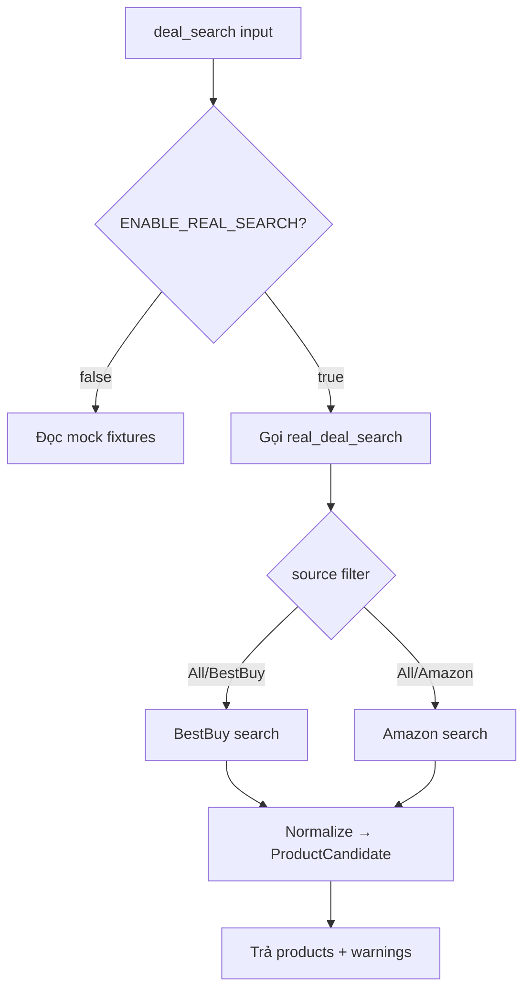
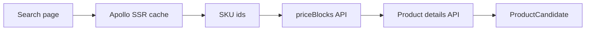
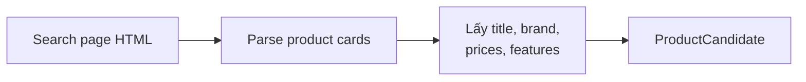

# Phase 4B: Real Amazon/BestBuy Search Extraction

## 1. Phase Này Là Gì?

Phase 4B thêm khả năng search Amazon và BestBuy thật vào V3, nhưng đặt sau cờ
opt-in:

```text
ENABLE_REAL_SEARCH=true
```

Default vẫn là mock search từ Phase 4A. Nhờ vậy tests và demo local không bị phụ
thuộc vào mạng, website, hoặc scraping failures.

## 2. Trước Phase Này Hệ Thống Đang Thiếu Gì?

Phase 4A chỉ search trong `mock_products.json`. Nó tốt cho test nhưng chưa cho
biết hệ thống có thể lấy sản phẩm từ nguồn thật.

Phase 4B đưa logic từ prototype `segment4` sang V3 theo cách copy/adapt, không
direct import, không sửa `segment4/`.

## 3. Phase Này Đã Xây Được Gì?

Phase 4B tạo:

- BestBuy real search module.
- Amazon real search module.
- Real search orchestrator.
- Parser tests với HTML fixtures local.
- Opt-in live integration tests, skipped by default.
- Bounded warning grammar cho source failures.

Khi real search bật, worker có thể dùng search thật. Nếu một source fail, hệ
thống cố gắng giữ kết quả còn dùng được từ source khác và trả warning.

## 4. Chức Năng Hoạt Động Như Thế Nào?

Luồng search dispatch:



BestBuy flow:



Amazon flow hiện tại:



Amazon product detail page scraping được để lại cho future milestone.

## 5. Kỹ Thuật Được Sử Dụng

- `curl_cffi` với Chrome impersonation cho real HTTP requests.
- `BeautifulSoup` để parse Amazon HTML.
- BestBuy internal APIs cho price/details.
- Parser functions tách riêng để test bằng local HTML fixtures.
- Warning sanitization để không trả raw exception, HTML, headers, hoặc stack
  trace cho user.
- Opt-in tests cho live search, skipped by default.

## 6. Các File Quan Trọng Và Mối Quan Hệ

```text
backend/tools/deal_search/tool.py
backend/tools/deal_search/real_search.py
backend/tools/deal_search/bestbuy_search.py
backend/tools/deal_search/amazon_search.py
backend/tools/deal_search/schemas.py
tests/fixtures/bestbuy_search_page.html
tests/fixtures/amazon_search_page.html
tests/test_real_search.py
tests/test_tools.py
```

Quan hệ:

- `tool.py` quyết định dùng mock path hay real path theo `ENABLE_REAL_SEARCH`.
- `real_search.py` điều phối Amazon và BestBuy.
- `bestbuy_search.py` chứa logic BestBuy real extraction.
- `amazon_search.py` chứa logic Amazon search-page extraction.
- `schemas.py` giữ output chung `ProductCandidate`.
- `tests/fixtures/*.html` cho parser tests không cần network.
- `test_real_search.py` là opt-in, dùng cho live search khi được phép.

## 7. Cách Tự Kiểm Tra Và Chạy Code

### 7.1 Mục Tiêu Khi Chạy

Phase 4B cần chứng minh hai lớp:

- default path vẫn mock-safe như Phase 4A;
- real search extraction modules có parser/orchestrator test bằng fixtures và
  chỉ gọi live Amazon/BestBuy khi bạn bật opt-in rõ ràng.

### 7.2 Command An Toàn

Default, không scrape live:

```bash
uv run pytest tests/test_tools.py -v
uv run pytest tests/test_real_search.py -v
uv run pytest tests/ -v
```

Khi Phase 4B được approve, default suite có:

```text
99 passed, 8 skipped
```

`8 skipped` là real search tests, chỉ chạy khi bạn bật real search rõ ràng.

### 7.3 Opt-In Live Search

Chỉ chạy khi bạn chấp nhận network request tới Amazon/BestBuy:

```bash
ENABLE_REAL_SEARCH=true uv run pytest tests/test_real_search.py -v
```

Kết quả mong đợi khi site/network ổn định là live tests pass hoặc trả warnings
đã sanitize. Nếu Amazon/BestBuy đổi HTML, block request, hoặc timeout, test có
thể fail dù code vẫn đúng với mock contract. Ghi lại source nào fail và warning
code, không paste raw HTML/header nếu có.

### 7.4 Cách Đọc Kết Quả

- Parser tests pass: HTML fixtures local vẫn parse đúng.
- `skipped`: real tests không chạy vì `ENABLE_REAL_SEARCH` chưa bật; đây là
  behavior đúng cho default mode.
- Warnings dạng source fail là expected với live web instability, nhưng không
  được chứa raw exception/HTML/secrets.
- Source filter `Amazon` hoặc `BestBuy` không nên tạo warning kiểu source kia
  bị skipped; đó là filter bình thường.

### 7.5 Notebook Companion

Notebook tương ứng:

```text
shopping_assistant_v3/reports/notebooks/phase_4b_real_search.ipynb
```

Notebook này chạy parser/mock-safe checks trước. Phần live search có guard:
chỉ chạy khi environment có `ENABLE_REAL_SEARCH=true`.

### 7.6 Lỗi Thường Gặp

- Không có network hoặc bị website block: live search fail, nhưng mock tests
  vẫn phải pass.
- `curl_cffi` import lỗi: chạy lại `uv sync`; dependency này nằm trong base
  dependencies của V3 hiện tại.
- Kết quả live thay đổi theo thời gian: không dùng live output làm default
  grading evidence.

### 7.7 Safety Notes

Không bật `ENABLE_REAL_SEARCH=true` trong default verification. Live search
không cần API key nhưng có network/flaky risk, nên chỉ chạy khi bạn chủ động
muốn kiểm tra extraction thật.

## 8. Giới Hạn Hiện Tại

- Real search chạy tuần tự BestBuy rồi Amazon, chưa parallel.
- Timeout là per-request, chưa phải deadline toàn source.
- Amazon mới parse search page, chưa vào product detail page để enrich specs.
- Website có thể block hoặc đổi HTML bất cứ lúc nào.
- Pricing vẫn chưa real ở Phase 4B, trừ mock estimator từ 4A.

## 9. Phase Sau Sẽ Xây Tiếp Gì?

Phase 4C bắt đầu real price estimator extraction. Vì full ensemble từ
`segment4` nặng, Phase 4C được chia nhỏ. Milestone đầu tiên đã hoàn thành là
4C.1: deterministic formatter và neural adapter.

## 10. Tóm Tắt Ngắn

Phase 4B làm hệ thống có khả năng lấy sản phẩm thật từ Amazon/BestBuy, nhưng
vẫn giữ mock mode làm mặc định. Đây là cách cân bằng giữa product realism và
test safety.
